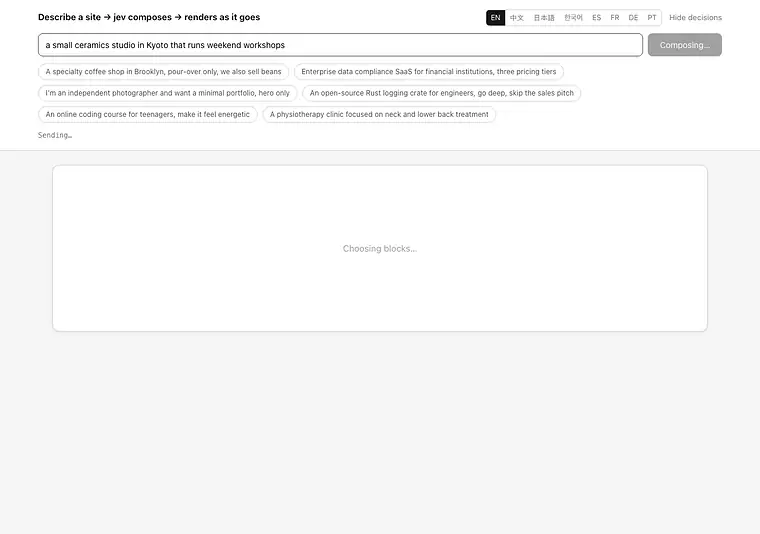
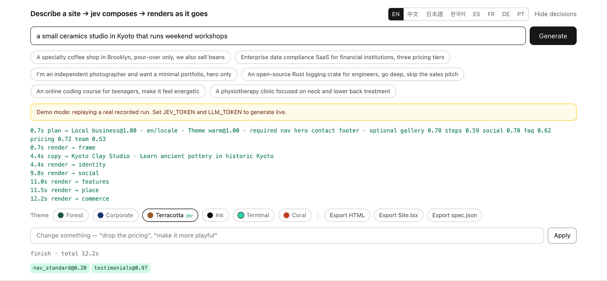
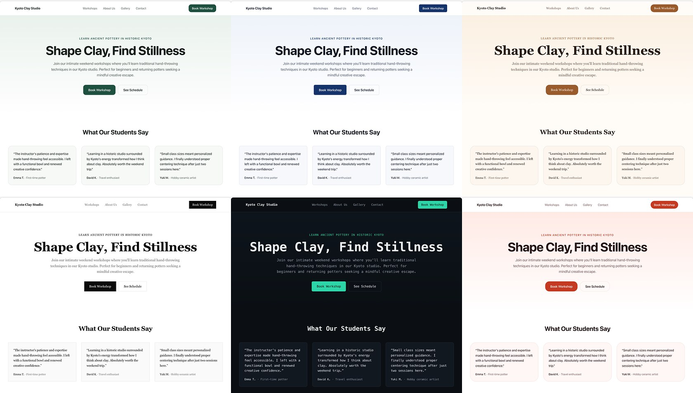

**English** · [简体中文](docs/README.zh.md) · [日本語](docs/README.ja.md) · [한국어](docs/README.ko.md) · [Español](docs/README.es.md) · [Français](docs/README.fr.md) · [Deutsch](docs/README.de.md) · [Português](docs/README.pt.md)

# loom

<p align="center">
  <a href="https://github.com/yldm-tech/loom/actions/workflows/ci.yml"></a>
  <a href="LICENSE"></a>
  <a href="https://github.com/yldm-tech/loom/stargazers"></a>
  <a href="https://github.com/yldm-tech/loom/commits/main"></a>
  
  <a href="https://typesafe.ai"></a>
</p>


> Three threads woven into one cloth: copy from an LLM, judgement from Jev, rules from code.

Describe your business in a sentence, get a landing page you can actually use.

<p align="center">
  
</p>

```
"A specialty coffee shop in Brooklyn, pour-over only"

0.7s   full skeleton (blocks, order and palette already decided)
4.5s   hero and footer filled with real copy
13s    every block landed
```

The skeleton is themed from the first frame, because the plan lands before any copy does. Recorded in demo mode, so this is exactly what you see after `npm run dev` with no keys.

What sets this apart is not that AI builds a site. It is that **three layers each do only what they are good at**.

## Why three layers

A generative model will write anything, but you cannot guarantee the structure it emits is valid. A constrained model is always valid, but it cannot invent a single word. Use either alone, or blend them carelessly, and something collapses.

This project splits decisions by **where the information lives**:

| Layer | Owns | Because |
|---|---|---|
| **LLM** | Copy, plus facts about the business (how many selling points, how many price tiers, is there an interface to show) | None of this exists in the system; it can only be generated |
| **[Jev](https://typesafe.ai)** | Page archetype, visual theme, whether a block belongs, which kind of social proof | The answer is already in what the user said — it is a judgement |
| **Code** | Layout rules, block order, required blocks, readiness gating | These are rules; asking a model is the wrong move |

The test is simple: **persistently low confidence means you asked the wrong party** — either the input holds no answer, or the question needed no judgement at all.

That pattern showed up four times during development. Each time the fix was to replace the question with a factual one plus a code rule:

```
ask jev "grid or list for features?"      → 0.16  ← the request says nothing about it
have the LLM report "how many points?"    → code: >= 5 means grid        deterministic

ask jev "centered or split hero?"         → 0.28  ← same problem
have the LLM report "is there a UI shot?" → code: split only with a shot deterministic

ask jev "which language is this?"         → 0.76  ← and the answer was wrong
detect the script in code                 → jev only: "did they ask for
                                                       another language?"  split

ask jev "which visual theme?"             → 0.99  ← "playful", "financial clients" are right there
keep it                                                                  judgement
```

## Measured Jev behaviour

| Judgement | Confidence |
|---|---|
| Asked-for language (1 of 9, when asked) | 1.00 |
| Visual theme (1 of 6) | 0.98 – 1.00 |
| Page archetype (1 of 6) | 0.62 – 1.00 |
| Edit intent (1 of 6) | 0.98 – 1.00 |
| Kind of social proof (1 of 3) | 0.70 – 0.97 |

```
coffee shop     → local page@1.00   warm@0.99      → Nav HeroCentered Testimonials Gallery Pricing Contact FAQ Footer
photographer    → local page@0.62   ink@1.00       → Nav HeroCentered Testimonials Gallery Pricing Contact Footer
compliance SaaS → landing@1.00      corporate@1.00 → Nav HeroSplit Testimonials FeatureGrid Steps Pricing FAQ CTABand Footer
```

Every one is a **single mutually exclusive choice** — probabilities must sum to one, so a distractor can only win by taking mass from the right answer. Ask instead "one independent yes/no per candidate" and at 40 options roughly 5% of them leak in as false positives. That gap is structural, not something prompt wording fixes.

Jev costs about three calls, under a second, on the order of $0.001 per site. **The LLM writing copy is always the bottleneck.**

## Running it

You can run it without keys. `npm run dev` and open it — that is **demo mode**: a real recorded run replayed with its original streaming timing, and the UI says so plainly.

```bash
git clone https://github.com/yldm-tech/loom
cd loom
npm install
npm run dev          # demo mode, zero config
```

Add keys to generate for real:

```bash
cp .env.example .env.local   # fill in JEV_TOKEN and LLM_TOKEN
```

Get `JEV_TOKEN` from [typesafe.ai](https://typesafe.ai). `LLM_TOKEN` works with any OpenAI-compatible endpoint — OpenAI, OpenRouter, a gateway, a local llama.cpp server — just set `LLM_BASE_URL` and `LLM_MODEL`.

The files under `fixtures/` are **actual recorded runs**, not hand-written. A demo propped up by invented output nobody could reproduce is worse than no demo.

Editing works in demo mode too, but not through Jev — there are no keys to call it with. A word list maps a handful of instructions onto outcomes the UI can apply on its own, which is why every confidence it reports there reads 1.00. That list is the one place adding a UI language can quietly break something, so a test feeds each language's own placeholder suggestions back through it: four locales shipped without that check, and every suggestion the app made in them did nothing.

## Editing afterwards

<p align="center">
  
</p>

Every judgement Jev made, with its confidence and when it landed. An edit that misfires is traceable rather than mysterious.


Say what you want in plain language. One request, 200–400 ms, and **no copy is regenerated**:

| You say | Result |
|---|---|
| drop the pricing | `remove` → pricing `1.00` |
| make the palette more playful | `theme` → coral `1.00` |
| center the nav bar | `restyle` → nav_centered `1.00` |
| change the nav style | `restyle` → any other one (`0.34`, all three are fine) |
| make features a list | `restyle` → features_list `1.00` |
| deploy this for me | `unclear` `1.00` |

That last row matters most: **when it cannot do something it says so**, instead of forcing the request into the nearest available edit.

This uses [speculative fan-out](https://docs.typesafe.ai/patterns/fan-out.md) — which block to remove, which to add, which theme, which block to restyle, all asked in one request, with code reading only the branch that won. More tokens, one fewer round trip.

### The same 0.34, sometimes blocked and sometimes not

```
change the nav style     → restyle@1.00  variant=nav_centered@0.34   executed (any)
change the navbar style  → theme@0.87    theme_target=coral@0.15     blocked
```

"Change it" names no destination, so with the current variant excluded all three remaining options are acceptable and an even split is the **correct answer**. But when "change the navbar style" was misread as a whole-site recolour, that 0.15 meant it had no idea what to change to — and that one has to be blocked.

**A threshold is not a global constant. It follows from the cost of being wrong.**

## Language is two questions, not one

Asking "which language should this site be written in?" looks like a single judgement, and it was one here for a while. Across ten requests that one Choice put an English request in `zh` at 0.76 confidence, and was right but shaky at 0.63 on another. Three of the ten came back under 0.85.

The low confidence was the tell — the question was two questions stacked:

| Question | Who answers it | How |
|---|---|---|
| Which script is this request written in? | Code | Kana, Hangul and Han are three regexes. Latin script cannot be narrowed further from the text, so the editor's own locale decides |
| Does it ask for a language other than the one it is written in? | Jev | The answer is in the sentence, and only a reader can see it |

Split that way, both halves came out crisp. The override question separated its two populations by 0.03 against 0.85 across eleven requests and misread none of them, and the follow-up "which language, then" answered every override case at 1.00.

```
我在杭州开了家咖啡店                         → zh  script
A small bakery in Brooklyn                 → en  locale
東京で小さなラーメン屋をやっています            → ja  script
我做外贸的，帮我做个英文站，客户都在北美         → en  request @1.00   ← asked for, not detected
```

The fourth line is still the point. **What you write in is not what you want written** — someone describes their business in Chinese but needs an English site for overseas customers, and they usually say so in that very sentence. That part is a judgement and stays with Jev. Which script they typed in is not.

Simplified versus traditional is the one split code does not attempt: it is a question about market and word choice rather than script, so a Han-script request gets one extra Choice between `zh` and `zh-Hant`.

### Deciding the language is only half of it

The site still came back in Chinese. The copy layer's field schema is written in Chinese down to its `字` counts, and with the language rule up in the preamble the model followed the schema instead of the instruction: one French request produced 476 Chinese characters and a German one 429. Moving the rule after the schema fixed French and not German. Repeating it in the user turn as well brought French, German, Korean and English all to zero.

Three field descriptions were quietly demanding a Chinese site on their own — a team member's `name` was specified as "a Chinese name", prices as `¥`, figures in `万`. Those now follow the copy language, and the currency follows the business's location rather than the language, so an English page for a Kyoto studio still prices in yen.

Supports `en` / `zh` / `ja` / `ko` / `es` / `fr` / `de` / `pt` / `zh-Hant`. Length hints are written for Chinese, so other languages get a conversion note appended.

The editor UI is a separate matter: eight languages, picked from `navigator.languages` and switchable by hand. Translations live in `locales/*.json`; adding a language means adding a file and one line. **`zh.json` is the reference and tests assert the other files carry exactly its keys** — a half-finished translation fails CI instead of silently falling back to Chinese at runtime.

## Export

Six formats, all derived from **the same rendered result**. There is no second copy of the layout code.

| Export | Size | For |
|---|---|---|
| `site.html` | 36 KB | Put it online, or just double-click it |
| `Site.tsx` | 34 KB | Keep developing; compiles under `tsc --strict` |
| `spec.json` | a few KB | Archive it, or feed another renderer |
| `site.registry.json` | `Site.tsx`, wrapped | Install the page into a project that already uses shadcn/ui |
| `AGENTS.md` | a page | Hand the page to a coding agent: tokens, blocks, and where components come from |
| `bundle.zip` | the other five | Hand the whole thing over at once, with a `CLAUDE.md` pointing at the brief |

### Site.tsx

One flat component, no dependency beyond React. Colours, fonts and radii all live in a single style object on the outermost element, so retheming means editing one place. Tailwind class names are preserved.

Anything the page draws with CSS rather than markup has to come along as text, or it vanishes from a file that ships no stylesheet. Quotation marks moved into `content: open-quote` at one point and the export lost every one of them, keeping only the class name that pointed at a rule which does not ship. They are resolved and written into the JSX now, flush against the text — JSX turns the newline between two pieces of text into a space, and `「 like this 」` is wrong in every language that does not ask for one.

Component splitting is deliberately skipped — a generated file you can read top to bottom and cut apart yourself beats a structure you have to reverse-engineer first.

Verification is a real `tsc --noEmit --strict --jsx react-jsx` run, **judged by exit code**. That is how the first version turned out not to compile: CSS custom properties are not valid in `React.CSSProperties`. It now emits an `as CSSProperties` cast.

### site.html

The rendered result plus **only the CSS rules it actually uses**.

```
all CSS on the page   22 KB      ← Tailwind already tree-shakes in a production build
actual export         29 KB      ← including the HTML
editor's own styles   removed    ← no input box, buttons or decision log
```

Filtering tests each selector with `root.matches()` / `root.querySelector()`, strips pseudo-classes and retries on the base selector, recurses into `@media` and drops the whole block when nothing inside survives, and keeps `:root` and `@font-face` unconditionally. **A selector it cannot parse is kept rather than dropped** — a slightly larger file beats a silently broken one.

Size-wise it only saves 16% (Tailwind was never the problem). The real gain is that the exported site no longer carries the editor's own styling. See `lib/export.ts`; there is **no second renderer**, block layout exists only in `app/registry.tsx`.

### site.registry.json

A [shadcn registry](https://ui.shadcn.com/docs/registry) item, so the page installs the way any shadcn component does:

```bash
npx shadcn@latest add ./site.registry.json
```

One command writes the component into whatever directory the project's `components.json` calls components, and merges the theme's 17 tokens into its stylesheet. The dependency list is empty on purpose: `Site.tsx` imports one type from React and nothing else, and padding the list would make the CLI install packages the file never uses. The CLI accepts a local path, so nothing has to be hosted first — the file the browser just downloaded works where it landed.

The item carries the same `Site.tsx` source; it is not a second rendering of the page. The tokens travel with it as `cssVars` because a component dropped into a project that defines its own variables renders in that project's colours, which is not the page anyone exported. They are keyed without the leading `--`, since the CLI adds that itself: written `--accent`, the token reaches the Tailwind bridge as `var(----accent)`, resolves to nothing, and the install still reports success.

### AGENTS.md

A short brief for the coding agent that picks the export up: `spec.json` is the authoritative description of the page, here are the 17 theme tokens with their values, here are the blocks this page actually has, and here are the component sources relevant to those blocks. It is written to be read once before work starts, not as documentation for a person.

### bundle.zip

The other five in one archive, plus a `CLAUDE.md` whose entire content is `@AGENTS.md` — Claude Code looks for that filename and imports what the line points at, so the brief gets read instead of sitting unopened next to the markup. It is a pointer, not a second copy.

Five buttons are five chances to drop a file, and the one that gets dropped is `AGENTS.md`, because it is the only one that does not look like the page. What the receiving agent has then is markup with no account of what may be edited, what the theme contract is, or where better components live.

The zip is written by hand, STORE with no compression — the alternative was a dependency, and the payload is text that gets unzipped once on arrival. Two details are load-bearing. Sizes and CRCs are measured on UTF-8 bytes rather than string length, because the copy is routinely CJK and a length taken off the JavaScript string is a smaller number; the archive then opens in whichever tool ignores the field and fails everywhere else. And the timestamp is fixed rather than read from the clock, so the same page exported twice is byte-identical and a test can say so.

## Components worth stealing

The workflow is the lazy one — point a coding agent at a good library and let it pick, adapt and paste. `lib/sources.ts` is the table it reads: five libraries, each with its role, licence, install command, the machine-readable endpoints that answered when they were checked, the slots it can improve, and the caveat that bites.

| Source | What it is | Way in |
|---|---|---|
| [shadcn/ui](https://ui.shadcn.com) | 63 accessible React primitives over Radix, plus the registry spec the other four target | `npx shadcn@latest add <name>` |
| [beUI](https://beui.dev) | 85 animated components as a shadcn-compatible registry, with an MCP endpoint | `npx shadcn@latest add https://beui.dev/r/<name>.json` |
| [Rare UI](https://rareui.com) | About 20 single-file animated widgets — gooey nav, proximity sidebar, odometer counter | `npx shadcn@latest add swamimalode07/rare-ui/<name>` |
| [Transitions](https://transitions.dev) | About 44 named motion snippets as plain CSS, namespaced `.t-*` | `npx transitions-dev add <slug>` |
| [Beautiful UI](https://beautifului.dev) | 21 primitives for AI application interfaces | Copy-paste from the browser; no CLI, no registry |

**None of the five ships a marketing page section.** No hero, no testimonials, no team grid and no footer anywhere in the set — they are primitives, motion and app-shaped widgets. So a source improves a block loom already renders; it never replaces one, and `role` is the field that says which kind of improvement to expect. An agent that reads the table as a block catalogue goes looking for a hero in shadcn/ui and finds `/blocks/login`.

The licences are not uniform either. Four are MIT; Transitions is a custom licence that forbids redistributing a substantial part of the collection, so its snippets can be used on a site but must not be vendored into this repo.

Every url and endpoint in that table was fetched and checked rather than recalled, and all of them will rot eventually:

```bash
npm run sources   # re-checks each endpoint and reports how many components it still lists
```

## Reachable without a browser

That table ranks the five by how much of each one a machine can reach unattended — three publish an `llms.txt`, one runs an MCP server, three install from a CLI. loom, which wrote the table, published none of it: everything it knew about its own blocks, themes and sources was reachable only by a person clicking in a tab. These are the surfaces it was grading others on.

### MCP server

```bash
claude mcp add loom -- npm run --silent mcp
```

Five read-only tools: the component source table, the sources for one named block, the 13 blocks with their variants and which archetypes require them, the six themes with the rubric Jev chooses from, and one theme's 17 tokens with their values.

Every answer is read out of `lib/plan.ts`, `lib/themes.ts` and `lib/sources.ts` when the call arrives; nothing is restated in `lib/mcp.ts`. A tool carrying its own copy of the block list keeps answering confidently after the list changes, and the agent on the other end has no way to notice.

The JSON-RPC framing is written out rather than taken from the MCP SDK, because **nothing here added a dependency**. A tools-only server owes a client `initialize`, `tools/list`, `tools/call`, and the discipline of returning nothing at all for `notifications/initialized` — a reply nobody is waiting for puts every later response against the wrong request. `scripts/mcp.mjs` is only the pump: it splits stdin on newlines and keeps the tail of a partial line, because a chunk boundary is not a message boundary and a real client sends the handshake fast enough for two messages to land together.

Two of the answers are deliberately more than a lookup. A block name loom does not have comes back as an empty list *with an explanation*, never a guess, and a real block that no source covers says so — an empty list on its own reads like a failed lookup. An unknown theme name comes back with the fallback palette **labelled as the fallback**: `themeVars()` answers anything it does not recognise with `forest`, which is right for rendering and wrong to hand an agent unlabelled, because it would paste a green button in believing it had asked for `terminal`.

### /llms.txt

The same format three of the five catalogued sources publish, generated per request from `lib/plan.ts`, `lib/themes.ts` and `lib/sources.ts`, so it cannot drift from what the deployment is actually running. A test walks the real tables, so adding a block, a theme or a source without touching `lib/llms.ts` fails rather than ships a document that omits it.

It follows llmstxt.org literally: one H1, a blockquote, prose that contains no heading, then H2 sections in which every line is a link item. That last rule is why the blocks, themes, tokens, exports and sources are prose rather than sections of their own — none of them has a URL, and inventing `/docs/blocks` to satisfy the shape would send an agent to a 404. Other people's endpoints appear as code spans, so every link an agent can follow is one this origin answers.

The origin comes from the request rather than from a build-time constant, since the same build answers on localhost, a preview host and a custom domain, and a baked-in address is the error that only shows up in the one environment nobody tested. The two sections that are real links are `POST /api/generate` and `POST /api/edit`, with their request bodies and the shape of what comes back.

## Themes are data

<p align="center">
  
</p>

The same generated copy under all six themes. Switching is a single client-side prop change — no model call, no regeneration.


Six themes, each a complete set of design tokens. Every colour in `app/registry.tsx` reads from a CSS variable, with **exactly one exception**, which a test holds at one: the three macOS traffic-light dots in the mocked screenshot inside the split hero, which draw another operating system's window chrome rather than loom's palette:

| Theme | Character | Suits |
|---|---|---|
| `forest` | Deep green + off-white | Tools, open source, outdoors |
| `corporate` | Navy + 6px radius | Finance, legal, enterprise |
| `warm` | Caramel + serif + 16px radius | Food, craft, guesthouses |
| `ink` | Pure black and white, zero radius, generous space | Photography, portfolios, publishing |
| `terminal` | Dark ground + monospace + teal | Developer tools, infrastructure |
| `coral` | Bright orange + 20px radius | Consumer, education, social |

Switching theme is therefore a single client-side prop change: no model call, no copy touched, instant. Content, structure and appearance are fully decoupled.

## 13 blocks, 6 page archetypes

Blocks: nav (4 variants), hero (2), social proof (3), features (2), gallery, comparison, steps, team, pricing (2), contact, FAQ, CTA band, footer.

The archetype decides which blocks are **required** — no model gets to drop a landing page's hero, or a local business's address:

| Archetype | Required | Optional |
|---|---|---|
| Landing page | nav hero features cta footer | social pricing faq gallery steps |
| Local business | nav hero **contact** footer | gallery steps social faq pricing |
| Technical detail | nav hero features footer | faq social steps |
| Pricing page | nav pricing faq cta footer | social hero |
| Open-source home | nav hero features footer | faq social pricing |
| Minimal one-pager | hero | nav footer |

## Tests

Accessibility is checked twice, in two different ways.

`npm test` recomputes WCAG contrast from the theme token values — no browser, so it runs in CI. Every accent/text, band/text and background/text pair must clear 4.5:1; muted text, which is only ever secondary, must clear 3:1.

```bash
npm run dev          # demo mode is enough
npm run audit:a11y   # axe-core against the generated site, all six themes
```

The audit needs a running server and `npx playwright install chromium`, so it stays a script rather than part of CI. It found exactly one real problem: `coral`'s accent was `#e2553d`, which gives white text 3.75:1 — below AA. Darkened to `#c53a22` (5.25:1), same hue. All six themes now report no violations.


```bash
npm test          # 347 of them, ~1.5s, no network
```

They cover **the three rules taken back from the model** — selling-point count decides grid vs list, tier count decides single vs comparison, whether there is a UI screenshot decides the hero layout. If any of these drift, the decision quietly goes back to a model that cannot make it, so they are the ones that must not move.

Also covered: readiness gating (an empty array counts as missing, not ready), `asSettled` completion ordering, and the JSX serializer's sharp edges — custom properties need `as CSSProperties`, semicolons inside a gradient are not separators, text containing braces must be wrapped, and the `blk-in` animation class and `<style>` block must not reach the export. The agent-facing surfaces get the same treatment: `bundle.zip` is read back by a second, deliberately slow zip reader written in the test file rather than by the writer that produced it, `/llms.txt` is parsed against the llmstxt.org shape and checked line by line against the real block, theme and source tables, and the MCP server is driven through the handshake, every tool it advertises, and a series of messages that arrive broken.

Plus structural invariants: every slot an archetype references must exist, required and optional must not overlap, `SLOT_ORDER` must cover every slot exactly once, and every variant must declare the fields it needs.

Locale files get their own set: keys must match `zh.json` exactly, no blank values, the same number of examples, and each language's examples must actually be written in that script (checked with Han / kana / Hangul regexes).

**Every test was mutation-verified afterwards**, because a suite that passes the moment you write it proves nothing:

```
grid threshold 5 → 4        → red ✓    ja.json missing a key      → red ✓
invert the hero condition   → red ✓    ja.json blank value        → red ✓
let an empty array be ready → red ✓    ja.json two fewer examples → red ✓
drop the CSSProperties cast → red ✓    ko.json English example    → red ✓
stop stripping style blocks → red ✓
```

## Layout

```
lib/
  catalog.ts           component contract: which blocks may appear, and their props
  themes.ts            6 token sets, plus the rubric Jev chooses from
  plan.ts              archetypes, slot variants, code rules in layoutRules()
  content.ts           the shape of the copy, and how it fills each block
  content-parallel.ts  four parallel chunks, retry, shape validation, readiness
  compose.ts           three-layer orchestration, streamed
  edit.ts              edit intent recognition (speculative fan-out)
  export.ts            self-contained HTML, only the CSS in use
  export-tsx.ts        React source export, DOM → JSX
  export-registry.ts   the same source as a shadcn registry item, tokens included
  export-agents.ts     AGENTS.md: spec, tokens, blocks, and where components come from
  export-bundle.ts     all five exports plus a CLAUDE.md, zipped by hand
  llms.ts              /llms.txt, built from plan.ts, themes.ts and sources.ts
  mcp.ts               the five MCP tools and the JSON-RPC framing, pure and synchronous
  i18n.ts              UI language, reads locales/*.json
  sources.ts           five component libraries an agent can pull from, with roles and caveats
  *.test.ts            pure-logic tests, no network
locales/
  en|zh|ja|ko|es|fr|de|pt.json   UI translations, zh is the reference
app/
  page.tsx             the editor, stream consumption, client-side retheme/restyle
  registry.tsx         what blocks look like, via CSS variables
  llms.txt/            the /llms.txt route
  api/generate         generation
  api/edit             edits
scripts/
  mcp.mjs              stdio pump for the MCP server; the protocol itself is in lib/mcp.ts
  sources.mjs          re-checks every url and endpoint in sources.ts
  record-fixture.mjs   records real runs into fixtures/
  capture-docs.mjs     the README screenshots and recordings
  audit-a11y.mjs       axe-core against a running demo-mode server
```

## Known limits

- **The LLM emits invalid JSON.** Measured: roughly one run in two. Retry and shape validation catch it, but this is inherent to generative models — the Jev side never produced a single malformed response.
- **13 seconds is not fast**, and all of it is the LLM writing copy. Skeletons make the first paint visible at 0.7s, but the total is unchanged.
- **13 block types**, still missing a contact form, video and maps. `Gallery` renders tinted placeholder tiles with captions; it does not generate images.
- **`Site.tsx` is one flat stretch of JSX**, not a split component tree. It compiles and it is editable, but long-term maintenance means splitting it yourself.
- **Copy quality follows the model.** A stronger one is noticeably better, and noticeably slower.
- **The MCP server answers questions about loom; it does not drive it.** The five tools read the block, theme and source tables. Generating or editing a page still means posting to `/api/generate` and `/api/edit`, or opening the editor.

## Contributing

See [CONTRIBUTING.md](CONTRIBUTING.md). Adding a block, a theme, a UI language, a component source or an MCP tool each has a short, established path.

## Star History

If the approach is useful to you, a star is the most direct feedback.

<a href="https://star-history.com/#yldm-tech/loom&Date">
  <picture>
    <source media="(prefers-color-scheme: dark)" srcset="https://api.star-history.com/svg?repos=yldm-tech/loom&type=Date&theme=dark" />
    
  </picture>
</a>

## License

Apache-2.0. Built on the published npm packages of [json-render](https://github.com/vercel-labs/json-render) (Vercel Labs, Apache-2.0); no upstream source is vendored. Judgements come from [TypeSafe](https://typesafe.ai)'s Jev model. See `NOTICE`.
