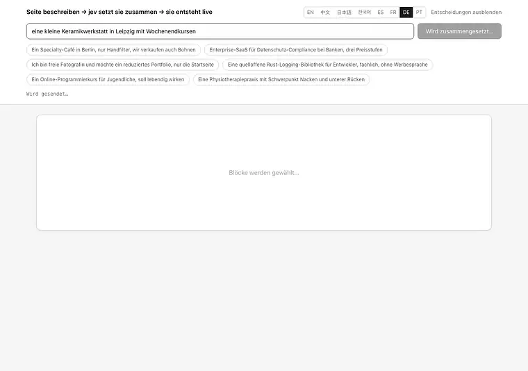
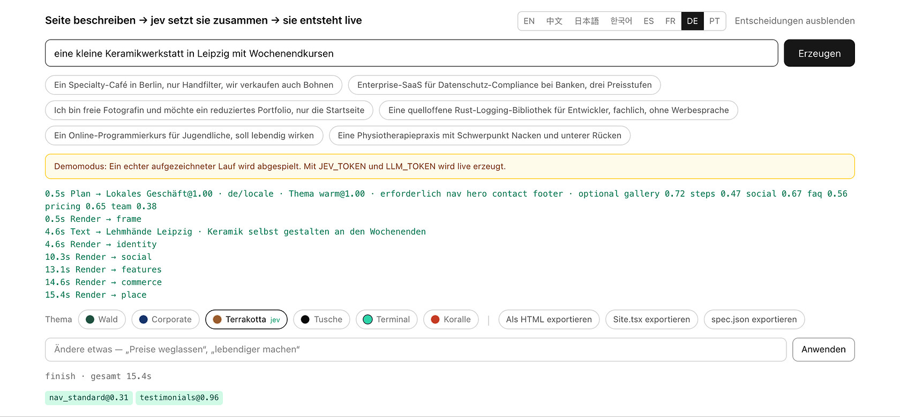
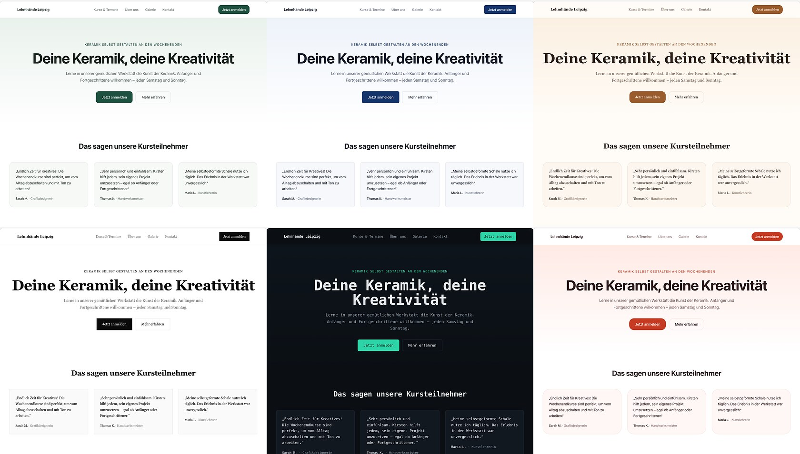

[English](../README.md) · [简体中文](README.zh.md) · [日本語](README.ja.md) · [한국어](README.ko.md) · [Español](README.es.md) · [Français](README.fr.md) · **Deutsch** · [Português](README.pt.md)

# loom

<p align="center">
  <a href="https://github.com/yldm-tech/loom/actions/workflows/ci.yml"></a>
  <a href="../LICENSE"></a>
  <a href="https://github.com/yldm-tech/loom/stargazers"></a>
  <a href="https://github.com/yldm-tech/loom/commits/main"></a>
  
  <a href="https://typesafe.ai"></a>
</p>

> Drei Fäden zu einem Stoff verwoben: Den Text schreibt ein LLM, das Urteil fällt Jev, die Regeln setzt der Code.

Beschreibe dein Geschäft in einem Satz und bekomme eine Landingpage, die man wirklich benutzen kann.

<p align="center">
  
</p>

```
„Ein Specialty-Café in Berlin, nur Handfilter“

0,7 s   vollständiges Gerüst (Blöcke, Reihenfolge und Palette stehen bereits fest)
4,5 s   Kopfbereich und Fußzeile mit echtem Text gefüllt
13 s    alle Blöcke sitzen
```

Das Gerüst trägt sein Thema schon im ersten Einzelbild, weil der Plan vor jedem Text eintrifft. Im Demomodus aufgezeichnet: genau das sieht man nach `npm run dev` ganz ohne Schlüssel.

Das Besondere ist nicht, dass eine KI eine Seite baut. Es ist, dass **jede der drei Schichten nur das tut, was sie gut kann**.

## Warum drei Schichten

Ein generatives Modell schreibt alles, aber niemand garantiert, dass die Struktur gültig ist. Ein eingeschränktes Modell ist immer gültig, erfindet aber kein einziges Wort. Nimm nur eines von beiden oder mische sie achtlos, und irgendwo bricht etwas weg.

Dieses Projekt teilt Entscheidungen danach auf, **wo die Information liegt**:

| Schicht | Zuständig für | Weil |
|---|---|---|
| **LLM** | Den Text sowie Fakten über das Geschäft (wie viele Verkaufsargumente, wie viele Preisstufen, gibt es eine Oberfläche zu zeigen) | Nichts davon existiert im System; es kann nur erzeugt werden |
| **[Jev](https://typesafe.ai)** | Seitenarchetyp, visuelles Thema, ob ein Block hingehört, welche Art sozialer Beleg | Die Antwort steckt bereits in dem, was die Person gesagt hat — das ist ein Urteil |
| **Code** | Layoutregeln, Blockreihenfolge, Pflichtblöcke, Freigabe nach Datenlage | Das sind Regeln; ein Modell dafür zu fragen ist die falsche Adresse |

Der Prüfstein ist einfach: **dauerhaft niedrige Konfidenz heißt, dass die falsche Instanz gefragt wurde** — entweder enthält die Eingabe die Antwort nicht, oder die Frage brauchte gar kein Urteil.

Dieses Muster tauchte während der Entwicklung viermal auf. Jedes Mal bestand die Lösung darin, die Frage durch eine sachliche plus eine Coderegel zu ersetzen:

```
jev fragen „Raster oder Liste?“                → 0,16  ← die Anfrage sagt dazu nichts
das LLM melden lassen „wie viele Punkte?“      → Code: ab 5 wird es ein Raster     deterministisch

jev fragen „Kopfbereich zentriert oder geteilt?“ → 0,28  ← dasselbe Problem
das LLM melden lassen „gibt es einen Screenshot?“ → Code: geteilt nur mit Screenshot deterministisch

jev fragen „welche Sprache ist das?“           → 0,76  ← und die Antwort war falsch
die Schrift im Code erkennen                   → jev nur: „wird eine andere
                                                  Sprache verlangt?“              aufteilen

jev fragen „welches visuelle Thema?“           → 0,99  ← „lebendig“, „Bankkunden“ stehen da
bleibt so                                                                           Urteil
```

## Gemessenes Verhalten von Jev

| Urteil | Konfidenz |
|---|---|
| Verlangte Sprache (1 von 9, wenn verlangt) | 1,00 |
| Visuelles Thema (1 von 6) | 0,98 – 1,00 |
| Seitenarchetyp (1 von 6) | 0,62 – 1,00 |
| Änderungsabsicht (1 von 6) | 0,98 – 1,00 |
| Art des sozialen Belegs (1 von 3) | 0,70 – 0,97 |

```
Café               → lokales Geschäft@1,00  warm@0,99      → Nav HeroCentered Testimonials Gallery Pricing Contact FAQ Footer
Fotografin         → lokales Geschäft@0,62  ink@1,00       → Nav HeroCentered Testimonials Gallery Pricing Contact Footer
Compliance-SaaS    → Landingpage@1,00       corporate@1,00 → Nav HeroSplit Testimonials FeatureGrid Steps Pricing FAQ CTABand Footer
```

Jede davon ist **eine einzige, sich gegenseitig ausschließende Wahl**: Die Wahrscheinlichkeiten müssen sich zu eins summieren, ein Ablenker kann also nur gewinnen, indem er der richtigen Antwort Masse wegnimmt. Fragt man stattdessen „ein unabhängiges Ja/Nein pro Kandidat“, rutschen bei 40 Optionen rund 5 % als Falschpositive durch. Dieser Unterschied ist strukturell und lässt sich nicht durch Umformulieren des Prompts beheben.

Jev kostet etwa drei Aufrufe, unter einer Sekunde, in der Größenordnung von 0,001 $ pro Seite. **Der Engpass ist immer das LLM beim Texten.**

## Starten

Es läuft auch ohne Schlüssel. `npm run dev` und öffnen — das ist der **Demomodus**: ein echter aufgezeichneter Lauf, im ursprünglichen Takt abgespielt, und die Oberfläche sagt das unmissverständlich.

```bash
git clone https://github.com/yldm-tech/loom
cd loom
npm install
npm run dev          # Demomodus, ohne Konfiguration
```

Mit Schlüsseln wird echt erzeugt:

```bash
cp .env.example .env.local   # JEV_TOKEN und LLM_TOKEN eintragen
```

`JEV_TOKEN` gibt es bei [typesafe.ai](https://typesafe.ai). `LLM_TOKEN` funktioniert mit jedem OpenAI-kompatiblen Endpunkt — OpenAI, OpenRouter, ein Gateway, ein lokales llama.cpp — es genügt, `LLM_BASE_URL` und `LLM_MODEL` zu setzen.

Die Dateien unter `fixtures/` sind **tatsächlich aufgezeichnete Läufe**, nicht von Hand geschrieben. Eine Demo, die sich auf erfundene Ausgaben stützt, die niemand reproduzieren kann, ist schlechter als gar keine Demo.

Im Demomodus lässt sich ebenfalls bearbeiten, aber nicht über Jev — es gibt keinen Schlüssel, um es aufzurufen. Eine Wortliste bildet eine Handvoll Anweisungen auf Ergebnisse ab, die die Oberfläche allein anwenden kann, und deshalb steht dort bei jeder Konfidenz 1,00. Diese Liste ist die eine Stelle, an der eine zusätzliche Oberflächensprache still etwas kaputtmachen kann, also schickt ein Test die Vorschläge aus dem Platzhalter jeder Sprache wieder durch sie hindurch: vier Locales sind ohne diese Prüfung erschienen, und kein einziger Vorschlag, den die Anwendung dort machte, bewirkte etwas.

## Nachträglich ändern

<p align="center">
  
</p>

Jedes Urteil von Jev, mit Konfidenz und Zeitpunkt. Eine Änderung, die danebengeht, lässt sich nachvollziehen statt rätselhaft zu bleiben.

Sag in normaler Sprache, was du willst. Eine Anfrage, 200–400 ms, und **es wird kein Text neu erzeugt**:

| Du sagst | Ergebnis |
|---|---|
| Preise weglassen | `remove` → pricing `1,00` |
| eine lebendigere Farbwelt | `theme` → coral `1,00` |
| Navigationsleiste zentrieren | `restyle` → nav_centered `1,00` |
| anderen Navigationsstil | `restyle` → irgendein anderer (`0,34`, alle drei passen) |
| Features als Liste | `restyle` → features_list `1,00` |
| deploy das für mich | `unclear` `1,00` |

Die letzte Zeile zählt am meisten: **Was es nicht kann, sagt es**, statt die Anfrage auf die nächstbeste verfügbare Änderung zu biegen.

Dahinter steht [spekulatives Fan-out](https://docs.typesafe.ai/patterns/fan-out.md): Welcher Block entfernt, welcher ergänzt, welches Thema, welcher Block umgestaltet wird — alles in einer Anfrage, und der Code liest nur den Zweig, der gewonnen hat. Mehr Tokens, ein Roundtrip weniger.

### Dieselben 0,34, mal blockiert und mal nicht

```
anderen Navigationsstil      → restyle@1,00  variant=nav_centered@0,34   ausgeführt (beliebig)
Stil der Navileiste ändern   → theme@0,87    theme_target=coral@0,15     blockiert
```

„Ändere es“ nennt kein Ziel; schließt man die aktuelle Variante aus, sind die drei übrigen alle vertretbar, und eine gleichmäßige Verteilung ist die **richtige Antwort**. Als „Stil der Navileiste ändern“ dagegen als Umfärben der ganzen Seite gelesen wurde, hieß dieses 0,15, dass völlig offen war, worauf geändert werden soll — und das muss blockiert werden.

**Ein Schwellenwert ist keine globale Konstante. Er ergibt sich aus den Kosten des Irrtums.**

## Sprache sind zwei Fragen, nicht eine

„In welcher Sprache soll diese Seite geschrieben sein?" sieht nach einem einzigen Urteil aus, und hier war es eine Zeit lang auch eines. Über zehn Anfragen gemessen, beantwortete dieses eine Choice eine englische Anfrage mit `zh` bei 0.76 Konfidenz und lag bei einer anderen zwar richtig, aber nur bei 0.63. Drei von zehn kamen unter 0.85 zurück.

Die niedrige Konfidenz war das Signal — die Frage waren zwei übereinandergelegte Fragen:

| Frage | Wer beantwortet sie | Wie |
|---|---|---|
| In welcher Schrift ist diese Anfrage geschrieben? | Code | Kana, Hangul und Han sind drei reguläre Ausdrücke. Lateinische Schrift lässt sich aus dem Text heraus nicht weiter eingrenzen, also entscheidet das locale des Editors selbst |
| Verlangt sie eine andere Sprache als die, in der sie geschrieben ist? | Jev | Die Antwort steht im Satz, und nur wer liest, kann sie sehen |

So getrennt wurden beide Hälften scharf. Über elf Anfragen trennte die Frage nach dem ausdrücklichen Wunsch ihre beiden Populationen bei 0.03 gegen 0.85, ohne eine einzige falsch zu lesen, und die Anschlussfrage „welche denn?" beantwortete alle vier Fälle mit 1.00.

```
我在杭州开了家咖啡店                         → zh  script
A small bakery in Brooklyn                 → en  locale
東京で小さなラーメン屋をやっています            → ja  script
我做外贸的，帮我做个英文站，客户都在北美         → en  request @1.00   ← verlangt, nicht erkannt
```

Die vierte Zeile bleibt der Punkt. **Worin Sie schreiben, ist nicht, was Sie geschrieben haben wollen** — jemand beschreibt sein Geschäft auf Chinesisch, braucht aber für Kunden im Ausland eine englische Seite, und sagt das meist in genau diesem Satz. Dieser Teil ist ein Urteil und bleibt bei Jev. In welcher Schrift getippt wurde, nicht.

Vereinfacht gegen traditionell ist die einzige Unterscheidung, die der Code nicht versucht: Sie betrifft Markt und Wortwahl, nicht die Schrift, deshalb bekommt eine Han-Anfrage ein zusätzliches Choice zwischen `zh` und `zh-Hant`.

### Die Sprache zu entscheiden ist nur die Hälfte

Die Seite kam weiterhin auf Chinesisch zurück. Das Feld-Schema der Copy-Schicht ist bis hinunter zu seinen `字`-Zählungen auf Chinesisch geschrieben, und mit der Sprachregel in der Präambel folgte das Modell dem Schema statt der Anweisung: eine französische Anfrage erzeugte 476 chinesische Zeichen, eine deutsche 429. Die Regel hinter das Schema zu verschieben, behob das Französische, nicht das Deutsche. Sie zusätzlich im User-Turn zu wiederholen, brachte Französisch, Deutsch, Koreanisch und Englisch alle auf null.

Drei Feldbeschreibungen verlangten zudem von sich aus eine chinesische Seite — der `name` eines Teammitglieds war als „ein chinesischer Name" angegeben, Preise als `¥`, Zahlen in `万`. Sie folgen jetzt der Copy-Sprache, und die Währung folgt dem Standort des Geschäfts statt der Sprache, sodass eine englische Seite für ein Kyotoer Atelier weiterhin in Yen auszeichnet.

Unterstützt `en` / `zh` / `ja` / `ko` / `es` / `fr` / `de` / `pt` / `zh-Hant`. Die Längenangaben sind für Chinesisch geschrieben, andere Sprachen bekommen deshalb einen Umrechnungshinweis.

Die Editor-Oberfläche ist eine andere Sache: acht Sprachen, gewählt anhand von `navigator.languages` und von Hand umschaltbar. Die Übersetzungen liegen in `locales/*.json`; eine Sprache hinzuzufügen heißt, eine Datei und eine Zeile hinzuzufügen. **`zh.json` ist die Referenz, und Tests prüfen, dass die anderen Dateien exakt deren Schlüssel tragen** — eine halbfertige Übersetzung lässt die CI rot werden, statt zur Laufzeit stillschweigend auf Chinesisch zurückzufallen.

## Export

Sechs Formate, alle aus **demselben gerenderten Ergebnis**. Es gibt keine zweite Kopie des Layout-Codes.

| Export | Größe | Für |
|---|---|---|
| `site.html` | 36 KB | Online stellen oder einfach doppelklicken |
| `Site.tsx` | 34 KB | Weiterentwickeln; kompiliert unter `tsc --strict` |
| `spec.json` | ein paar KB | Archivieren oder einem anderen Renderer geben |
| `site.registry.json` | `Site.tsx`, verpackt | Die Seite in ein Projekt installieren, das schon shadcn/ui nutzt |
| `AGENTS.md` | eine Seite | Die Seite einem Coding-Agent übergeben: Tokens, Blöcke, Herkunft der Komponenten |
| `bundle.zip` | die anderen fünf | Alles auf einmal übergeben, mit einer `CLAUDE.md`, die auf die Einweisung zeigt |

### Site.tsx

Eine einzige flache Komponente, außer React ohne Abhängigkeiten. Farben, Schriften und Radien stehen alle in einem einzigen Style-Objekt am äußersten Element — ein Themenwechsel ist also eine Änderung an genau einer Stelle. Tailwind-Klassennamen bleiben erhalten.

Alles, was die Seite mit CSS statt mit Markup zeichnet, muss als Text mitkommen, sonst verschwindet es aus einer Datei, die kein Stylesheet mitbringt. Die Anführungszeichen wanderten irgendwann in `content: open-quote`, und der Export verlor sie alle — übrig blieb nur der Klassenname, der auf eine Regel zeigte, die nicht mitgeliefert wird. Sie werden jetzt aufgelöst und in das JSX geschrieben, direkt am Text: JSX macht aus dem Zeilenumbruch zwischen zwei Textstücken ein Leerzeichen, und `« so »` ist in jeder Sprache falsch, die keines verlangt.

Auf eine Aufteilung in Komponenten wird bewusst verzichtet: Eine generierte Datei, die man von oben nach unten lesen und selbst zerlegen kann, ist mehr wert als eine Struktur, die man erst rückwärts verstehen muss.

Die Prüfung ist ein echter Lauf von `tsc --noEmit --strict --jsx react-jsx`, **bewertet nach dem Exit-Code**. So kam heraus, dass die erste Fassung nicht kompilierte: CSS-Custom-Properties sind in `React.CSSProperties` nicht zulässig. Jetzt wird ein `as CSSProperties` ausgegeben.

### site.html

Das gerenderte Ergebnis plus **nur die CSS-Regeln, die tatsächlich verwendet werden**.

```
gesamtes CSS der Seite   22 KB      ← Tailwind entfernt Ungenutztes im Produktionsbuild bereits
tatsächlicher Export     29 KB      ← inklusive HTML
Stile des Editors        entfernt   ← kein Eingabefeld, keine Knöpfe, kein Protokoll
```

Gefiltert wird, indem jeder Selektor mit `root.matches()` / `root.querySelector()` geprüft wird; Pseudoklassen werden abgestreift und mit dem Basisselektor erneut versucht, `@media` wird rekursiv durchlaufen und der ganze Block verworfen, wenn innen nichts überlebt, `:root` und `@font-face` bleiben bedingungslos erhalten. **Ein Selektor, der sich nicht parsen lässt, bleibt drin statt zu verschwinden** — eine etwas größere Datei ist besser als eine still kaputte.

An Größe spart das nur 16 % (Tailwind war nie das Problem). Der eigentliche Gewinn ist, dass die exportierte Seite nicht mehr das Styling des Editors mitschleppt. Siehe `lib/export.ts`; es gibt **keinen zweiten Renderer**, das Blocklayout existiert nur in `app/registry.tsx`.

### site.registry.json

Ein [shadcn-Registry](https://ui.shadcn.com/docs/registry)-Item, die Seite installiert sich also wie jede andere shadcn-Komponente:

```bash
npx shadcn@latest add ./site.registry.json
```

Ein Befehl schreibt die Komponente in das Verzeichnis, das die `components.json` des Projekts als Komponentenordner ausweist, und führt die 17 Tokens des Themes mit dessen Stylesheet zusammen. Die Abhängigkeitsliste ist mit Absicht leer: `Site.tsx` importiert einen Typ aus React und sonst nichts, und sie zu füllen hieße, die CLI Pakete installieren zu lassen, die die Datei nie benutzt. Die CLI nimmt einen lokalen Pfad an, es muss also vorher nichts gehostet werden — die Datei, die der Browser gerade heruntergeladen hat, funktioniert dort, wo sie gelandet ist.

Das Item trägt denselben `Site.tsx`-Quelltext; es ist kein zweites Rendern der Seite. Die Tokens reisen als `cssVars` mit, denn eine Komponente, die in einem Projekt mit eigenen Variablen landet, wird in dessen Farben gezeichnet — und das ist nicht die Seite, die jemand exportiert hat. Ihre Schlüssel stehen ohne führendes `--`, weil die CLI das selbst ergänzt: als `--accent` geschrieben, kommt der Token in der Tailwind-Brücke als `var(----accent)` an, löst sich zu nichts auf, und die Installation meldet trotzdem Erfolg.

### AGENTS.md

Eine kurze Einweisung für den Coding-Agent, der den Export aufnimmt: `spec.json` ist die maßgebliche Beschreibung der Seite, hier sind die 17 Theme-Tokens mit ihren Werten, hier sind die Blöcke, die diese Seite tatsächlich hat, und hier sind die Komponentenquellen, die zu diesen Blöcken passen. Geschrieben, um vor der Arbeit einmal gelesen zu werden, nicht als Dokumentation für einen Menschen.

### bundle.zip

Die anderen fünf in einem Archiv, dazu eine `CLAUDE.md`, deren gesamter Inhalt `@AGENTS.md` lautet — Claude Code sucht nach diesem Dateinamen und importiert, worauf die Zeile zeigt, also wird die Einweisung gelesen statt ungeöffnet neben dem Markup zu liegen. Ein Verweis, keine zweite Kopie.

Fünf Knöpfe sind fünf Gelegenheiten, eine Datei zu verlieren, und verloren geht `AGENTS.md`, weil sie als einzige der fünf nicht wie die Seite aussieht. Was dem empfangenden Agent dann bleibt, ist Markup ohne jede Auskunft darüber, was geändert werden darf, worin der Vertrag des Themes besteht und wo bessere Komponenten liegen.

Das Zip ist von Hand geschrieben, STORE und ohne Kompression — die Alternative wäre eine Abhängigkeit gewesen, und die Nutzlast ist Text, der bei der Ankunft einmal ausgepackt wird. Zwei Details tragen dabei alles. Größen und CRCs werden über UTF-8-Bytes gemessen und nicht über die Stringlänge, weil der Text regelmäßig CJK enthält und eine am JavaScript-String genommene Länge eine kleinere Zahl ergibt; das Archiv öffnet dann in dem Werkzeug, das dieses Feld ignoriert, und scheitert überall sonst. Und der Zeitstempel ist fest statt von der Uhr gelesen: dieselbe Seite zweimal exportiert ergibt dieselben Bytes, und ein Test kann das behaupten.

## Komponenten, die das Stehlen wert sind

Der Weg ist der bequeme: einem Coding-Agent eine gute Bibliothek zeigen und ihn auswählen, anpassen und einfügen lassen. `lib/sources.ts` ist die Tabelle, die er dabei liest: fünf Bibliotheken, jede mit ihrer Rolle, ihrer Lizenz, ihrem Installationsbefehl, den maschinenlesbaren Endpunkten, die bei der Prüfung geantwortet haben, den Slots, die sie verbessern kann, und dem Haken, der beißt.

| Quelle | Was es ist | Weg hinein |
|---|---|---|
| [shadcn/ui](https://ui.shadcn.com) | 63 zugängliche React-Primitive auf Radix, dazu die Registry-Spezifikation, auf die die anderen vier zielen | `npx shadcn@latest add <name>` |
| [beUI](https://beui.dev) | 85 animierte Komponenten als shadcn-kompatible Registry, mit MCP-Endpunkt | `npx shadcn@latest add https://beui.dev/r/<name>.json` |
| [Rare UI](https://rareui.com) | Rund 20 animierte Einzeldatei-Widgets — zähflüssige Navigation, Näherungs-Sidebar, Kilometerzähler | `npx shadcn@latest add swamimalode07/rare-ui/<name>` |
| [Transitions](https://transitions.dev) | Rund 44 benannte Bewegungsschnipsel in reinem CSS, im Namensraum `.t-*` | `npx transitions-dev add <slug>` |
| [Beautiful UI](https://beautifului.dev) | 21 Primitive für Oberflächen von KI-Anwendungen | Nur Kopieren und Einfügen im Browser; keine CLI, keine Registry |

**Keine der fünf liefert einen Abschnitt einer Marketingseite.** Kein Kopfbereich, keine Kundenstimmen, kein Teamraster, keine Fußzeile in der ganzen Auswahl — es sind Primitive, Bewegung und Widgets in App-Form. Eine Quelle verbessert also einen Block, den loom ohnehin rendert; sie ersetzt ihn nie, und `role` ist das Feld, das sagt, welche Art von Verbesserung zu erwarten ist. Ein Agent, der die Tabelle als Blockkatalog liest, sucht in shadcn/ui nach einem Kopfbereich und findet `/blocks/login`.

Auch die Lizenzen sind nicht einheitlich. Vier sind MIT; Transitions hat eine eigene Lizenz, die das Weiterverbreiten eines wesentlichen Teils der Sammlung untersagt, seine Schnipsel dürfen also auf einer Seite verwendet, aber nicht in dieses Repository übernommen werden.

Jede url und jeder Endpunkt in dieser Tabelle wurde abgerufen und geprüft statt aus dem Gedächtnis notiert, und verrotten werden sie trotzdem:

```bash
npm run sources   # ruft jeden Endpunkt erneut ab und meldet, wie viele Komponenten er noch listet
```

## Ohne Browser erreichbar

Jene Tabelle ordnet die fünf danach, wie viel eine Maschine von ihnen unbeaufsichtigt erreichen kann: drei veröffentlichen eine `llms.txt`, eine betreibt einen MCP-Server, drei installieren sich per CLI. loom, das diese Tabelle geschrieben hat, veröffentlichte nichts davon — alles, was es über die eigenen Blöcke, Themes und Quellen wusste, war nur erreichbar, wenn ein Mensch in einem Tab klickte. Das sind die Oberflächen, nach denen es die anderen benotet hat.

### MCP-Server

```bash
claude mcp add loom -- npm run --silent mcp
```

Fünf Werkzeuge, alle nur lesend: die Tabelle der Komponentenquellen, die Quellen zu einem benannten Block, die 13 Blöcke mit ihren Varianten und den Archetypen, die sie verlangen, die sechs Themes samt dem Raster, nach dem Jev wählt, und die 17 Tokens eines Themes mit ihren Werten.

Jede Antwort wird beim Eintreffen des Aufrufs aus `lib/plan.ts`, `lib/themes.ts` und `lib/sources.ts` gelesen; in `lib/mcp.ts` steht nichts davon noch einmal. Ein Werkzeug mit einer eigenen Kopie der Blockliste antwortet auch dann noch mit voller Überzeugung, wenn sich die Liste geändert hat, und der Agent am anderen Ende hat keine Möglichkeit, das zu merken.

Das JSON-RPC-Gerüst ist ausgeschrieben statt aus dem MCP-SDK übernommen, denn **hier wurde keine Abhängigkeit hinzugefügt**. Ein Server, der nur Werkzeuge anbietet, schuldet einem Client `initialize`, `tools/list`, `tools/call` und die Disziplin, auf `notifications/initialized` überhaupt nichts zu antworten — eine Antwort, auf die niemand wartet, schiebt jede spätere Antwort auf die falsche Anfrage. `scripts/mcp.mjs` ist nur die Pumpe: sie trennt stdin an Zeilenumbrüchen und behält den Rest einer angefangenen Zeile, weil eine Chunk-Grenze keine Nachrichtengrenze ist und ein echter Client den Handshake schnell genug sendet, dass zwei Nachrichten zusammen ankommen.

Zwei der Antworten sind bewusst mehr als ein Nachschlagen. Ein Blockname, den loom nicht hat, kommt als leere Liste *mit einer Erklärung* zurück, nie als Vermutung, und ein echter Block, den keine Quelle abdeckt, sagt das auch — eine leere Liste allein liest sich wie eine fehlgeschlagene Suche. Ein unbekannter Theme-Name kommt mit der Ersatzpalette zurück, **als Ersatz gekennzeichnet**: `themeVars()` antwortet auf alles Unbekannte mit `forest`, was fürs Rendern richtig ist und falsch, einem Agent unbeschriftet in die Hand zu geben, weil er einen grünen Knopf einfügen würde im Glauben, er habe `terminal` verlangt.

### /llms.txt

Dasselbe Format, das drei der fünf katalogisierten Quellen veröffentlichen, pro Anfrage aus `lib/plan.ts`, `lib/themes.ts` und `lib/sources.ts` erzeugt, damit es von dem, was das Deployment tatsächlich ausführt, nicht abweichen kann. Ein Test geht die echten Tabellen durch, also schlägt das Hinzufügen eines Blocks, eines Themes oder einer Quelle ohne Änderung an `lib/llms.ts` fehl, statt ein Dokument auszuliefern, das sie auslässt.

Es folgt llmstxt.org wörtlich: eine H1, ein Zitat, Fließtext ohne jede Überschrift, dann H2-Abschnitte, in denen jede Zeile ein Link-Eintrag ist. Genau diese letzte Regel ist der Grund, warum Blöcke, Themes, Tokens, Exporte und Quellen Fließtext sind und keine eigenen Abschnitte: keines von ihnen hat eine URL, und ein erfundenes `/docs/blocks` zur Erfüllung der Form würde einen Agent auf einen 404 schicken. Fremde Endpunkte stehen als Code-Fragmente da, sodass jeder Link, dem ein Agent folgen kann, einer ist, den diese Origin auch beantwortet.

Die Origin stammt aus der Anfrage und nicht aus einer Konstante zur Build-Zeit, denn derselbe Build antwortet auf localhost, auf einem Preview-Host und auf einer eigenen Domain, und eine einkompilierte Adresse ist genau der Fehler, der nur in der einen Umgebung auftaucht, die niemand getestet hat. Die beiden Abschnitte, die wirklich Links sind, sind `POST /api/generate` und `POST /api/edit`, mit ihren Request-Bodies und der Form dessen, was zurückkommt.

## Themes sind Daten

<p align="center">
  
</p>

Derselbe generierte Text in allen sechs Themes. Umschalten ist eine einzige Prop-Änderung im Client: kein Modellaufruf, keine Neuerzeugung.

Sechs Themes, jedes ein vollständiger Satz Design-Tokens. Alle Farben in `app/registry.tsx` kommen aus CSS-Variablen, mit **genau einer Ausnahme**, die ein Test bei einer hält: die drei macOS-Ampelpunkte im nachgebauten Screenshot im geteilten Hero, die den Fensterrahmen eines anderen Betriebssystems zeichnen und nicht die Palette von loom.

| Theme | Charakter | Passt zu |
|---|---|---|
| `forest` | Tiefes Grün + Naturweiß | Werkzeuge, Open Source, Outdoor |
| `corporate` | Marineblau + 6px Radius | Finanzen, Recht, Konzerne |
| `warm` | Karamell + Serife + 16px Radius | Gastronomie, Handwerk, Pensionen |
| `ink` | Reines Schwarzweiß, Radius null, viel Luft | Fotografie, Portfolios, Verlag |
| `terminal` | Dunkler Grund + Monospace + Türkis | Entwicklerwerkzeuge, Infrastruktur |
| `coral` | Leuchtendes Orange + 20px Radius | Consumer, Bildung, Social |

Inhalt, Struktur und Erscheinung sind vollständig entkoppelt.

## 13 Blöcke, 6 Seitenarchetypen

Blöcke: Navigation (4 Varianten), Kopfbereich (2), sozialer Beleg (3), Features (2), Galerie, Vergleich, Ablauf, Team, Preise (2), Kontakt, FAQ, Handlungsaufruf, Fußzeile.

Der Archetyp legt fest, welche Blöcke **Pflicht** sind — kein Modell darf den Kopfbereich einer Landingpage oder die Adresse eines lokalen Geschäfts streichen.

| Archetyp | Pflicht | Optional |
|---|---|---|
| Landingpage | nav hero features cta footer | social pricing faq gallery steps |
| Lokales Geschäft | nav hero **contact** footer | gallery steps social faq pricing |
| Technische Detailseite | nav hero features footer | faq social steps |
| Preisseite | nav pricing faq cta footer | social hero |
| Open-Source-Startseite | nav hero features footer | faq social pricing |
| Minimale Einzelseite | hero | nav footer |

## Tests

Barrierefreiheit wird zweimal geprüft, auf zwei verschiedene Arten.

`npm test` rechnet den WCAG-Kontrast aus den Theme-Tokens neu aus — ohne Browser, läuft also in der CI. Jedes Paar aus Akzent/Text, Band/Text und Hintergrund/Fließtext muss 4,5:1 überschreiten; gedämpfter Text, der nie allein Information trägt, muss 3:1 überschreiten.

```bash
npm run dev          # der Demomodus genügt
npm run audit:a11y   # axe-core auf der erzeugten Seite, alle sechs Themes
```

Die Prüfung braucht einen laufenden Server und `npx playwright install chromium` und bleibt deshalb ein Skript außerhalb der CI. Sie fand genau ein echtes Problem: Der Akzent von `coral` war `#e2553d` und ergab mit weißer Schrift 3,75:1 — unter AA. Auf `#c53a22` (5,25:1) abgedunkelt, gleicher Farbton. Alle sechs Themes melden jetzt keine Verstöße.


```bash
npm test          # 362 Stück, rund 1,5 s, ohne Netz
```

Sie decken **die drei dem Modell abgenommenen Regeln** ab: Die Anzahl der Verkaufsargumente entscheidet Raster oder Liste, die Anzahl der Preisstufen entscheidet Einzelkarte oder Vergleich, und ob es einen Oberflächen-Screenshot gibt, entscheidet das Layout des Kopfbereichs. Driftet eine davon, geht die Entscheidung still an ein Modell zurück, das sie nicht treffen kann — sie dürfen sich also nicht bewegen.

Ebenfalls abgedeckt: der Vertrag des Katalogs, jetzt durchgesetzt statt bloß erklärt — ein Block, dessen Props das Schema nicht erfüllen, das `lib/catalog.ts` für ihn festlegt, hält seinen Platz als Skelett, statt bei einem Renderer zu landen, der nur castet; die Freigabe nach Datenlage (ein leeres Array zählt als fehlend, nicht als bereit), die Abschlussreihenfolge von `asSettled` und die Kanten des JSX-Serialisierers — Custom Properties brauchen `as CSSProperties`, Semikolons in einem Farbverlauf sind keine Trennzeichen, Text mit geschweiften Klammern muss eingefasst werden, und weder die Animationsklasse `blk-in` noch der `<style>`-Block dürfen in den Export gelangen. Die an Agenten gerichteten Oberflächen bekommen dieselbe Behandlung: `bundle.zip` wird von einem zweiten, bewusst langsamen Zip-Leser zurückgelesen, der in der Testdatei steht und nicht von dem Schreiber, der es erzeugt hat; `/llms.txt` wird gegen die Form von llmstxt.org geparst und Zeile für Zeile mit den echten Block-, Theme- und Quellentabellen abgeglichen; und der MCP-Server wird durch den Handshake, durch jedes Werkzeug, das er ankündigt, und durch eine Reihe kaputt eintreffender Nachrichten geführt.

Dazu strukturelle Invarianten: Jeder von einem Archetyp referenzierte Slot muss existieren, Pflicht und Optional dürfen sich nicht überschneiden, `SLOT_ORDER` muss jeden Slot genau einmal abdecken, und jede Variante muss die Felder deklarieren, die sie braucht.

Die Sprachdateien haben ihren eigenen Satz: Die Schlüssel müssen exakt zu `zh.json` passen, keine leeren Werte, gleich viele Beispiele, und die Beispiele jeder Sprache müssen wirklich in deren Schrift geschrieben sein.

**Jeder Test wurde anschließend per Mutation geprüft**, denn eine Suite, die beim Schreiben sofort durchläuft, beweist nichts:

```
Rasterschwelle 5 → 4                → rot ✓   fehlender Schlüssel in ja.json → rot ✓
Bedingung des Kopfbereichs umdrehen → rot ✓   leerer Wert in ja.json         → rot ✓
leeres Array als bereit gelten      → rot ✓   zwei Beispiele weniger         → rot ✓
CSSProperties-Cast entfernen        → rot ✓   englisches Beispiel in ko.json → rot ✓
style-Blöcke nicht mehr filtern     → rot ✓
```

## Aufbau

```
lib/
  catalog.ts           Komponentenvertrag: welche Blöcke auftreten dürfen und ihre Props
  themes.ts            6 Token-Sätze und das Raster, nach dem Jev wählt
  plan.ts              Archetypen, Slot-Varianten, Coderegeln in layoutRules()
  content.ts           die Form des Textes und wie er jeden Block füllt
  content-parallel.ts  vier parallele Teile, Wiederholung, Formprüfung, Bereitschaft
  compose.ts           Orchestrierung der drei Schichten, als Stream
  edit.ts              Erkennung der Änderungsabsicht (spekulatives Fan-out)
  export.ts            eigenständiges HTML, nur das genutzte CSS
  export-tsx.ts        React-Quellexport, DOM → JSX
  export-registry.ts   derselbe Quelltext als shadcn-Registry-Item, Tokens inklusive
  export-agents.ts     AGENTS.md: Spec, Tokens, Blöcke und Herkunft der Komponenten
  export-bundle.ts     alle fünf Exporte plus eine CLAUDE.md, von Hand gezippt
  llms.ts              /llms.txt, gebaut aus plan.ts, themes.ts und sources.ts
  mcp.ts               die fünf MCP-Werkzeuge und das JSON-RPC-Gerüst, rein und synchron
  i18n.ts              Oberflächensprache, liest locales/*.json
  demo.ts              spielt fixtures/ ab, wenn keine Schlüssel gesetzt sind
  sources.ts           fünf Komponentenquellen, aus denen ein Agent schöpfen kann, mit Rollen und Haken
  *.test.ts            Tests reiner Logik, ohne Netz
locales/
  en|zh|ja|ko|es|fr|de|pt.json   Oberflächenübersetzungen, zh ist die Referenz
fixtures/
  en|zh|ja|ko.jsonl    echte aufgezeichnete Läufe für den Demomodus
app/
  page.tsx             der Editor, Stream-Verarbeitung, Theme- und Variantenwechsel im Client
  registry.tsx         wie die Blöcke aussehen, über CSS-Variablen
  llms.txt/            die Route /llms.txt
  api/generate         Erzeugung
  api/edit             Änderungen
scripts/
  mcp.mjs              stdio-Pumpe des MCP-Servers; das Protokoll steht in lib/mcp.ts
  sources.mjs          prüft jede url und jeden Endpunkt aus sources.ts erneut
  record-fixture.mjs   zeichnet echte Läufe nach fixtures/ auf
  capture-docs.mjs     die Screenshots und Aufnahmen für die README
  audit-a11y.mjs       axe-core gegen einen laufenden Demomodus-Server
```

## Bekannte Grenzen

- **Das LLM liefert ungültiges JSON.** Gemessen: etwa jeder zweite Lauf. Wiederholung und Formprüfung fangen es ab, aber das gehört zu generativen Modellen; auf der Jev-Seite kam keine einzige fehlerhafte Antwort.
- **13 Sekunden sind nicht schnell**, und alles davon geht für das Texten des LLM drauf. Das Gerüst macht die erste Darstellung nach 0,7 s sichtbar, an der Gesamtzeit ändert das nichts.
- **13 Blocktypen**, es fehlen noch Kontaktformular, Video und Karten. `Gallery` zeichnet eingefärbte Platzhalter mit Bildunterschrift; Bilder erzeugt sie nicht.
- **`Site.tsx` ist ein einziges flaches Stück JSX**, kein bereits aufgeteilter Komponentenbaum. Es kompiliert und lässt sich ändern, aber auf Dauer pflegen heißt, es selbst zu zerlegen.
- **Die Textqualität folgt dem Modell.** Ein stärkeres merkt man deutlich, und dass es langsamer ist, auch.
- **Der MCP-Server beantwortet Fragen über loom; er steuert es nicht.** Die fünf Werkzeuge lesen die Block-, Theme- und Quellentabellen. Eine Seite zu erzeugen oder zu ändern heißt weiterhin, `/api/generate` und `/api/edit` aufzurufen oder den Editor zu öffnen.

## Mitmachen

Siehe [CONTRIBUTING.md](../CONTRIBUTING.md). Für einen neuen Block, ein Theme, eine Oberflächensprache, eine Komponentenquelle oder ein MCP-Werkzeug gibt es jeweils einen kurzen, festgelegten Weg.

## Star History

Wenn der Ansatz nützlich ist, ist ein Stern die direkteste Rückmeldung.

<a href="https://star-history.com/#yldm-tech/loom&Date">
  <picture>
    <source media="(prefers-color-scheme: dark)" srcset="https://api.star-history.com/svg?repos=yldm-tech/loom&type=Date&theme=dark" />
    
  </picture>
</a>

## Lizenz

Apache-2.0. Aufgebaut auf den veröffentlichten npm-Paketen von [json-render](https://github.com/vercel-labs/json-render) (Vercel Labs, Apache-2.0); es wird kein Upstream-Quellcode mitgeliefert. Die Urteile stammen vom Jev-Modell von [TypeSafe](https://typesafe.ai). Siehe `NOTICE`.
