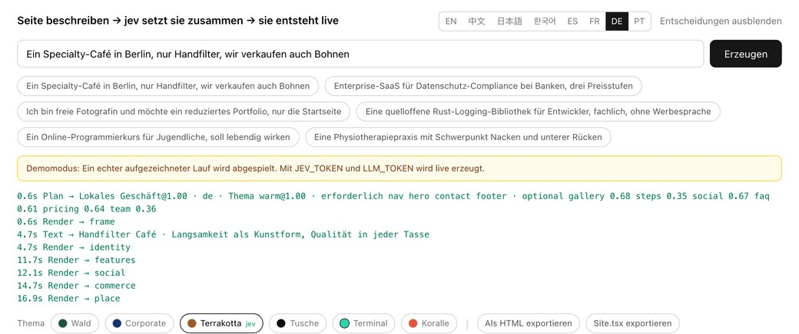
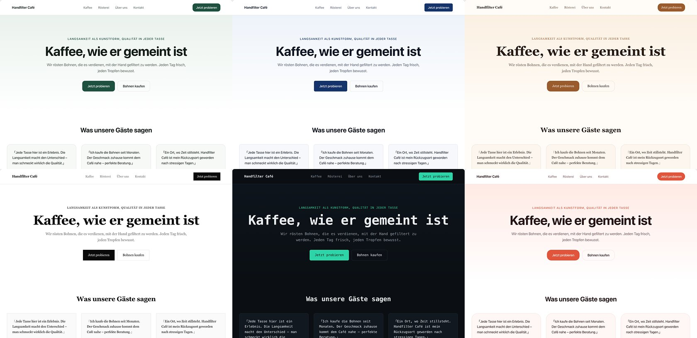

[English](../README.md) · [简体中文](README.zh.md) · [日本語](README.ja.md) · [한국어](README.ko.md) · [Español](README.es.md) · [Français](README.fr.md) · **Deutsch** · [Português](README.pt.md)

# loom

<p align="center">
  <a href="https://github.com/yldm-tech/loom/actions/workflows/ci.yml"></a>
  <a href="../LICENSE"></a>
  <a href="https://github.com/yldm-tech/loom/stargazers"></a>
  <a href="https://github.com/yldm-tech/loom/commits/main"></a>
  
  <a href="https://typesafe.ai"></a>
</p>

> Drei Fäden zu einem Stoff verwoben: Den Text schreibt ein LLM, das Urteil fällt Jev, die Regeln setzt der Code.

Beschreibe dein Geschäft in einem Satz und bekomme eine Landingpage, die man wirklich benutzen kann.

<p align="center">
  
</p>

```
„Ein Specialty-Café in Berlin, nur Handfilter“

0,7 s   vollständiges Gerüst (Blöcke, Reihenfolge und Palette stehen bereits fest)
4,5 s   Kopfbereich und Fußzeile mit echtem Text gefüllt
13 s    alle Blöcke sitzen
```

Das Gerüst trägt sein Thema schon im ersten Einzelbild, weil der Plan vor jedem Text eintrifft. Im Demomodus aufgezeichnet: genau das sieht man nach `npm run dev` ganz ohne Schlüssel.

Das Besondere ist nicht, dass eine KI eine Seite baut. Es ist, dass **jede der drei Schichten nur das tut, was sie gut kann**.

## Warum drei Schichten

Ein generatives Modell schreibt alles, aber niemand garantiert, dass die Struktur gültig ist. Ein eingeschränktes Modell ist immer gültig, erfindet aber kein einziges Wort. Nimm nur eines von beiden oder mische sie achtlos, und irgendwo bricht etwas weg.

Dieses Projekt teilt Entscheidungen danach auf, **wo die Information liegt**:

| Schicht | Zuständig für | Weil |
|---|---|---|
| **LLM** | Den Text sowie Fakten über das Geschäft (wie viele Verkaufsargumente, wie viele Preisstufen, gibt es eine Oberfläche zu zeigen) | Nichts davon existiert im System; es kann nur erzeugt werden |
| **[Jev](https://typesafe.ai)** | Seitenarchetyp, visuelles Thema, ob ein Block hingehört, welche Art sozialer Beleg | Die Antwort steckt bereits in dem, was die Person gesagt hat — das ist ein Urteil |
| **Code** | Layoutregeln, Blockreihenfolge, Pflichtblöcke, Freigabe nach Datenlage | Das sind Regeln; ein Modell dafür zu fragen ist die falsche Adresse |

Der Prüfstein ist einfach: **dauerhaft niedrige Konfidenz heißt, dass die falsche Instanz gefragt wurde** — entweder enthält die Eingabe die Antwort nicht, oder die Frage brauchte gar kein Urteil.

Dieses Muster tauchte während der Entwicklung dreimal auf. Jedes Mal bestand die Lösung darin, die Frage durch eine sachliche plus eine Coderegel zu ersetzen:

```
jev fragen „Raster oder Liste?“                → 0,16  ← die Anfrage sagt dazu nichts
das LLM melden lassen „wie viele Punkte?“      → Code: ab 5 wird es ein Raster     deterministisch

jev fragen „Kopfbereich zentriert oder geteilt?“ → 0,28  ← dasselbe Problem
das LLM melden lassen „gibt es einen Screenshot?“ → Code: geteilt nur mit Screenshot deterministisch

jev fragen „welches visuelle Thema?“           → 0,99  ← „lebendig“, „Bankkunden“ stehen da
bleibt so                                                                           Urteil
```

## Gemessenes Verhalten von Jev

| Urteil | Konfidenz |
|---|---|
| Textsprache (1 von 9) | 0,66 – 1,00 |
| Visuelles Thema (1 von 6) | 0,98 – 1,00 |
| Seitenarchetyp (1 von 6) | 0,62 – 1,00 |
| Änderungsabsicht (1 von 6) | 0,98 – 1,00 |
| Art des sozialen Belegs (1 von 3) | 0,70 – 0,97 |

```
Café               → lokales Geschäft@1,00  warm@0,99      → Nav HeroCentered Testimonials Gallery Pricing Contact FAQ Footer
Fotografin         → lokales Geschäft@0,62  ink@1,00       → Nav HeroCentered Testimonials Gallery Pricing Contact Footer
Compliance-SaaS    → Landingpage@1,00       corporate@1,00 → Nav HeroSplit Testimonials FeatureGrid Steps Pricing FAQ CTABand Footer
```

Jede davon ist **eine einzige, sich gegenseitig ausschließende Wahl**: Die Wahrscheinlichkeiten müssen sich zu eins summieren, ein Ablenker kann also nur gewinnen, indem er der richtigen Antwort Masse wegnimmt. Fragt man stattdessen „ein unabhängiges Ja/Nein pro Kandidat“, rutschen bei 40 Optionen rund 5 % als Falschpositive durch. Dieser Unterschied ist strukturell und lässt sich nicht durch Umformulieren des Prompts beheben.

Jev kostet etwa drei Aufrufe, unter einer Sekunde, in der Größenordnung von 0,001 $ pro Seite. **Der Engpass ist immer das LLM beim Texten.**

## Starten

Es läuft auch ohne Schlüssel. `npm run dev` und öffnen — das ist der **Demomodus**: ein echter aufgezeichneter Lauf, im ursprünglichen Takt abgespielt, und die Oberfläche sagt das unmissverständlich.

```bash
git clone https://github.com/yldm-tech/loom
cd loom
npm install
npm run dev          # Demomodus, ohne Konfiguration
```

Mit Schlüsseln wird echt erzeugt:

```bash
cp .env.example .env.local   # JEV_TOKEN und LLM_TOKEN eintragen
```

`JEV_TOKEN` gibt es bei [typesafe.ai](https://typesafe.ai). `LLM_TOKEN` funktioniert mit jedem OpenAI-kompatiblen Endpunkt — OpenAI, OpenRouter, ein Gateway, ein lokales llama.cpp — es genügt, `LLM_BASE_URL` und `LLM_MODEL` zu setzen.

Die Dateien unter `fixtures/` sind **tatsächlich aufgezeichnete Läufe**, nicht von Hand geschrieben. Eine Demo, die sich auf erfundene Ausgaben stützt, die niemand reproduzieren kann, ist schlechter als gar keine Demo.

## Nachträglich ändern

<p align="center">
  
</p>

Jedes Urteil von Jev, mit Konfidenz und Zeitpunkt. Eine Änderung, die danebengeht, lässt sich nachvollziehen statt rätselhaft zu bleiben.

Sag in normaler Sprache, was du willst. Eine Anfrage, 200–400 ms, und **es wird kein Text neu erzeugt**:

| Du sagst | Ergebnis |
|---|---|
| Preise weglassen | `remove` → pricing `1,00` |
| eine lebendigere Farbwelt | `theme` → coral `1,00` |
| Navigationsleiste zentrieren | `restyle` → nav_centered `1,00` |
| anderen Navigationsstil | `restyle` → irgendein anderer (`0,34`, alle drei passen) |
| Features als Liste | `restyle` → features_list `1,00` |
| deploy das für mich | `unclear` `1,00` |

Die letzte Zeile zählt am meisten: **Was es nicht kann, sagt es**, statt die Anfrage auf die nächstbeste verfügbare Änderung zu biegen.

Dahinter steht [spekulatives Fan-out](https://docs.typesafe.ai/patterns/fan-out.md): Welcher Block entfernt, welcher ergänzt, welches Thema, welcher Block umgestaltet wird — alles in einer Anfrage, und der Code liest nur den Zweig, der gewonnen hat. Mehr Tokens, ein Roundtrip weniger.

### Dieselben 0,34, mal blockiert und mal nicht

```
anderen Navigationsstil      → restyle@1,00  variant=nav_centered@0,34   ausgeführt (beliebig)
Stil der Navileiste ändern   → theme@0,87    theme_target=coral@0,15     blockiert
```

„Ändere es“ nennt kein Ziel; schließt man die aktuelle Variante aus, sind die drei übrigen alle vertretbar, und eine gleichmäßige Verteilung ist die **richtige Antwort**. Als „Stil der Navileiste ändern“ dagegen als Umfärben der ganzen Seite gelesen wurde, hieß dieses 0,15, dass völlig offen war, worauf geändert werden soll — und das muss blockiert werden.

**Ein Schwellenwert ist keine globale Konstante. Er ergibt sich aus den Kosten des Irrtums.**

## Sprache ist ein Urteil, keine Erkennung

Auch die Sprache, in der die Seite geschrieben wird, entscheidet Jev — in derselben Anfrage wie Thema und Archetyp, also ohne zusätzlichen Roundtrip.

```
我在杭州开了家咖啡店                           → zh @1,00
我们做数据合规 SaaS，卖给海外客户，要做英文站     → en @1,00   ← auf Chinesisch beschrieben, will Englisch
A small bakery in Brooklyn                   → en @0,66
東京で小さなラーメン屋をやっています              → ja @0,99
```

Die zweite Zeile ist der Punkt. **In welcher Sprache man schreibt, ist nicht die Sprache, in der geschrieben werden soll**: Jemand beschreibt sein Geschäft auf Chinesisch, braucht aber eine englische Seite für Kundschaft im Ausland — und sagt das meist in genau diesem Satz. Reine Erkennung liegt hier immer daneben, ein Urteil trifft es.

Die `0,66` in der Brooklyn-Zeile sind ebenfalls richtig: Ein englischer Satz, der keine Zielsprache nennt, macht `en` zu einer Schlussfolgerung und nicht zu einer Anweisung — die Wahrscheinlichkeit soll sich also verteilen.

Unterstützt `en` / `zh` / `ja` / `ko` / `es` / `fr` / `de` / `pt` / `zh-Hant`. Die Längenangaben sind für Chinesisch geschrieben, andere Sprachen bekommen deshalb einen Umrechnungshinweis.

Die Editor-Oberfläche ist eine andere Sache: acht Sprachen, gewählt anhand von `navigator.languages` und von Hand umschaltbar. Die Übersetzungen liegen in `locales/*.json`; eine Sprache hinzuzufügen heißt, eine Datei und eine Zeile hinzuzufügen. **`zh.json` ist die Referenz, und Tests prüfen, dass die anderen Dateien exakt deren Schlüssel tragen** — eine halbfertige Übersetzung lässt die CI rot werden, statt zur Laufzeit stillschweigend auf Chinesisch zurückzufallen.

## Export

Drei Formate, alle aus **demselben gerenderten Ergebnis**. Es gibt keine zweite Kopie des Layout-Codes.

| Export | Größe | Für |
|---|---|---|
| `site.html` | 36 KB | Online stellen oder einfach doppelklicken |
| `Site.tsx` | 34 KB | Weiterentwickeln; kompiliert unter `tsc --strict` |
| `spec.json` | ein paar KB | Archivieren oder einem anderen Renderer geben |

### Site.tsx

Eine einzige flache Komponente, außer React ohne Abhängigkeiten. Farben, Schriften und Radien stehen alle in einem einzigen Style-Objekt am äußersten Element — ein Themenwechsel ist also eine Änderung an genau einer Stelle. Tailwind-Klassennamen bleiben erhalten.

Auf eine Aufteilung in Komponenten wird bewusst verzichtet: Eine generierte Datei, die man von oben nach unten lesen und selbst zerlegen kann, ist mehr wert als eine Struktur, die man erst rückwärts verstehen muss.

Die Prüfung ist ein echter Lauf von `tsc --noEmit --strict --jsx react-jsx`, **bewertet nach dem Exit-Code**. So kam heraus, dass die erste Fassung nicht kompilierte: CSS-Custom-Properties sind in `React.CSSProperties` nicht zulässig. Jetzt wird ein `as CSSProperties` ausgegeben.

### site.html

Das gerenderte Ergebnis plus **nur die CSS-Regeln, die tatsächlich verwendet werden**.

```
gesamtes CSS der Seite   22 KB      ← Tailwind entfernt Ungenutztes im Produktionsbuild bereits
tatsächlicher Export     29 KB      ← inklusive HTML
Stile des Editors        entfernt   ← kein Eingabefeld, keine Knöpfe, kein Protokoll
```

Gefiltert wird, indem jeder Selektor mit `root.matches()` / `root.querySelector()` geprüft wird; Pseudoklassen werden abgestreift und mit dem Basisselektor erneut versucht, `@media` wird rekursiv durchlaufen und der ganze Block verworfen, wenn innen nichts überlebt, `:root` und `@font-face` bleiben bedingungslos erhalten. **Ein Selektor, der sich nicht parsen lässt, bleibt drin statt zu verschwinden** — eine etwas größere Datei ist besser als eine still kaputte.

An Größe spart das nur 16 % (Tailwind war nie das Problem). Der eigentliche Gewinn ist, dass die exportierte Seite nicht mehr das Styling des Editors mitschleppt. Siehe `lib/export.ts`; es gibt **keinen zweiten Renderer**, das Blocklayout existiert nur in `app/registry.tsx`.

## Themes sind Daten

<p align="center">
  
</p>

Derselbe generierte Text in allen sechs Themes. Umschalten ist eine einzige Prop-Änderung im Client: kein Modellaufruf, keine Neuerzeugung.

Sechs Themes, jedes ein vollständiger Satz Design-Tokens. `app/registry.tsx` enthält **keinen einzigen Hex-Wert** — alles kommt aus CSS-Variablen.

| Theme | Charakter | Passt zu |
|---|---|---|
| `forest` | Tiefes Grün + Naturweiß | Werkzeuge, Open Source, Outdoor |
| `corporate` | Marineblau + 6px Radius | Finanzen, Recht, Konzerne |
| `warm` | Karamell + Serife + 16px Radius | Gastronomie, Handwerk, Pensionen |
| `ink` | Reines Schwarzweiß, Radius null, viel Luft | Fotografie, Portfolios, Verlag |
| `terminal` | Dunkler Grund + Monospace + Türkis | Entwicklerwerkzeuge, Infrastruktur |
| `coral` | Leuchtendes Orange + 20px Radius | Consumer, Bildung, Social |

Inhalt, Struktur und Erscheinung sind vollständig entkoppelt.

## 13 Blöcke, 6 Seitenarchetypen

Blöcke: Navigation (4 Varianten), Kopfbereich (2), sozialer Beleg (3), Features (2), Galerie, Vergleich, Ablauf, Team, Preise (2), Kontakt, FAQ, Handlungsaufruf, Fußzeile.

Der Archetyp legt fest, welche Blöcke **Pflicht** sind — kein Modell darf den Kopfbereich einer Landingpage oder die Adresse eines lokalen Geschäfts streichen.

| Archetyp | Pflicht | Optional |
|---|---|---|
| Landingpage | nav hero features cta footer | social pricing faq gallery steps |
| Lokales Geschäft | nav hero **contact** footer | gallery steps social faq pricing |
| Technische Detailseite | nav hero features footer | faq social steps |
| Preisseite | nav pricing faq cta footer | social hero |
| Open-Source-Startseite | nav hero features footer | faq social pricing |
| Minimale Einzelseite | hero | nav footer |

## Tests

```bash
npm test          # 98 Stück, rund 4 s, ohne Netz
```

Sie decken **die drei dem Modell abgenommenen Regeln** ab: Die Anzahl der Verkaufsargumente entscheidet Raster oder Liste, die Anzahl der Preisstufen entscheidet Einzelkarte oder Vergleich, und ob es einen Oberflächen-Screenshot gibt, entscheidet das Layout des Kopfbereichs. Driftet eine davon, geht die Entscheidung still an ein Modell zurück, das sie nicht treffen kann — sie dürfen sich also nicht bewegen.

Ebenfalls abgedeckt: die Freigabe nach Datenlage (ein leeres Array zählt als fehlend, nicht als bereit), die Abschlussreihenfolge von `asSettled` und die Kanten des JSX-Serialisierers — Custom Properties brauchen `as CSSProperties`, Semikolons in einem Farbverlauf sind keine Trennzeichen, Text mit geschweiften Klammern muss eingefasst werden, und weder die Animationsklasse `blk-in` noch der `<style>`-Block dürfen in den Export gelangen.

Dazu strukturelle Invarianten: Jeder von einem Archetyp referenzierte Slot muss existieren, Pflicht und Optional dürfen sich nicht überschneiden, `SLOT_ORDER` muss jeden Slot genau einmal abdecken, und jede Variante muss die Felder deklarieren, die sie braucht.

Die Sprachdateien haben ihren eigenen Satz: Die Schlüssel müssen exakt zu `zh.json` passen, keine leeren Werte, gleich viele Beispiele, und die Beispiele jeder Sprache müssen wirklich in deren Schrift geschrieben sein.

**Jeder Test wurde anschließend per Mutation geprüft**, denn eine Suite, die beim Schreiben sofort durchläuft, beweist nichts:

```
Rasterschwelle 5 → 4                → rot ✓   fehlender Schlüssel in ja.json → rot ✓
Bedingung des Kopfbereichs umdrehen → rot ✓   leerer Wert in ja.json         → rot ✓
leeres Array als bereit gelten      → rot ✓   zwei Beispiele weniger         → rot ✓
CSSProperties-Cast entfernen        → rot ✓   englisches Beispiel in ko.json → rot ✓
style-Blöcke nicht mehr filtern     → rot ✓
```

## Aufbau

```
lib/
  catalog.ts           Komponentenvertrag: welche Blöcke auftreten dürfen und ihre Props
  themes.ts            6 Token-Sätze und das Raster, nach dem Jev wählt
  plan.ts              Archetypen, Slot-Varianten, Coderegeln in layoutRules()
  content.ts           die Form des Textes und wie er jeden Block füllt
  content-parallel.ts  vier parallele Teile, Wiederholung, Formprüfung, Bereitschaft
  compose.ts           Orchestrierung der drei Schichten, als Stream
  edit.ts              Erkennung der Änderungsabsicht (spekulatives Fan-out)
  export.ts            eigenständiges HTML, nur das genutzte CSS
  export-tsx.ts        React-Quellexport, DOM → JSX
  i18n.ts              Oberflächensprache, liest locales/*.json
  demo.ts              spielt fixtures/ ab, wenn keine Schlüssel gesetzt sind
  *.test.ts            Tests reiner Logik, ohne Netz
locales/
  en|zh|ja|ko|es|fr|de|pt.json   Oberflächenübersetzungen, zh ist die Referenz
fixtures/
  en|zh|ja|ko.jsonl    echte aufgezeichnete Läufe für den Demomodus
app/
  page.tsx             der Editor, Stream-Verarbeitung, Theme- und Variantenwechsel im Client
  registry.tsx         wie die Blöcke aussehen, durchgehend über CSS-Variablen
  api/generate         Erzeugung
  api/edit             Änderungen
```

## Bekannte Grenzen

- **Das LLM liefert ungültiges JSON.** Gemessen: etwa jeder zweite Lauf. Wiederholung und Formprüfung fangen es ab, aber das gehört zu generativen Modellen; auf der Jev-Seite kam keine einzige fehlerhafte Antwort.
- **13 Sekunden sind nicht schnell**, und alles davon geht für das Texten des LLM drauf. Das Gerüst macht die erste Darstellung nach 0,7 s sichtbar, an der Gesamtzeit ändert das nichts.
- **13 Blocktypen**, es fehlen noch Kontaktformular, Video und Karten. `Gallery` zeichnet eingefärbte Platzhalter mit Bildunterschrift; Bilder erzeugt sie nicht.
- **`Site.tsx` ist ein einziges flaches Stück JSX**, kein bereits aufgeteilter Komponentenbaum. Es kompiliert und lässt sich ändern, aber auf Dauer pflegen heißt, es selbst zu zerlegen.
- **Die Textqualität folgt dem Modell.** Ein stärkeres merkt man deutlich, und dass es langsamer ist, auch.

## Mitmachen

Siehe [CONTRIBUTING.md](../CONTRIBUTING.md). Für einen neuen Block, ein Theme oder eine Oberflächensprache gibt es jeweils einen kurzen, festgelegten Weg.

## Star History

Wenn der Ansatz nützlich ist, ist ein Stern die direkteste Rückmeldung.

<a href="https://star-history.com/#yldm-tech/loom&Date">
  <picture>
    <source media="(prefers-color-scheme: dark)" srcset="https://api.star-history.com/svg?repos=yldm-tech/loom&type=Date&theme=dark" />
    
  </picture>
</a>

## Lizenz

Apache-2.0. Aufgebaut auf den veröffentlichten npm-Paketen von [json-render](https://github.com/vercel-labs/json-render) (Vercel Labs, Apache-2.0); es wird kein Upstream-Quellcode mitgeliefert. Die Urteile stammen vom Jev-Modell von [TypeSafe](https://typesafe.ai). Siehe `NOTICE`.
