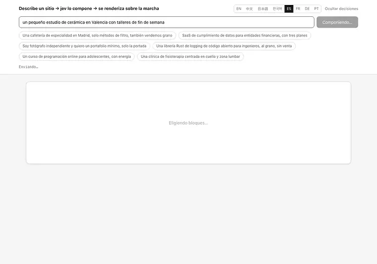
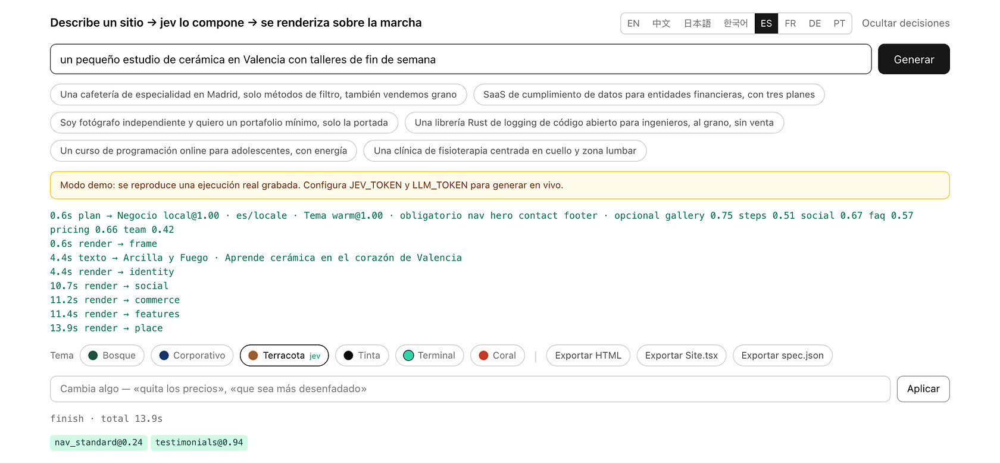
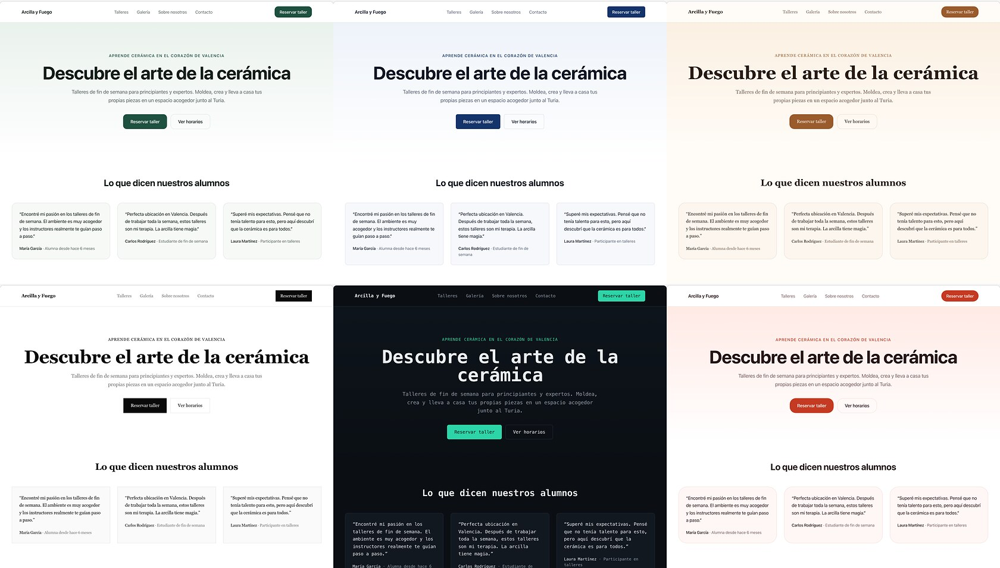

[English](../README.md) · [简体中文](README.zh.md) · [日本語](README.ja.md) · [한국어](README.ko.md) · **Español** · [Français](README.fr.md) · [Deutsch](README.de.md) · [Português](README.pt.md)

# loom

<p align="center">
  <a href="https://github.com/yldm-tech/loom/actions/workflows/ci.yml"></a>
  <a href="../LICENSE"></a>
  <a href="https://github.com/yldm-tech/loom/stargazers"></a>
  <a href="https://github.com/yldm-tech/loom/commits/main"></a>
  
  <a href="https://typesafe.ai"></a>
</p>

> Tres hilos tejidos en una sola tela: el texto lo escribe un LLM, el criterio lo pone Jev, las reglas las pone el código.

Describe tu negocio en una frase y obtén una página de aterrizaje que se puede usar de verdad.

<p align="center">
  
</p>

```
«Una cafetería de especialidad en Madrid, solo métodos de filtro»

0,7 s   esqueleto completo (bloques, orden y paleta ya decididos)
4,5 s   portada y pie rellenados con texto real
13 s    todos los bloques en su sitio
```

El esqueleto ya lleva tema desde el primer fotograma, porque el plan llega antes que cualquier texto. Grabado en modo demo: es exactamente lo que se ve tras `npm run dev` sin ninguna clave.

Lo distinto aquí no es que una IA construya un sitio, sino que **cada una de las tres capas hace solo aquello en lo que es buena**.

## Por qué tres capas

Un modelo generativo escribe cualquier cosa, pero no puedes garantizar que la estructura que emite sea válida. Un modelo restringido siempre es válido, pero no se inventa ni una palabra. Usa uno solo, o mézclalos sin criterio, y algo se derrumba.

Este proyecto reparte las decisiones según **dónde vive la información**:

| Capa | De qué responde | Por qué |
|---|---|---|
| **LLM** | El texto, y los hechos del negocio (cuántos argumentos de venta, cuántos planes de precio, si hay una interfaz que enseñar) | Nada de esto existe en el sistema; solo se puede generar |
| **[Jev](https://typesafe.ai)** | Arquetipo de página, tema visual, si un bloque procede, qué tipo de prueba social | La respuesta ya está en lo que dijo el usuario: es un juicio |
| **Código** | Reglas de composición, orden de bloques, bloques obligatorios, control de disponibilidad | Esto son reglas; preguntárselo a un modelo es equivocarse de sitio |

El criterio es sencillo: **una confianza sistemáticamente baja significa que preguntaste a quien no debías**, porque la entrada no contiene la respuesta o porque la pregunta no requería ningún juicio.

Ese patrón apareció cuatro veces durante el desarrollo. Cada vez la solución fue sustituir la pregunta por una factual más una regla en código:

```
preguntar a jev «¿rejilla o lista?»        → 0,16  ← la petición no dice nada al respecto
que el LLM informe «¿cuántos puntos?»      → código: >= 5 significa rejilla   determinista

preguntar a jev «¿portada centrada o partida?» → 0,28  ← mismo problema
que el LLM informe «¿hay captura de UI?»       → código: partida solo si la hay determinista

preguntar a jev «¿en qué idioma está?»     → 0,76  ← y la respuesta era errónea
detectar la escritura en código            → jev solo: «¿piden otro idioma?»   dividir

preguntar a jev «¿qué tema visual?»        → 0,99  ← «con energía», «clientes financieros» están ahí
conservarlo                                                                   juicio
```

## Comportamiento medido de Jev

| Juicio | Confianza |
|---|---|
| Idioma pedido (1 de 9, cuando se pide) | 1,00 |
| Tema visual (1 de 6) | 0,98 – 1,00 |
| Arquetipo de página (1 de 6) | 0,62 – 1,00 |
| Intención de edición (1 de 6) | 0,98 – 1,00 |
| Tipo de prueba social (1 de 3) | 0,70 – 0,97 |

```
cafetería          → negocio local@1,00  warm@0,99      → Nav HeroCentered Testimonials Gallery Pricing Contact FAQ Footer
fotógrafo          → negocio local@0,62  ink@1,00       → Nav HeroCentered Testimonials Gallery Pricing Contact Footer
SaaS de compliance → aterrizaje@1,00     corporate@1,00 → Nav HeroSplit Testimonials FeatureGrid Steps Pricing FAQ CTABand Footer
```

Todas son **una única elección mutuamente excluyente**: las probabilidades deben sumar uno, así que una opción distractora solo gana quitándole masa a la correcta. Si en cambio preguntas «un sí/no independiente por cada candidato», con 40 opciones aproximadamente un 5 % se cuela como falso positivo. Esa diferencia es estructural, no se arregla reescribiendo el prompt.

Jev cuesta unas tres llamadas, menos de un segundo, del orden de 0,001 $ por sitio. **El cuello de botella es siempre el LLM redactando.**

## Cómo ejecutarlo

Funciona sin claves. Ejecuta `npm run dev` y ábrelo: eso es el **modo demo**, la reproducción de una ejecución real grabada con su ritmo original, y la interfaz lo dice con claridad.

```bash
git clone https://github.com/yldm-tech/loom
cd loom
npm install
npm run dev          # modo demo, sin configuración
```

Añade las claves para generar de verdad:

```bash
cp .env.example .env.local   # rellena JEV_TOKEN y LLM_TOKEN
```

`JEV_TOKEN` se obtiene en [typesafe.ai](https://typesafe.ai). `LLM_TOKEN` funciona con cualquier endpoint compatible con OpenAI —OpenAI, OpenRouter, una pasarela, un llama.cpp local— basta con ajustar `LLM_BASE_URL` y `LLM_MODEL`.

Los archivos de `fixtures/` son **ejecuciones realmente grabadas**, no escritas a mano. Una demo sostenida por una salida inventada que nadie puede reproducir es peor que no tener demo.

En modo demo también se puede editar, pero no a través de Jev: no hay claves con las que llamarlo. Una lista de palabras asigna un puñado de instrucciones a resultados que la interfaz puede aplicar por su cuenta, y por eso toda confianza que informa ahí es 1,00. Esa lista es el único sitio donde añadir un idioma de interfaz puede romper algo en silencio, así que una prueba vuelve a pasar por ella las sugerencias del propio placeholder de cada idioma: cuatro locales se publicaron sin esa comprobación, y ninguna de las sugerencias que la aplicación hacía en ellos hacía nada.

## Editar después

<p align="center">
  
</p>

Cada juicio que hizo Jev, con su confianza y el momento en que llegó. Una edición que falla se puede rastrear en lugar de quedar en misterio.

Di lo que quieras en lenguaje corriente. Una petición, 200–400 ms, y **no se regenera ningún texto**:

| Dices | Resultado |
|---|---|
| quita los precios | `remove` → pricing `1,00` |
| una paleta más desenfadada | `theme` → coral `1,00` |
| centra la barra de navegación | `restyle` → nav_centered `1,00` |
| cambia el estilo de la navegación | `restyle` → cualquier otro (`0,34`, los tres valen) |
| pon las características en lista | `restyle` → features_list `1,00` |
| despliégamelo | `unclear` `1,00` |

La última fila es la que más importa: **cuando no puede hacer algo, lo dice**, en vez de forzar la petición hacia la edición más parecida que tenga a mano.

Esto usa [abanico especulativo](https://docs.typesafe.ai/patterns/fan-out.md): qué bloque quitar, cuál añadir, qué tema, qué bloque recomponer, todo preguntado en una sola petición, y el código lee únicamente la rama que ganó. Más tokens, una ida y vuelta menos.

### El mismo 0,34, unas veces bloqueado y otras no

```
cambia el estilo de la nav      → restyle@1,00  variant=nav_centered@0,34   ejecutado (cualquiera)
cambia el estilo de la barra    → theme@0,87    theme_target=coral@0,15     bloqueado
```

«Cámbialo» no nombra ningún destino, así que, excluida la variante actual, las tres restantes son aceptables y un reparto uniforme es la **respuesta correcta**. En cambio, cuando «cambia el estilo de la barra» se interpretó como recolorear el sitio entero, ese 0,15 significaba que no tenía ni idea de a qué cambiarlo, y eso sí hay que bloquearlo.

**Un umbral no es una constante global. Se deduce del coste de equivocarse.**

## El idioma son dos preguntas, no una

Preguntar "¿en qué idioma debería estar este sitio?" parece un solo juicio, y aquí lo fue durante un tiempo. Medido sobre diez peticiones, ese único Choice respondió `zh` a una petición en inglés con 0.76 de confianza, y acertó pero con solo 0.63 en otra. Tres de las diez quedaron por debajo de 0.85.

La confianza baja era la señal: la pregunta eran dos preguntas apiladas.

| Pregunta | Quién la responde | Cómo |
|---|---|---|
| ¿En qué escritura está escrita esta petición? | Código | Kana, hangul y han son tres expresiones regulares. La escritura latina no se puede acotar más desde el texto, así que decide el locale del propio editor |
| ¿Pide un idioma distinto de aquel en que está escrita? | Jev | La respuesta está en la frase, y solo quien lee puede verla |

Separadas así, ambas mitades quedaron nítidas. En once peticiones, la pregunta sobre si se pide otro idioma separó sus dos poblaciones en 0.03 frente a 0.85 sin malinterpretar ninguna, y la siguiente —"entonces, ¿cuál?"— respondió los cuatro casos con 1.00.

```
我在杭州开了家咖啡店                         → zh  script
A small bakery in Brooklyn                 → en  locale
東京で小さなラーメン屋をやっています            → ja  script
我做外贸的，帮我做个英文站，客户都在北美         → en  request @1.00   ← pedido, no detectado
```

La cuarta línea sigue siendo el punto. **Aquello en lo que escribes no es aquello que quieres escrito**: alguien describe su negocio en chino pero necesita un sitio en inglés para clientes del extranjero, y normalmente lo dice en esa misma frase. Esa parte es un juicio y se queda con Jev. En qué escritura lo tecleó, no.

Simplificado frente a tradicional es la única división que el código no intenta: es una cuestión de mercado y de léxico, no de escritura, así que una petición en han recibe un Choice adicional entre `zh` y `zh-Hant`.

### Decidir el idioma es solo la mitad

El sitio seguía llegando en chino. El schema de campos de la capa de copy está escrito en chino hasta en sus recuentos de `字`, y con la regla de idioma en el preámbulo el modelo seguía el schema en vez de la instrucción: una petición en francés produjo 476 caracteres chinos y una en alemán, 429. Mover la regla detrás del schema arregló el francés y no el alemán. Repetirla también en el turno del usuario llevó francés, alemán, coreano e inglés a cero.

Además, tres descripciones de campo exigían por su cuenta un sitio chino: el `name` de un miembro del equipo estaba especificado como "un nombre chino", los precios como `¥` y las cifras en `万`. Ahora siguen el idioma del copy, y la moneda sigue la ubicación del negocio en vez del idioma, así que una página en inglés para un estudio de Kioto sigue cotizando en yenes.

Admite `en` / `zh` / `ja` / `ko` / `es` / `fr` / `de` / `pt` / `zh-Hant`. Las indicaciones de longitud están pensadas para el chino, así que los demás idiomas reciben una nota de conversión.

La interfaz del editor es otra cosa: ocho idiomas, elegidos a partir de `navigator.languages` y conmutables a mano. Las traducciones viven en `locales/*.json`; añadir un idioma es añadir un archivo y una línea. **`zh.json` es la referencia y las pruebas comprueban que los demás archivos tengan exactamente sus claves**: una traducción a medias tumba la CI en vez de caer silenciosamente al chino en tiempo de ejecución.

## Exportación

Cinco formatos, todos derivados **del mismo resultado renderizado**. No hay una segunda copia del código de composición.

| Exportación | Tamaño | Para |
|---|---|---|
| `site.html` | 36 KB | Súbelo, o simplemente ábrelo con doble clic |
| `Site.tsx` | 34 KB | Seguir desarrollando; compila con `tsc --strict` |
| `spec.json` | unos pocos KB | Archivarlo, o alimentar otro renderizador |
| `site.registry.json` | `Site.tsx`, envuelto | Instalar la página en un proyecto que ya use shadcn/ui |
| `AGENTS.md` | una página | Entregarle la página a un agente de código: tokens, bloques y de dónde salen los componentes |

### Site.tsx

Un único componente plano, sin más dependencia que React. Colores, tipografías y radios viven todos en un solo objeto de estilo del elemento más externo, así que cambiar de tema es editar un solo sitio. Se conservan las clases de Tailwind.

Todo lo que la página dibuja con CSS en lugar de con marcado tiene que viajar como texto, o desaparece de un archivo que no lleva hoja de estilos. Las comillas pasaron en algún momento a `content: open-quote` y la exportación las perdió todas, conservando solo el nombre de clase que apuntaba a una regla que no viaja con el archivo. Ahora se resuelven y se escriben en el JSX, pegadas al texto: JSX convierte en espacio el salto de línea entre dos fragmentos de texto, y `« así »` está mal en todo idioma que no lo pida.

La división en componentes se omite a propósito: un archivo generado que puedes leer de arriba abajo y trocear tú mismo vale más que una estructura que primero hay que descifrar.

La verificación es una ejecución real de `tsc --noEmit --strict --jsx react-jsx`, **juzgada por el código de salida**. Así se descubrió que la primera versión no compilaba: las propiedades personalizadas de CSS no son válidas en `React.CSSProperties`. Ahora emite un `as CSSProperties`.

### site.html

El resultado renderizado más **solo las reglas CSS que realmente usa**.

```
todo el CSS de la página   22 KB      ← Tailwind ya elimina lo no usado en build de producción
exportación real           29 KB      ← incluyendo el HTML
estilos del propio editor  eliminados ← ni caja de texto, ni botones, ni registro
```

El filtrado prueba cada selector con `root.matches()` / `root.querySelector()`, quita las pseudoclases y reintenta con el selector base, entra recursivamente en `@media` y descarta el bloque entero cuando nada sobrevive dentro, y conserva `:root` y `@font-face` sin condiciones. **Un selector que no puede analizar se conserva en vez de descartarse**: un archivo algo más grande es mejor que uno roto en silencio.

En tamaño solo ahorra un 16 % (Tailwind nunca fue el problema). La ganancia real es que el sitio exportado ya no arrastra el estilo del propio editor. Ver `lib/export.ts`; **no hay un segundo renderizador**, la composición de bloques existe únicamente en `app/registry.tsx`.

### site.registry.json

Un elemento de [registro shadcn](https://ui.shadcn.com/docs/registry), así que la página se instala igual que cualquier componente de shadcn:

```bash
npx shadcn@latest add ./site.registry.json
```

Un solo comando escribe el componente en el directorio que el `components.json` del proyecto llame de componentes y fusiona los 17 tokens del tema con su hoja de estilos. La lista de dependencias está vacía a propósito: `Site.tsx` importa un tipo de React y nada más, y rellenarla haría que la CLI instalase paquetes que el archivo no usa. La CLI acepta una ruta local, así que no hay que alojar nada primero: el archivo que acaba de descargar el navegador sirve donde cayó.

El elemento lleva el mismo código de `Site.tsx`; no es un segundo renderizado de la página. Los tokens viajan con él como `cssVars` porque un componente soltado en un proyecto que define sus propias variables se dibuja con los colores de ese proyecto, que no son los de la página que alguien exportó. Van sin el `--` inicial, porque esos guiones los pone la CLI: escrito `--accent`, el token llega al puente de Tailwind como `var(----accent)`, no resuelve nada, y la instalación informa igualmente de éxito.

### AGENTS.md

Un informe breve para el agente de código que recoge la exportación: `spec.json` es la descripción autorizada de la página, estos son los 17 tokens del tema con sus valores, estos son los bloques que la página tiene de verdad, y estas son las fuentes de componentes relevantes para esos bloques. Está escrito para leerse una vez antes de empezar, no como documentación para una persona.

## Componentes que vale la pena robar

El método es el perezoso: señalarle una buena biblioteca a un agente de código y dejar que elija, adapte y pegue. `lib/sources.ts` es la tabla que lee: cinco bibliotecas, cada una con su papel, su licencia, su comando de instalación, los endpoints legibles por máquina que respondieron cuando se comprobaron, los slots que puede mejorar y la advertencia que muerde.

| Fuente | Qué es | Cómo se coge |
|---|---|---|
| [shadcn/ui](https://ui.shadcn.com) | 63 primitivas React accesibles sobre Radix, más la especificación de registro a la que apuntan las otras cuatro | `npx shadcn@latest add <name>` |
| [beUI](https://beui.dev) | 85 componentes animados como registro compatible con shadcn, con endpoint MCP | `npx shadcn@latest add https://beui.dev/r/<name>.json` |
| [Rare UI](https://rareui.com) | Unos 20 widgets animados de un solo archivo: navegación gelatinosa, barra lateral por proximidad, contador de odómetro | `npx shadcn@latest add swamimalode07/rare-ui/<name>` |
| [Transitions](https://transitions.dev) | Unos 44 fragmentos de movimiento con nombre, en CSS puro y con el espacio de nombres `.t-*` | `npx transitions-dev add <slug>` |
| [Beautiful UI](https://beautifului.dev) | 21 primitivas para interfaces de aplicaciones de IA | Copiar y pegar desde el navegador; ni CLI ni registro |

**Ninguna de las cinco trae una sección de página de marketing.** No hay portada, ni testimonios, ni rejilla de equipo, ni pie de página en todo el conjunto: son primitivas, movimiento y widgets con forma de aplicación. Así que una fuente mejora un bloque que loom ya dibuja; nunca lo sustituye, y `role` es el campo que dice qué clase de mejora cabe esperar. Un agente que lea la tabla como un catálogo de bloques se irá a buscar una portada a shadcn/ui y encontrará `/blocks/login`.

Las licencias tampoco son uniformes. Cuatro son MIT; Transitions usa una licencia propia que prohíbe redistribuir una parte sustancial de la colección, así que sus fragmentos se pueden usar en un sitio pero no incorporarse a este repositorio.

Cada url y cada endpoint de esa tabla se obtuvieron y comprobaron en vez de recordarse, y aun así acabarán pudriéndose:

```bash
npm run sources   # vuelve a pedir cada endpoint e informa de cuántos componentes sigue listando
```

## Los temas son datos

<p align="center">
  
</p>

El mismo texto generado bajo los seis temas. Cambiar de tema es modificar una sola prop en el cliente: sin llamada al modelo, sin regeneración.

Seis temas, cada uno un conjunto completo de tokens de diseño. `app/registry.tsx` **no contiene ni un solo valor hexadecimal**: todo se lee de variables CSS.

| Tema | Carácter | Encaja con |
|---|---|---|
| `forest` | Verde profundo + hueso | Herramientas, código abierto, aire libre |
| `corporate` | Azul marino + radio 6px | Finanzas, jurídico, empresa |
| `warm` | Caramelo + serifa + radio 16px | Hostelería, artesanía, alojamientos |
| `ink` | Blanco y negro puros, radio cero, mucho aire | Fotografía, portafolios, editorial |
| `terminal` | Fondo oscuro + monoespaciada + turquesa | Herramientas de desarrollo, infraestructura |
| `coral` | Naranja vivo + radio 20px | Consumo, educación, social |

Contenido, estructura y apariencia están completamente desacoplados.

## 13 bloques, 6 arquetipos de página

Bloques: navegación (4 variantes), portada (2), prueba social (3), características (2), galería, comparativa, pasos, equipo, precios (2), contacto, preguntas frecuentes, banda de llamada a la acción, pie.

El arquetipo decide qué bloques son **obligatorios**: ningún modelo puede quitar la portada de una página de aterrizaje ni la dirección de un negocio local.

| Arquetipo | Obligatorio | Opcional |
|---|---|---|
| Página de aterrizaje | nav hero features cta footer | social pricing faq gallery steps |
| Negocio local | nav hero **contact** footer | gallery steps social faq pricing |
| Ficha técnica | nav hero features footer | faq social steps |
| Página de precios | nav pricing faq cta footer | social hero |
| Portada de código abierto | nav hero features footer | faq social pricing |
| Una sola pantalla | hero | nav footer |

## Pruebas

La accesibilidad se comprueba dos veces, de dos maneras distintas.

`npm test` recalcula el contraste WCAG a partir de los tokens del tema —sin navegador, así que corre en CI—. Cada par acento/texto, banda/texto y fondo/texto debe superar 4,5:1; el texto atenuado, que nunca es el único, debe superar 3:1.

```bash
npm run dev          # basta el modo demo
npm run audit:a11y   # axe-core sobre el sitio generado, los seis temas
```

La auditoría necesita el servidor en marcha y `npx playwright install chromium`, así que se queda como script y no entra en CI. Encontró exactamente un problema real: el acento de `coral` era `#e2553d`, que con texto blanco da 3,75:1, por debajo de AA. Oscurecido a `#c53a22` (5,25:1), mismo tono. Los seis temas no reportan ninguna violación.


```bash
npm test          # 199, unos 1,5 s, sin red
```

Cubren **las tres reglas recuperadas del modelo**: el número de argumentos decide rejilla o lista, el número de planes decide tarjeta única o comparativa, y la existencia de una captura de interfaz decide la composición de la portada. Si alguna se desvía, la decisión vuelve en silencio a un modelo que no puede tomarla, así que son las que no deben moverse.

También se cubren: el control de disponibilidad (un array vacío cuenta como ausente, no como listo), el orden de finalización de `asSettled`, y las aristas del serializador de JSX —las propiedades personalizadas necesitan `as CSSProperties`, los punto y coma dentro de un degradado no son separadores, el texto con llaves debe envolverse, y ni la clase de animación `blk-in` ni el bloque `<style>` pueden llegar a la exportación—.

Además, invariantes estructurales: cada slot que referencia un arquetipo debe existir, obligatorios y opcionales no pueden solaparse, `SLOT_ORDER` debe cubrir cada slot exactamente una vez, y cada variante debe declarar los campos que necesita.

Los archivos de idioma tienen su propio conjunto: las claves deben coincidir exactamente con `zh.json`, sin valores vacíos, con el mismo número de ejemplos, y los ejemplos de cada idioma deben estar escritos realmente en esa escritura.

**Cada prueba se verificó después por mutación**, porque un conjunto que pasa en cuanto lo escribes no demuestra nada:

```
umbral de rejilla 5 → 4          → rojo ✓    a ja.json le falta una clave  → rojo ✓
invertir la condición de portada → rojo ✓    valor vacío en ja.json        → rojo ✓
que un array vacío cuente listo  → rojo ✓    dos ejemplos menos en ja.json → rojo ✓
quitar el cast CSSProperties     → rojo ✓    ejemplo en inglés en ko.json  → rojo ✓
dejar de filtrar bloques style   → rojo ✓
```

## Estructura

```
lib/
  catalog.ts           contrato de componentes: qué bloques pueden aparecer y sus props
  themes.ts            6 juegos de tokens, y el criterio con el que Jev elige
  plan.ts              arquetipos, variantes de slot, reglas de código en layoutRules()
  content.ts           la forma del texto, y cómo se reparte por cada bloque
  content-parallel.ts  cuatro bloques en paralelo, reintento, validación de forma, disponibilidad
  compose.ts           orquestación de las tres capas, en streaming
  edit.ts              reconocimiento de intención de edición (abanico especulativo)
  export.ts            HTML autocontenido, solo con el CSS en uso
  export-tsx.ts        exportación de fuente React, DOM → JSX
  export-registry.ts   el mismo código como elemento de registro shadcn, con los tokens
  export-agents.ts     AGENTS.md: spec, tokens, bloques y de dónde salen los componentes
  i18n.ts              idioma de la interfaz, lee locales/*.json
  demo.ts              reproduce fixtures/ cuando no hay claves
  sources.ts           cinco bibliotecas de componentes de las que puede tirar un agente, con papeles y advertencias
  *.test.ts            pruebas de lógica pura, sin red
locales/
  en|zh|ja|ko|es|fr|de|pt.json   traducciones de la interfaz, zh es la referencia
fixtures/
  en|zh|ja|ko.jsonl    ejecuciones reales grabadas, para el modo demo
app/
  page.tsx             el editor, consumo del stream, cambio de tema y variante en cliente
  registry.tsx         el aspecto de cada bloque, todo mediante variables CSS
  api/generate         generación
  api/edit             ediciones
```

## Límites conocidos

- **El LLM emite JSON inválido.** Medido: aproximadamente una de cada dos ejecuciones. El reintento y la validación de forma lo atrapan, pero es inherente a los modelos generativos; Jev no produjo ni una sola respuesta malformada.
- **13 segundos no es rápido**, y todo se va en el LLM redactando. El esqueleto hace visible el primer pintado a los 0,7 s, pero el total no cambia.
- **13 tipos de bloque**, todavía faltan formulario de contacto, vídeo y mapas. `Gallery` dibuja recuadros de color con pie de texto; no genera imágenes.
- **`Site.tsx` es un único tramo plano de JSX**, no un árbol de componentes ya separado. Compila y se puede editar, pero mantenerlo a largo plazo implica trocearlo uno mismo.
- **La calidad del texto sigue al modelo.** Uno más potente se nota bastante, y también se nota que es más lento.

## Contribuir

Ver [CONTRIBUTING.md](../CONTRIBUTING.md). Añadir un bloque, un tema, un idioma de interfaz o una fuente de componentes tiene cada uno un camino corto y establecido.

## Star History

Si el enfoque te resulta útil, una estrella es la forma más directa de decirlo.

<a href="https://star-history.com/#yldm-tech/loom&Date">
  <picture>
    <source media="(prefers-color-scheme: dark)" srcset="https://api.star-history.com/svg?repos=yldm-tech/loom&type=Date&theme=dark" />
    
  </picture>
</a>

## Licencia

Apache-2.0. Construido sobre los paquetes npm publicados de [json-render](https://github.com/vercel-labs/json-render) (Vercel Labs, Apache-2.0); no se incorpora código fuente de terceros. Los juicios provienen del modelo Jev de [TypeSafe](https://typesafe.ai). Ver `NOTICE`.
