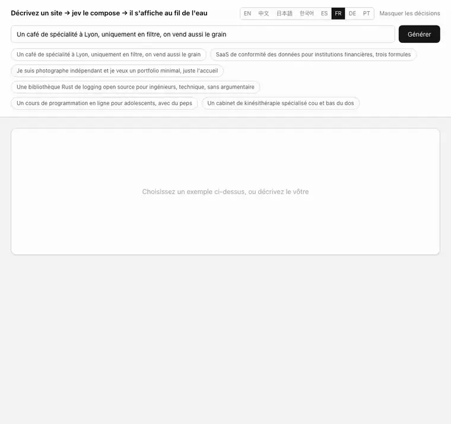
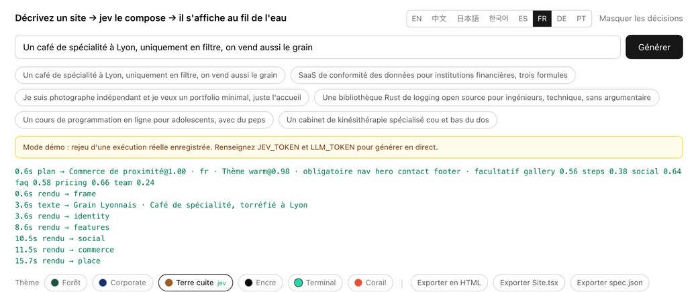
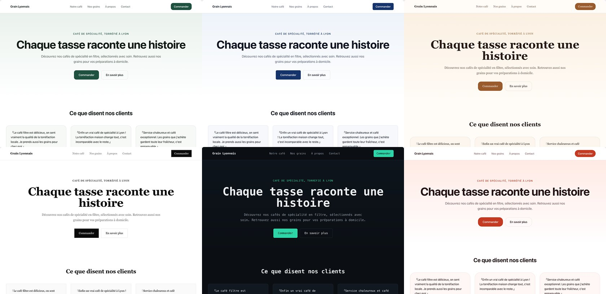

[English](../README.md) · [简体中文](README.zh.md) · [日本語](README.ja.md) · [한국어](README.ko.md) · [Español](README.es.md) · **Français** · [Deutsch](README.de.md) · [Português](README.pt.md)

# loom

<p align="center">
  <a href="https://github.com/yldm-tech/loom/actions/workflows/ci.yml"></a>
  <a href="../LICENSE"></a>
  <a href="https://github.com/yldm-tech/loom/stargazers"></a>
  <a href="https://github.com/yldm-tech/loom/commits/main"></a>
  
  <a href="https://typesafe.ai"></a>
</p>

> Trois fils tissés en une seule étoffe : le texte vient d'un LLM, le jugement de Jev, les règles du code.

Décrivez votre activité en une phrase et obtenez une page d'atterrissage réellement utilisable.

<p align="center">
  
</p>

```
« Un café de spécialité à Lyon, uniquement en filtre »

0,7 s   squelette complet (blocs, ordre et palette déjà décidés)
4,5 s   en-tête et pied remplis de vrai texte
13 s    tous les blocs en place
```

Le squelette porte son thème dès la première image, parce que le plan arrive avant le moindre texte. Enregistré en mode démo : c'est exactement ce qu'on voit après `npm run dev`, sans aucune clé.

Ce qui distingue ce projet, ce n'est pas qu'une IA fabrique un site, c'est que **chacune des trois couches ne fait que ce qu'elle sait bien faire**.

## Pourquoi trois couches

Un modèle génératif écrit n'importe quoi, mais rien ne garantit que la structure qu'il produit soit valide. Un modèle contraint est toujours valide, mais il n'invente pas un seul mot. N'utilisez que l'un des deux, ou mélangez-les sans discernement, et quelque chose s'effondre.

Ce projet découpe les décisions selon **l'endroit où se trouve l'information** :

| Couche | Ce dont elle répond | Pourquoi |
|---|---|---|
| **LLM** | Le texte, et les faits sur l'activité (combien d'arguments, combien de paliers tarifaires, y a-t-il une interface à montrer) | Rien de tout cela n'existe dans le système ; cela ne peut être que généré |
| **[Jev](https://typesafe.ai)** | Archétype de page, thème visuel, pertinence d'un bloc, type de preuve sociale | La réponse est déjà dans ce qu'a dit l'utilisateur : c'est un jugement |
| **Code** | Règles de mise en page, ordre des blocs, blocs obligatoires, contrôle de disponibilité | Ce sont des règles ; les confier à un modèle est une erreur d'adressage |

Le critère est simple : **une confiance durablement basse signifie que vous avez interrogé la mauvaise partie**, soit parce que l'entrée ne contient pas la réponse, soit parce que la question ne demandait aucun jugement.

Ce schéma est apparu trois fois pendant le développement. Chaque fois, la correction a consisté à remplacer la question par une question factuelle assortie d'une règle en code :

```
demander à jev « grille ou liste ? »          → 0,16  ← la demande n'en dit rien
faire dire au LLM « combien d'arguments ? »   → code : >= 5 donne une grille   déterministe

demander à jev « en-tête centré ou scindé ? » → 0,28  ← même problème
faire dire au LLM « y a-t-il une capture ? »  → code : scindé seulement si oui déterministe

demander à jev « quel thème visuel ? »        → 0,99  ← « avec du peps », « clients financiers » y sont
on le garde                                                                     jugement
```

## Comportement mesuré de Jev

| Jugement | Confiance |
|---|---|
| Langue du texte (1 sur 9) | 0,66 – 1,00 |
| Thème visuel (1 sur 6) | 0,98 – 1,00 |
| Archétype de page (1 sur 6) | 0,62 – 1,00 |
| Intention de modification (1 sur 6) | 0,98 – 1,00 |
| Type de preuve sociale (1 sur 3) | 0,70 – 0,97 |

```
café               → commerce local@1,00  warm@0,99      → Nav HeroCentered Testimonials Gallery Pricing Contact FAQ Footer
photographe        → commerce local@0,62  ink@1,00       → Nav HeroCentered Testimonials Gallery Pricing Contact Footer
SaaS de conformité → atterrissage@1,00    corporate@1,00 → Nav HeroSplit Testimonials FeatureGrid Steps Pricing FAQ CTABand Footer
```

Chacun est **un choix unique et mutuellement exclusif** : les probabilités doivent faire un, donc une option parasite ne peut l'emporter qu'en prenant de la masse à la bonne réponse. Posez plutôt « un oui/non indépendant par candidat » et, à 40 options, environ 5 % s'infiltrent en faux positifs. Cet écart est structurel, aucune reformulation de prompt ne le corrige.

Jev coûte environ trois appels, moins d'une seconde, de l'ordre de 0,001 $ par site. **Le goulet d'étranglement, c'est toujours le LLM qui rédige.**

## Lancer le projet

Il fonctionne sans clé. `npm run dev` puis ouvrez-le : c'est le **mode démo**, le rejeu d'une exécution réelle enregistrée avec son rythme d'origine, et l'interface le dit clairement.

```bash
git clone https://github.com/yldm-tech/loom
cd loom
npm install
npm run dev          # mode démo, aucune configuration
```

Ajoutez les clés pour générer pour de vrai :

```bash
cp .env.example .env.local   # renseignez JEV_TOKEN et LLM_TOKEN
```

`JEV_TOKEN` s'obtient sur [typesafe.ai](https://typesafe.ai). `LLM_TOKEN` fonctionne avec n'importe quel endpoint compatible OpenAI — OpenAI, OpenRouter, une passerelle, un llama.cpp local — il suffit de régler `LLM_BASE_URL` et `LLM_MODEL`.

Les fichiers de `fixtures/` sont de **vraies exécutions enregistrées**, pas des fichiers écrits à la main. Une démo qui tient debout grâce à une sortie inventée que personne ne peut reproduire vaut moins que pas de démo du tout.

## Modifier ensuite

<p align="center">
  
</p>

Chaque jugement rendu par Jev, avec sa confiance et son horodatage. Une modification qui rate se remonte au lieu de rester mystérieuse.

Dites ce que vous voulez en langage courant. Une requête, 200–400 ms, et **aucun texte n'est régénéré** :

| Vous dites | Résultat |
|---|---|
| enlève les tarifs | `remove` → pricing `1,00` |
| une palette plus enjouée | `theme` → coral `1,00` |
| centre la barre de navigation | `restyle` → nav_centered `1,00` |
| change le style de la nav | `restyle` → n'importe quel autre (`0,34`, les trois conviennent) |
| mets les fonctionnalités en liste | `restyle` → features_list `1,00` |
| déploie-le pour moi | `unclear` `1,00` |

La dernière ligne est la plus importante : **quand il ne sait pas faire, il le dit**, au lieu de rabattre la demande sur la modification la plus proche dont il dispose.

Cela repose sur l'[éventail spéculatif](https://docs.typesafe.ai/patterns/fan-out.md) : quel bloc retirer, lequel ajouter, quel thème, quel bloc restyler — tout est demandé en une seule requête, et le code ne lit que la branche gagnante. Plus de jetons, un aller-retour de moins.

### Le même 0,34, parfois bloqué et parfois non

```
change le style de la nav       → restyle@1,00  variant=nav_centered@0,34   exécuté (au choix)
change le style de la barre     → theme@0,87    theme_target=coral@0,15     bloqué
```

« Change-le » ne nomme aucune destination : une fois la variante actuelle exclue, les trois restantes sont acceptables et une répartition uniforme est la **bonne réponse**. En revanche, quand « change le style de la barre » a été compris comme une recoloration de tout le site, ce 0,15 signifiait qu'il ne savait pas vers quoi changer — et celui-là doit être bloqué.

**Un seuil n'est pas une constante globale. Il découle du coût de l'erreur.**

## La langue est un jugement, pas une détection

La langue dans laquelle le site est rédigé passe aussi par Jev, dans la même requête que le thème et l'archétype, donc sans aller-retour supplémentaire.

```
我在杭州开了家咖啡店                           → zh @1,00
我们做数据合规 SaaS，卖给海外客户，要做英文站     → en @1,00   ← décrit en chinois, veut de l'anglais
A small bakery in Brooklyn                   → en @0,66
東京で小さなラーメン屋をやっています              → ja @0,99
```

La deuxième ligne est le point essentiel. **La langue dans laquelle vous écrivez n'est pas celle dans laquelle vous voulez qu'on écrive** : quelqu'un décrit son activité en chinois mais a besoin d'un site en anglais pour une clientèle étrangère, et il le dit généralement dans cette même phrase. La détection pure se trompe à chaque fois ; le jugement tombe juste.

Le `0,66` de la ligne de Brooklyn est également correct : une phrase en anglais qui ne déclare aucune langue cible fait de `en` une inférence et non une instruction, la probabilité doit donc se disperser.

Prend en charge `en` / `zh` / `ja` / `ko` / `es` / `fr` / `de` / `pt` / `zh-Hant`. Les indications de longueur sont pensées pour le chinois, les autres langues reçoivent donc une note de conversion.

L'interface de l'éditeur est une autre affaire : huit langues, choisies d'après `navigator.languages` et permutables à la main. Les traductions vivent dans `locales/*.json` ; ajouter une langue, c'est ajouter un fichier et une ligne. **`zh.json` fait référence et les tests vérifient que les autres fichiers portent exactement ses clés** : une traduction inachevée fait échouer la CI au lieu de retomber silencieusement sur le chinois à l'exécution.

## Export

Trois formats, tous issus **du même rendu**. Il n'existe pas de seconde copie du code de mise en page.

| Export | Taille | Pour |
|---|---|---|
| `site.html` | 36 Ko | Le mettre en ligne, ou simplement double-cliquer |
| `Site.tsx` | 34 Ko | Continuer à développer ; compile sous `tsc --strict` |
| `spec.json` | quelques Ko | L'archiver, ou alimenter un autre moteur de rendu |

### Site.tsx

Un seul composant plat, sans autre dépendance que React. Couleurs, polices et rayons vivent tous dans un unique objet de style sur l'élément le plus extérieur : changer de thème revient à éditer un seul endroit. Les classes Tailwind sont conservées.

Le découpage en composants est volontairement omis : un fichier généré qu'on peut lire de haut en bas et découper soi-même vaut mieux qu'une structure qu'il faut d'abord décrypter.

La vérification est une véritable exécution de `tsc --noEmit --strict --jsx react-jsx`, **jugée sur le code de sortie**. C'est ainsi qu'on a découvert que la première version ne compilait pas : les propriétés personnalisées CSS ne sont pas valides dans `React.CSSProperties`. Le fichier émet désormais un `as CSSProperties`.

### site.html

Le rendu, plus **uniquement les règles CSS réellement utilisées**.

```
tout le CSS de la page      22 Ko      ← Tailwind élague déjà en build de production
export réel                 29 Ko      ← HTML compris
styles propres à l'éditeur  supprimés  ← ni champ de saisie, ni boutons, ni journal
```

Le filtrage teste chaque sélecteur avec `root.matches()` / `root.querySelector()`, retire les pseudo-classes et retente sur le sélecteur de base, descend récursivement dans `@media` et jette le bloc entier quand rien n'y survit, et conserve `:root` et `@font-face` sans condition. **Un sélecteur qu'il ne sait pas analyser est conservé plutôt que supprimé** : un fichier un peu plus gros vaut mieux qu'un fichier silencieusement cassé.

En taille, cela ne fait gagner que 16 % (Tailwind n'a jamais été le problème). Le vrai gain, c'est que le site exporté ne traîne plus le style de l'éditeur. Voir `lib/export.ts` ; **il n'y a pas de second moteur de rendu**, la mise en page des blocs n'existe que dans `app/registry.tsx`.

## Les thèmes sont des données

<p align="center">
  
</p>

Le même texte généré sous les six thèmes. Changer de thème, c'est modifier une seule prop côté client : aucun appel au modèle, aucune régénération.

Six thèmes, chacun un jeu complet de tokens de design. `app/registry.tsx` ne contient **aucune valeur hexadécimale** : tout passe par des variables CSS.

| Thème | Caractère | Convient à |
|---|---|---|
| `forest` | Vert profond + écru | Outils, open source, plein air |
| `corporate` | Bleu marine + rayon 6px | Finance, juridique, grands comptes |
| `warm` | Caramel + serif + rayon 16px | Restauration, artisanat, maisons d'hôtes |
| `ink` | Noir et blanc purs, rayon nul, beaucoup d'air | Photographie, portfolios, édition |
| `terminal` | Fond sombre + monospace + turquoise | Outils de développement, infrastructure |
| `coral` | Orange vif + rayon 20px | Grand public, éducation, social |

Contenu, structure et apparence sont entièrement découplés.

## 13 blocs, 6 archétypes de page

Blocs : navigation (4 variantes), en-tête (2), preuve sociale (3), fonctionnalités (2), galerie, comparatif, étapes, équipe, tarifs (2), contact, FAQ, bandeau d'appel à l'action, pied de page.

L'archétype décide quels blocs sont **obligatoires** : aucun modèle n'a le droit de supprimer l'en-tête d'une page d'atterrissage ni l'adresse d'un commerce de proximité.

| Archétype | Obligatoire | Facultatif |
|---|---|---|
| Page d'atterrissage | nav hero features cta footer | social pricing faq gallery steps |
| Commerce de proximité | nav hero **contact** footer | gallery steps social faq pricing |
| Fiche technique | nav hero features footer | faq social steps |
| Page tarifs | nav pricing faq cta footer | social hero |
| Accueil open source | nav hero features footer | faq social pricing |
| Page unique minimale | hero | nav footer |

## Tests

L'accessibilité est vérifiée deux fois, de deux manières différentes.

`npm test` recalcule le contraste WCAG à partir des tokens du thème — sans navigateur, donc en CI. Chaque paire accent/texte, bandeau/texte et fond/texte doit dépasser 4,5:1 ; le texte atténué, qui n'est jamais le seul porteur d'information, doit dépasser 3:1.

```bash
npm run dev          # le mode démo suffit
npm run audit:a11y   # axe-core sur le site généré, les six thèmes
```

L'audit a besoin d'un serveur lancé et de `npx playwright install chromium`, il reste donc un script et n'entre pas dans la CI. Il a trouvé exactement un vrai problème : l'accent de `coral` valait `#e2553d`, soit 3,75:1 avec du texte blanc, en dessous du seuil AA. Assombri en `#c53a22` (5,25:1), même teinte. Les six thèmes ne signalent plus aucune violation.


```bash
npm test          # 125, environ 4 s, sans réseau
```

Ils couvrent **les trois règles reprises au modèle** : le nombre d'arguments décide grille ou liste, le nombre de paliers décide carte unique ou comparatif, et la présence d'une capture d'interface décide la mise en page de l'en-tête. Si l'une dérive, la décision retourne en silence à un modèle incapable de la prendre : ce sont celles qui ne doivent pas bouger.

Sont également couverts : le contrôle de disponibilité (un tableau vide compte comme absent, pas comme prêt), l'ordre d'achèvement de `asSettled`, et les pièges du sérialiseur JSX — les propriétés personnalisées ont besoin de `as CSSProperties`, les points-virgules d'un dégradé ne sont pas des séparateurs, un texte contenant des accolades doit être encadré, et ni la classe d'animation `blk-in` ni le bloc `<style>` ne doivent atteindre l'export.

Plus des invariants structurels : tout slot référencé par un archétype doit exister, obligatoires et facultatifs ne doivent pas se recouper, `SLOT_ORDER` doit couvrir chaque slot exactement une fois, et chaque variante doit déclarer les champs dont elle a besoin.

Les fichiers de langue ont leur propre jeu : les clés doivent correspondre exactement à `zh.json`, aucune valeur vide, le même nombre d'exemples, et les exemples de chaque langue doivent réellement être écrits dans son écriture.

**Chaque test a ensuite été vérifié par mutation**, parce qu'une suite qui passe dès qu'on l'écrit ne prouve rien :

```
seuil de grille 5 → 4              → rouge ✓   clé manquante dans ja.json   → rouge ✓
inverser la condition d'en-tête    → rouge ✓   valeur vide dans ja.json     → rouge ✓
faire passer un tableau vide prêt  → rouge ✓   deux exemples en moins       → rouge ✓
retirer le cast CSSProperties      → rouge ✓   exemple anglais dans ko.json → rouge ✓
cesser de filtrer les blocs style  → rouge ✓
```

## Structure

```
lib/
  catalog.ts           contrat de composants : quels blocs peuvent apparaître, et leurs props
  themes.ts            6 jeux de tokens, et le barème sur lequel Jev choisit
  plan.ts              archétypes, variantes de slot, règles de code dans layoutRules()
  content.ts           la forme du texte, et comment il remplit chaque bloc
  content-parallel.ts  quatre lots en parallèle, réessai, validation de forme, disponibilité
  compose.ts           orchestration des trois couches, en flux
  edit.ts              reconnaissance de l'intention de modification (éventail spéculatif)
  export.ts            HTML autonome, seulement le CSS utilisé
  export-tsx.ts        export de source React, DOM → JSX
  i18n.ts              langue de l'interface, lit locales/*.json
  demo.ts              rejoue fixtures/ en l'absence de clés
  *.test.ts            tests de logique pure, sans réseau
locales/
  en|zh|ja|ko|es|fr|de|pt.json   traductions de l'interface, zh fait référence
fixtures/
  en|zh|ja|ko.jsonl    exécutions réelles enregistrées, pour le mode démo
app/
  page.tsx             l'éditeur, consommation du flux, changement de thème et de variante côté client
  registry.tsx         l'apparence de chaque bloc, uniquement via des variables CSS
  api/generate         génération
  api/edit             modifications
```

## Limites connues

- **Le LLM produit du JSON invalide.** Mesuré : environ une exécution sur deux. Le réessai et la validation de forme le rattrapent, mais c'est inhérent aux modèles génératifs ; côté Jev, pas une seule réponse malformée.
- **13 secondes, ce n'est pas rapide**, et tout part dans la rédaction du LLM. Le squelette rend le premier affichage visible à 0,7 s, mais le total ne bouge pas.
- **13 types de blocs**, il manque encore un formulaire de contact, la vidéo et les cartes. `Gallery` affiche des vignettes colorées légendées ; elle ne génère pas d'images.
- **`Site.tsx` est un seul pan de JSX**, pas un arbre de composants déjà découpé. Il compile et se modifie, mais le maintenir sur la durée suppose de le découper soi-même.
- **La qualité du texte suit le modèle.** Un modèle plus fort se remarque nettement, et sa lenteur aussi.

## Contribuer

Voir [CONTRIBUTING.md](../CONTRIBUTING.md). Ajouter un bloc, un thème ou une langue d'interface suit à chaque fois un chemin court et balisé.

## Star History

Si l'approche vous est utile, une étoile est la façon la plus directe de le dire.

<a href="https://star-history.com/#yldm-tech/loom&Date">
  <picture>
    <source media="(prefers-color-scheme: dark)" srcset="https://api.star-history.com/svg?repos=yldm-tech/loom&type=Date&theme=dark" />
    
  </picture>
</a>

## Licence

Apache-2.0. Construit sur les paquets npm publiés de [json-render](https://github.com/vercel-labs/json-render) (Vercel Labs, Apache-2.0) ; aucun code source amont n'est embarqué. Les jugements proviennent du modèle Jev de [TypeSafe](https://typesafe.ai). Voir `NOTICE`.
