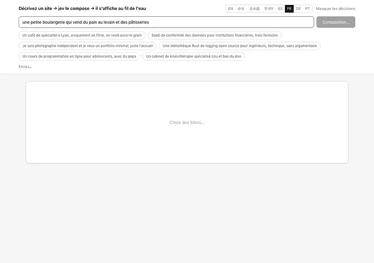
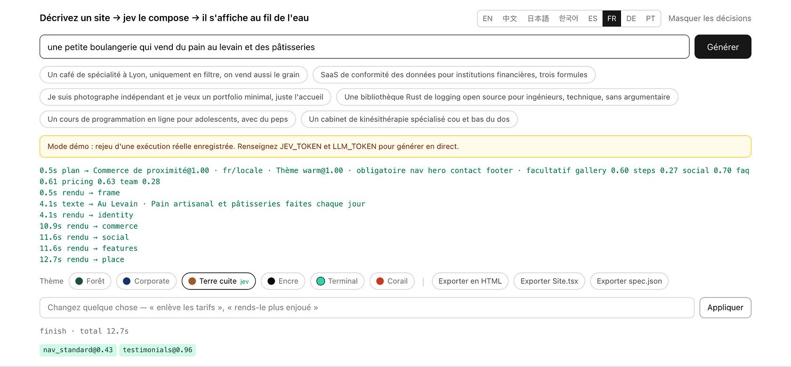

[English](../README.md) · [简体中文](README.zh.md) · [日本語](README.ja.md) · [한국어](README.ko.md) · [Español](README.es.md) · **Français** · [Deutsch](README.de.md) · [Português](README.pt.md)

# loom

<p align="center">
  <a href="https://github.com/yldm-tech/loom/actions/workflows/ci.yml"></a>
  <a href="../LICENSE"></a>
  <a href="https://github.com/yldm-tech/loom/stargazers"></a>
  <a href="https://github.com/yldm-tech/loom/commits/main"></a>
  
  <a href="https://typesafe.ai"></a>
</p>

> Trois fils tissés en une seule étoffe : le texte vient d'un LLM, le jugement de Jev, les règles du code.

Décrivez votre activité en une phrase et obtenez une page d'atterrissage réellement utilisable.

<p align="center">
  
</p>

```
« Un café de spécialité à Lyon, uniquement en filtre »

0,7 s   squelette complet (blocs, ordre et palette déjà décidés)
4,5 s   en-tête et pied remplis de vrai texte
13 s    tous les blocs en place
```

Le squelette porte son thème dès la première image, parce que le plan arrive avant le moindre texte. Enregistré en mode démo : c'est exactement ce qu'on voit après `npm run dev`, sans aucune clé.

Ce qui distingue ce projet, ce n'est pas qu'une IA fabrique un site, c'est que **chacune des trois couches ne fait que ce qu'elle sait bien faire**.

## Pourquoi trois couches

Un modèle génératif écrit n'importe quoi, mais rien ne garantit que la structure qu'il produit soit valide. Un modèle contraint est toujours valide, mais il n'invente pas un seul mot. N'utilisez que l'un des deux, ou mélangez-les sans discernement, et quelque chose s'effondre.

Ce projet découpe les décisions selon **l'endroit où se trouve l'information** :

| Couche | Ce dont elle répond | Pourquoi |
|---|---|---|
| **LLM** | Le texte, et les faits sur l'activité (combien d'arguments, combien de paliers tarifaires, y a-t-il une interface à montrer) | Rien de tout cela n'existe dans le système ; cela ne peut être que généré |
| **[Jev](https://typesafe.ai)** | Archétype de page, thème visuel, pertinence d'un bloc, type de preuve sociale | La réponse est déjà dans ce qu'a dit l'utilisateur : c'est un jugement |
| **Code** | Règles de mise en page, ordre des blocs, blocs obligatoires, contrôle de disponibilité | Ce sont des règles ; les confier à un modèle est une erreur d'adressage |

Le critère est simple : **une confiance durablement basse signifie que vous avez interrogé la mauvaise partie**, soit parce que l'entrée ne contient pas la réponse, soit parce que la question ne demandait aucun jugement.

Ce schéma est apparu quatre fois pendant le développement. Chaque fois, la correction a consisté à remplacer la question par une question factuelle assortie d'une règle en code :

```
demander à jev « grille ou liste ? »          → 0,16  ← la demande n'en dit rien
faire dire au LLM « combien d'arguments ? »   → code : >= 5 donne une grille   déterministe

demander à jev « en-tête centré ou scindé ? » → 0,28  ← même problème
faire dire au LLM « y a-t-il une capture ? »  → code : scindé seulement si oui déterministe

demander à jev « quelle langue est-ce ? »     → 0,76  ← et la réponse était fausse
détecter l'écriture dans le code              → jev seulement : « demandent-ils
                                                 une autre langue ? »            séparer

demander à jev « quel thème visuel ? »        → 0,99  ← « avec du peps », « clients financiers » y sont
on le garde                                                                     jugement
```

## Comportement mesuré de Jev

| Jugement | Confiance |
|---|---|
| Langue demandée (1 sur 9, quand elle est demandée) | 1,00 |
| Thème visuel (1 sur 6) | 0,98 – 1,00 |
| Archétype de page (1 sur 6) | 0,62 – 1,00 |
| Intention de modification (1 sur 6) | 0,98 – 1,00 |
| Type de preuve sociale (1 sur 3) | 0,70 – 0,97 |

```
café               → commerce local@1,00  warm@0,99      → Nav HeroCentered Testimonials Gallery Pricing Contact FAQ Footer
photographe        → commerce local@0,62  ink@1,00       → Nav HeroCentered Testimonials Gallery Pricing Contact Footer
SaaS de conformité → atterrissage@1,00    corporate@1,00 → Nav HeroSplit Testimonials FeatureGrid Steps Pricing FAQ CTABand Footer
```

Chacun est **un choix unique et mutuellement exclusif** : les probabilités doivent faire un, donc une option parasite ne peut l'emporter qu'en prenant de la masse à la bonne réponse. Posez plutôt « un oui/non indépendant par candidat » et, à 40 options, environ 5 % s'infiltrent en faux positifs. Cet écart est structurel, aucune reformulation de prompt ne le corrige.

Jev coûte environ trois appels, moins d'une seconde, de l'ordre de 0,001 $ par site. **Le goulet d'étranglement, c'est toujours le LLM qui rédige.**

## Lancer le projet

Il fonctionne sans clé. `npm run dev` puis ouvrez-le : c'est le **mode démo**, le rejeu d'une exécution réelle enregistrée avec son rythme d'origine, et l'interface le dit clairement.

```bash
git clone https://github.com/yldm-tech/loom
cd loom
npm install
npm run dev          # mode démo, aucune configuration
```

Ajoutez les clés pour générer pour de vrai :

```bash
cp .env.example .env.local   # renseignez JEV_TOKEN et LLM_TOKEN
```

`JEV_TOKEN` s'obtient sur [typesafe.ai](https://typesafe.ai). `LLM_TOKEN` fonctionne avec n'importe quel endpoint compatible OpenAI — OpenAI, OpenRouter, une passerelle, un llama.cpp local — il suffit de régler `LLM_BASE_URL` et `LLM_MODEL`.

Les fichiers de `fixtures/` sont de **vraies exécutions enregistrées**, pas des fichiers écrits à la main. Une démo qui tient debout grâce à une sortie inventée que personne ne peut reproduire vaut moins que pas de démo du tout.

Le mode démo permet aussi de modifier, mais pas via Jev : il n'y a pas de clé pour l'appeler. Une liste de mots associe une poignée d'instructions aux résultats que l'interface sait appliquer seule, et c'est pourquoi toute confiance affichée là vaut 1,00. Cette liste est le seul endroit où ajouter une langue d'interface peut casser quelque chose en silence, donc un test y repasse les suggestions du placeholder de chaque langue : quatre locales sont sorties sans cette vérification, et aucune des suggestions que l'application y faisait ne produisait quoi que ce soit.

## Modifier ensuite

<p align="center">
  
</p>

Chaque jugement rendu par Jev, avec sa confiance et son horodatage. Une modification qui rate se remonte au lieu de rester mystérieuse.

Dites ce que vous voulez en langage courant. Une requête, 200–400 ms, et **aucun texte n'est régénéré** :

| Vous dites | Résultat |
|---|---|
| enlève les tarifs | `remove` → pricing `1,00` |
| une palette plus enjouée | `theme` → coral `1,00` |
| centre la barre de navigation | `restyle` → nav_centered `1,00` |
| change le style de la nav | `restyle` → n'importe quel autre (`0,34`, les trois conviennent) |
| mets les fonctionnalités en liste | `restyle` → features_list `1,00` |
| déploie-le pour moi | `unclear` `1,00` |

La dernière ligne est la plus importante : **quand il ne sait pas faire, il le dit**, au lieu de rabattre la demande sur la modification la plus proche dont il dispose.

Cela repose sur l'[éventail spéculatif](https://docs.typesafe.ai/patterns/fan-out.md) : quel bloc retirer, lequel ajouter, quel thème, quel bloc restyler — tout est demandé en une seule requête, et le code ne lit que la branche gagnante. Plus de jetons, un aller-retour de moins.

### Le même 0,34, parfois bloqué et parfois non

```
change le style de la nav       → restyle@1,00  variant=nav_centered@0,34   exécuté (au choix)
change le style de la barre     → theme@0,87    theme_target=coral@0,15     bloqué
```

« Change-le » ne nomme aucune destination : une fois la variante actuelle exclue, les trois restantes sont acceptables et une répartition uniforme est la **bonne réponse**. En revanche, quand « change le style de la barre » a été compris comme une recoloration de tout le site, ce 0,15 signifiait qu'il ne savait pas vers quoi changer — et celui-là doit être bloqué.

**Un seuil n'est pas une constante globale. Il découle du coût de l'erreur.**

## La langue, ce sont deux questions et non une

Demander « dans quelle langue ce site doit-il être écrit ? » ressemble à un seul jugement, et cela en a été un ici pendant un temps. Mesuré sur dix requêtes, ce Choice unique a répondu `zh` à une requête en anglais avec 0.76 de confiance, et a eu raison mais à seulement 0.63 sur une autre. Trois des dix sont revenues sous 0.85.

La confiance basse était le signal : la question en contenait deux, empilées.

| Question | Qui y répond | Comment |
|---|---|---|
| Dans quelle écriture cette requête est-elle rédigée ? | Le code | Kana, hangul et han tiennent en trois expressions régulières. L'écriture latine ne peut pas être affinée davantage à partir du texte, c'est donc le locale de l'éditeur qui tranche |
| Demande-t-elle une langue autre que celle dans laquelle elle est écrite ? | Jev | La réponse est dans la phrase, et seul un lecteur peut la voir |

Séparées ainsi, les deux moitiés sont devenues nettes. Sur onze requêtes, la question sur la demande explicite a séparé ses deux populations à 0.03 contre 0.85 sans en mal lire une seule, et la suivante — « alors laquelle ? » — a répondu aux quatre cas à 1.00.

```
我在杭州开了家咖啡店                         → zh  script
A small bakery in Brooklyn                 → en  locale
東京で小さなラーメン屋をやっています            → ja  script
我做外贸的，帮我做个英文站，客户都在北美         → en  request @1.00   ← demandé, pas détecté
```

La quatrième ligne reste l'essentiel. **Ce dans quoi vous écrivez n'est pas ce que vous voulez voir écrit** : quelqu'un décrit son activité en chinois mais a besoin d'un site en anglais pour des clients à l'étranger, et il le dit généralement dans cette phrase même. Cette partie est un jugement et reste chez Jev. L'écriture dans laquelle il a tapé, non.

Simplifié contre traditionnel est la seule distinction que le code ne tente pas : c'est une question de marché et de lexique, pas d'écriture, donc une requête en han reçoit un Choice supplémentaire entre `zh` et `zh-Hant`.

### Décider de la langue ne fait que la moitié du chemin

Le site revenait encore en chinois. Le schéma de champs de la couche de copy est écrit en chinois jusque dans ses décomptes de `字`, et avec la règle de langue placée en préambule, le modèle suivait le schéma plutôt que l'instruction : une requête en français a produit 476 caractères chinois, une en allemand 429. Déplacer la règle après le schéma a corrigé le français mais pas l'allemand. La répéter aussi dans le tour utilisateur a ramené français, allemand, coréen et anglais à zéro.

Trois descriptions de champ réclamaient par ailleurs un site chinois d'elles-mêmes : le `name` d'un membre de l'équipe était spécifié comme « un nom chinois », les prix en `¥`, les chiffres en `万`. Elles suivent désormais la langue du copy, et la devise suit le lieu de l'activité plutôt que la langue, de sorte qu'une page en anglais pour un atelier de Kyoto affiche toujours des yens.

Prend en charge `en` / `zh` / `ja` / `ko` / `es` / `fr` / `de` / `pt` / `zh-Hant`. Les indications de longueur sont pensées pour le chinois, les autres langues reçoivent donc une note de conversion.

L'interface de l'éditeur est une autre affaire : huit langues, choisies d'après `navigator.languages` et permutables à la main. Les traductions vivent dans `locales/*.json` ; ajouter une langue, c'est ajouter un fichier et une ligne. **`zh.json` fait référence et les tests vérifient que les autres fichiers portent exactement ses clés** : une traduction inachevée fait échouer la CI au lieu de retomber silencieusement sur le chinois à l'exécution.

## Export

Six formats, tous issus **du même rendu**. Il n'existe pas de seconde copie du code de mise en page.

| Export | Taille | Pour |
|---|---|---|
| `site.html` | 36 Ko | Le mettre en ligne, ou simplement double-cliquer |
| `Site.tsx` | 34 Ko | Continuer à développer ; compile sous `tsc --strict` |
| `spec.json` | quelques Ko | L'archiver, ou alimenter un autre moteur de rendu |
| `site.registry.json` | `Site.tsx`, emballé | Installer la page dans un projet qui utilise déjà shadcn/ui |
| `AGENTS.md` | une page | Confier la page à un agent de code : tokens, blocs, et d'où viennent les composants |
| `bundle.zip` | les cinq autres | Tout confier d'un coup, avec un `CLAUDE.md` qui pointe vers la note |

### Site.tsx

Un seul composant plat, sans autre dépendance que React. Couleurs, polices et rayons vivent tous dans un unique objet de style sur l'élément le plus extérieur : changer de thème revient à éditer un seul endroit. Les classes Tailwind sont conservées.

Tout ce que la page dessine en CSS plutôt qu'en balisage doit partir avec elle sous forme de texte, sinon cela disparaît d'un fichier qui n'embarque aucune feuille de style. Les guillemets sont passés à un moment dans `content: open-quote` et l'export les a tous perdus, ne gardant que le nom de classe qui désignait une règle absente du fichier. Ils sont maintenant résolus et écrits dans le JSX, collés au texte : JSX transforme en espace le saut de ligne entre deux morceaux de texte, et `「 comme ceci 」` est faux dans toute langue qui n'en demande pas.

Le découpage en composants est volontairement omis : un fichier généré qu'on peut lire de haut en bas et découper soi-même vaut mieux qu'une structure qu'il faut d'abord décrypter.

La vérification est une véritable exécution de `tsc --noEmit --strict --jsx react-jsx`, **jugée sur le code de sortie**. C'est ainsi qu'on a découvert que la première version ne compilait pas : les propriétés personnalisées CSS ne sont pas valides dans `React.CSSProperties`. Le fichier émet désormais un `as CSSProperties`.

### site.html

Le rendu, plus **uniquement les règles CSS réellement utilisées**.

```
tout le CSS de la page      22 Ko      ← Tailwind élague déjà en build de production
export réel                 29 Ko      ← HTML compris
styles propres à l'éditeur  supprimés  ← ni champ de saisie, ni boutons, ni journal
```

Le filtrage teste chaque sélecteur avec `root.matches()` / `root.querySelector()`, retire les pseudo-classes et retente sur le sélecteur de base, descend récursivement dans `@media` et jette le bloc entier quand rien n'y survit, et conserve `:root` et `@font-face` sans condition. **Un sélecteur qu'il ne sait pas analyser est conservé plutôt que supprimé** : un fichier un peu plus gros vaut mieux qu'un fichier silencieusement cassé.

En taille, cela ne fait gagner que 16 % (Tailwind n'a jamais été le problème). Le vrai gain, c'est que le site exporté ne traîne plus le style de l'éditeur. Voir `lib/export.ts` ; **il n'y a pas de second moteur de rendu**, la mise en page des blocs n'existe que dans `app/registry.tsx`.

### site.registry.json

Un élément de [registre shadcn](https://ui.shadcn.com/docs/registry) : la page s'installe donc comme n'importe quel composant shadcn.

```bash
npx shadcn@latest add ./site.registry.json
```

Une seule commande écrit le composant dans le répertoire que le `components.json` du projet appelle composants, et fusionne les 17 tokens du thème dans sa feuille de style. La liste de dépendances est vide exprès : `Site.tsx` importe un type de React et rien d'autre, et la remplir ferait installer à la CLI des paquets que le fichier n'utilise pas. La CLI accepte un chemin local, donc rien n'a besoin d'être hébergé au préalable : le fichier que le navigateur vient de télécharger fonctionne là où il a atterri.

L'élément embarque le même source `Site.tsx` ; ce n'est pas un second rendu de la page. Les tokens voyagent avec lui sous forme de `cssVars`, parce qu'un composant déposé dans un projet qui définit ses propres variables s'affiche aux couleurs de ce projet — et ce n'est pas la page que quelqu'un a exportée. Ils sont écrits sans le `--` initial, que la CLI ajoute elle-même : noté `--accent`, le token arrive côté Tailwind sous la forme `var(----accent)`, ne résout rien, et l'installation annonce quand même une réussite.

### AGENTS.md

Une note brève pour l'agent de code qui récupère l'export : `spec.json` fait foi pour décrire la page, voici les 17 tokens du thème avec leurs valeurs, voici les blocs réellement présents sur cette page, et voici les sources de composants pertinentes pour ces blocs. C'est écrit pour être lu une fois avant de commencer, pas comme une documentation destinée à une personne.

### bundle.zip

Les cinq autres dans une seule archive, plus un `CLAUDE.md` dont tout le contenu est `@AGENTS.md` : Claude Code cherche ce nom de fichier et importe ce que cette ligne désigne, si bien que la note est lue au lieu de rester fermée à côté du balisage. C'est un renvoi, pas une seconde copie.

Cinq boutons, c'est cinq occasions de perdre un fichier, et celui qu'on perd est `AGENTS.md`, parce que c'est le seul des cinq qui ne ressemble pas à la page. Il ne reste alors à l'agent qui reçoit le tout que du balisage, sans rien qui dise ce qu'il a le droit de modifier, quel est le contrat du thème, ni où trouver de meilleurs composants.

Le zip est écrit à la main, en STORE, sans compression : l'autre voie était une dépendance, et la charge utile est du texte qu'on décompresse une fois à l'arrivée. Deux détails portent tout le reste. Les tailles et les CRC sont mesurés sur des octets UTF-8 et non sur la longueur de la chaîne, parce que le texte contient couramment du CJK et qu'une longueur prise sur la chaîne JavaScript donne un nombre plus petit ; l'archive s'ouvre alors dans l'outil qui ignore ce champ et échoue partout ailleurs. Et l'horodatage est figé plutôt que lu à l'horloge : la même page exportée deux fois donne des octets identiques, et un test peut l'affirmer.

## Des composants à voler

La méthode est la paresseuse : indiquer une bonne bibliothèque à un agent de code et le laisser choisir, adapter et coller. `lib/sources.ts` est le tableau qu'il lit : cinq bibliothèques, chacune avec son rôle, sa licence, sa commande d'installation, les endpoints lisibles par une machine qui ont répondu lors de la vérification, les slots qu'elle peut améliorer, et la mise en garde qui mord.

| Source | Ce que c'est | Comment l'obtenir |
|---|---|---|
| [shadcn/ui](https://ui.shadcn.com) | 63 primitives React accessibles au-dessus de Radix, plus la spécification de registre que visent les quatre autres | `npx shadcn@latest add <name>` |
| [beUI](https://beui.dev) | 85 composants animés servis comme registre compatible shadcn, avec un endpoint MCP | `npx shadcn@latest add https://beui.dev/r/<name>.json` |
| [Rare UI](https://rareui.com) | Environ 20 widgets animés en un seul fichier — nav gluante, barre latérale de proximité, compteur à odomètre | `npx shadcn@latest add swamimalode07/rare-ui/<name>` |
| [Transitions](https://transitions.dev) | Environ 44 extraits de mouvement nommés, en CSS pur, dans l'espace de noms `.t-*` | `npx transitions-dev add <slug>` |
| [Beautiful UI](https://beautifului.dev) | 21 primitives pour interfaces d'applications d'IA | Copier-coller depuis le navigateur ; ni CLI ni registre |

**Aucune des cinq ne fournit de section de page marketing.** Pas d'en-tête, pas de témoignages, pas de grille d'équipe, pas de pied de page dans tout l'ensemble : ce sont des primitives, du mouvement et des widgets en forme d'application. Une source améliore donc un bloc que loom affiche déjà ; elle ne le remplace jamais, et `role` est le champ qui dit de quelle sorte d'amélioration il s'agit. Un agent qui lit ce tableau comme un catalogue de blocs ira chercher un en-tête dans shadcn/ui et trouvera `/blocks/login`.

Les licences ne sont pas uniformes non plus. Quatre sont MIT ; Transitions est une licence propre qui interdit de redistribuer une partie substantielle de la collection, donc ses extraits peuvent servir sur un site mais ne doivent pas être embarqués dans ce dépôt.

Chaque url et chaque endpoint de ce tableau ont été récupérés et vérifiés plutôt que retrouvés de mémoire, et ils finiront quand même par pourrir :

```bash
npm run sources   # redemande chaque endpoint et indique combien de composants il liste encore
```

## Joignable sans navigateur

Ce tableau classe les cinq selon ce qu'une machine peut en atteindre sans assistance : trois publient un `llms.txt`, une fait tourner un serveur MCP, trois s'installent en CLI. loom, qui a écrit ce tableau, ne publiait rien de tout cela : tout ce qu'il savait de ses propres blocs, thèmes et sources n'était joignable que si une personne cliquait dans un onglet. Ce sont les surfaces sur lesquelles il notait les autres.

### Serveur MCP

```bash
claude mcp add loom -- npm run --silent mcp
```

Cinq outils, tous en lecture seule : le tableau des sources de composants, les sources utiles pour un bloc donné, les 13 blocs avec leurs variantes et les archétypes qui les exigent, les six thèmes avec le barème sur lequel Jev choisit, et les 17 tokens d'un thème avec leurs valeurs.

Chaque réponse est lue dans `lib/plan.ts`, `lib/themes.ts` et `lib/sources.ts` au moment où l'appel arrive ; rien n'est redit dans `lib/mcp.ts`. Un outil qui garde sa propre copie de la liste des blocs continue de répondre avec assurance après que la liste a changé, et l'agent d'en face n'a aucun moyen de s'en apercevoir.

L'armature JSON-RPC est écrite à la main plutôt que reprise du SDK MCP, parce qu'**aucune dépendance n'a été ajoutée ici**. Un serveur qui n'offre que des outils doit au client `initialize`, `tools/list`, `tools/call`, et la discipline de ne rien répondre du tout à `notifications/initialized` : une réponse que personne n'attend décale toutes les suivantes sur la mauvaise requête. `scripts/mcp.mjs` n'est que la pompe : il coupe l'entrée standard aux sauts de ligne et conserve la fin d'une ligne incomplète, parce qu'une frontière de bloc n'est pas une frontière de message et qu'un vrai client envoie la poignée de main assez vite pour que deux messages arrivent ensemble.

Deux des réponses font délibérément plus qu'une consultation. Un nom de bloc que loom n'a pas revient sous forme de liste vide *accompagnée d'une explication*, jamais d'une supposition, et un bloc qui existe mais qu'aucune source ne couvre le dit : une liste vide toute seule se lit comme une recherche ratée. Un nom de thème inconnu revient avec la palette de repli **annoncée comme telle** : `themeVars()` répond `forest` à tout ce qu'il ne reconnaît pas, ce qui est juste pour le rendu et faux à transmettre sans le dire à un agent, qui collerait un bouton vert en croyant avoir demandé `terminal`.

### /llms.txt

Le format même que publient trois des cinq sources cataloguées, généré à chaque requête depuis `lib/plan.ts`, `lib/themes.ts` et `lib/sources.ts` : il ne peut donc pas s'écarter de ce que le déploiement exécute réellement. Un test parcourt les tables réelles, si bien qu'ajouter un bloc, un thème ou une source sans toucher à `lib/llms.ts` échoue au lieu de livrer un document qui les omet.

Il suit llmstxt.org à la lettre : un H1, une citation, de la prose qui ne contient aucun titre, puis des sections H2 dont chaque ligne doit être un élément de lien. C'est cette dernière règle qui explique que les blocs, les thèmes, les tokens, les exports et les sources soient en prose et non en sections à part : aucun n'a d'URL, et inventer `/docs/blocks` pour satisfaire la forme enverrait un agent sur un 404. Les endpoints des autres apparaissent en fragments de code, de sorte que tout lien qu'un agent peut suivre est un lien auquel cette origine répond.

L'origine est lue dans la requête et non dans une constante de compilation, parce que le même build répond sur localhost, sur un hôte de préversion et sur un domaine propre, et qu'une adresse figée est le genre d'erreur qui n'apparaît que dans le seul environnement que personne n'a testé. Les deux sections qui sont de vrais liens sont `POST /api/generate` et `POST /api/edit`, avec leurs corps de requête et la forme de ce qui revient.

## Les thèmes sont des données

<p align="center">
  
</p>

Le même texte généré sous les six thèmes. Changer de thème, c'est modifier une seule prop côté client : aucun appel au modèle, aucune régénération.

Six thèmes, chacun un jeu complet de tokens de design. Toutes les couleurs de `app/registry.tsx` passent par des variables CSS, à **une seule exception** qu'un test maintient à une : les trois pastilles du feu tricolore macOS dans la capture simulée du hero en deux colonnes, qui dessinent le chrome de fenêtre d'un autre système d'exploitation et non la palette de loom.

| Thème | Caractère | Convient à |
|---|---|---|
| `forest` | Vert profond + écru | Outils, open source, plein air |
| `corporate` | Bleu marine + rayon 6px | Finance, juridique, grands comptes |
| `warm` | Caramel + serif + rayon 16px | Restauration, artisanat, maisons d'hôtes |
| `ink` | Noir et blanc purs, rayon nul, beaucoup d'air | Photographie, portfolios, édition |
| `terminal` | Fond sombre + monospace + turquoise | Outils de développement, infrastructure |
| `coral` | Orange vif + rayon 20px | Grand public, éducation, social |

Contenu, structure et apparence sont entièrement découplés.

## 13 blocs, 6 archétypes de page

Blocs : navigation (4 variantes), en-tête (2), preuve sociale (3), fonctionnalités (2), galerie, comparatif, étapes, équipe, tarifs (2), contact, FAQ, bandeau d'appel à l'action, pied de page.

L'archétype décide quels blocs sont **obligatoires** : aucun modèle n'a le droit de supprimer l'en-tête d'une page d'atterrissage ni l'adresse d'un commerce de proximité.

| Archétype | Obligatoire | Facultatif |
|---|---|---|
| Page d'atterrissage | nav hero features cta footer | social pricing faq gallery steps |
| Commerce de proximité | nav hero **contact** footer | gallery steps social faq pricing |
| Fiche technique | nav hero features footer | faq social steps |
| Page tarifs | nav pricing faq cta footer | social hero |
| Accueil open source | nav hero features footer | faq social pricing |
| Page unique minimale | hero | nav footer |

## Tests

L'accessibilité est vérifiée deux fois, de deux manières différentes.

`npm test` recalcule le contraste WCAG à partir des tokens du thème — sans navigateur, donc en CI. Chaque paire accent/texte, bandeau/texte et fond/texte doit dépasser 4,5:1 ; le texte atténué, qui n'est jamais le seul porteur d'information, doit dépasser 3:1.

```bash
npm run dev          # le mode démo suffit
npm run audit:a11y   # axe-core sur le site généré, les six thèmes
```

L'audit a besoin d'un serveur lancé et de `npx playwright install chromium`, il reste donc un script et n'entre pas dans la CI. Il a trouvé exactement un vrai problème : l'accent de `coral` valait `#e2553d`, soit 3,75:1 avec du texte blanc, en dessous du seuil AA. Assombri en `#c53a22` (5,25:1), même teinte. Les six thèmes ne signalent plus aucune violation.


```bash
npm test          # 362, environ 1,5 s, sans réseau
```

Ils couvrent **les trois règles reprises au modèle** : le nombre d'arguments décide grille ou liste, le nombre de paliers décide carte unique ou comparatif, et la présence d'une capture d'interface décide la mise en page de l'en-tête. Si l'une dérive, la décision retourne en silence à un modèle incapable de la prendre : ce sont celles qui ne doivent pas bouger.

Sont également couverts : le contrat du catalogue, désormais appliqué et non plus seulement déclaré — un bloc dont les props ne satisfont pas le schéma que `lib/catalog.ts` lui fixe garde sa place en squelette plutôt que d'atteindre un moteur de rendu qui se contente d'un cast ; le contrôle de disponibilité (un tableau vide compte comme absent, pas comme prêt), l'ordre d'achèvement de `asSettled`, et les pièges du sérialiseur JSX — les propriétés personnalisées ont besoin de `as CSSProperties`, les points-virgules d'un dégradé ne sont pas des séparateurs, un texte contenant des accolades doit être encadré, et ni la classe d'animation `blk-in` ni le bloc `<style>` ne doivent atteindre l'export. Les surfaces destinées aux agents reçoivent le même traitement : `bundle.zip` est relu par un second lecteur de zip, délibérément lent, écrit dans le fichier de test et non par l'écrivain qui l'a produit ; `/llms.txt` est analysé contre la forme de llmstxt.org et confronté ligne à ligne aux vraies tables de blocs, de thèmes et de sources ; et le serveur MCP est mené à travers la poignée de main, chacun des outils qu'il annonce, et une série de messages qui arrivent cassés.

Plus des invariants structurels : tout slot référencé par un archétype doit exister, obligatoires et facultatifs ne doivent pas se recouper, `SLOT_ORDER` doit couvrir chaque slot exactement une fois, et chaque variante doit déclarer les champs dont elle a besoin.

Les fichiers de langue ont leur propre jeu : les clés doivent correspondre exactement à `zh.json`, aucune valeur vide, le même nombre d'exemples, et les exemples de chaque langue doivent réellement être écrits dans son écriture.

**Chaque test a ensuite été vérifié par mutation**, parce qu'une suite qui passe dès qu'on l'écrit ne prouve rien :

```
seuil de grille 5 → 4              → rouge ✓   clé manquante dans ja.json   → rouge ✓
inverser la condition d'en-tête    → rouge ✓   valeur vide dans ja.json     → rouge ✓
faire passer un tableau vide prêt  → rouge ✓   deux exemples en moins       → rouge ✓
retirer le cast CSSProperties      → rouge ✓   exemple anglais dans ko.json → rouge ✓
cesser de filtrer les blocs style  → rouge ✓
```

## Structure

```
lib/
  catalog.ts           contrat de composants : quels blocs peuvent apparaître, et leurs props
  themes.ts            6 jeux de tokens, et le barème sur lequel Jev choisit
  plan.ts              archétypes, variantes de slot, règles de code dans layoutRules()
  content.ts           la forme du texte, et comment il remplit chaque bloc
  content-parallel.ts  quatre lots en parallèle, réessai, validation de forme, disponibilité
  compose.ts           orchestration des trois couches, en flux
  edit.ts              reconnaissance de l'intention de modification (éventail spéculatif)
  export.ts            HTML autonome, seulement le CSS utilisé
  export-tsx.ts        export de source React, DOM → JSX
  export-registry.ts   le même source en élément de registre shadcn, tokens compris
  export-agents.ts     AGENTS.md : spec, tokens, blocs, et d'où viennent les composants
  export-bundle.ts     les cinq exports plus un CLAUDE.md, zippés à la main
  llms.ts              /llms.txt, construit depuis plan.ts, themes.ts et sources.ts
  mcp.ts               les cinq outils MCP et l'armature JSON-RPC, pur et synchrone
  i18n.ts              langue de l'interface, lit locales/*.json
  demo.ts              rejoue fixtures/ en l'absence de clés
  sources.ts           cinq bibliothèques de composants où un agent peut puiser, avec rôles et mises en garde
  *.test.ts            tests de logique pure, sans réseau
locales/
  en|zh|ja|ko|es|fr|de|pt.json   traductions de l'interface, zh fait référence
fixtures/
  en|zh|ja|ko.jsonl    exécutions réelles enregistrées, pour le mode démo
app/
  page.tsx             l'éditeur, consommation du flux, changement de thème et de variante côté client
  registry.tsx         l'apparence de chaque bloc, via des variables CSS
  llms.txt/            la route /llms.txt
  api/generate         génération
  api/edit             modifications
scripts/
  mcp.mjs              pompe stdio du serveur MCP ; le protocole est dans lib/mcp.ts
  sources.mjs          revérifie chaque url et endpoint de sources.ts
  record-fixture.mjs   enregistre des exécutions réelles dans fixtures/
  capture-docs.mjs     les captures et enregistrements du README
  audit-a11y.mjs       axe-core contre un serveur en mode démo
```

## Limites connues

- **Le LLM produit du JSON invalide.** Mesuré : environ une exécution sur deux. Le réessai et la validation de forme le rattrapent, mais c'est inhérent aux modèles génératifs ; côté Jev, pas une seule réponse malformée.
- **13 secondes, ce n'est pas rapide**, et tout part dans la rédaction du LLM. Le squelette rend le premier affichage visible à 0,7 s, mais le total ne bouge pas.
- **13 types de blocs**, il manque encore un formulaire de contact, la vidéo et les cartes. `Gallery` affiche des vignettes colorées légendées ; elle ne génère pas d'images.
- **`Site.tsx` est un seul pan de JSX**, pas un arbre de composants déjà découpé. Il compile et se modifie, mais le maintenir sur la durée suppose de le découper soi-même.
- **La qualité du texte suit le modèle.** Un modèle plus fort se remarque nettement, et sa lenteur aussi.
- **Le serveur MCP répond à des questions sur loom ; il ne le pilote pas.** Les cinq outils lisent les tables de blocs, de thèmes et de sources. Générer ou modifier une page passe toujours par `/api/generate` et `/api/edit`, ou par l'éditeur.

## Contribuer

Voir [CONTRIBUTING.md](../CONTRIBUTING.md). Ajouter un bloc, un thème, une langue d'interface, une source de composants ou un outil MCP suit à chaque fois un chemin court et balisé.

## Star History

Si l'approche vous est utile, une étoile est la façon la plus directe de le dire.

<a href="https://star-history.com/#yldm-tech/loom&Date">
  <picture>
    <source media="(prefers-color-scheme: dark)" srcset="https://api.star-history.com/svg?repos=yldm-tech/loom&type=Date&theme=dark" />
    
  </picture>
</a>

## Licence

Apache-2.0. Construit sur les paquets npm publiés de [json-render](https://github.com/vercel-labs/json-render) (Vercel Labs, Apache-2.0) ; aucun code source amont n'est embarqué. Les jugements proviennent du modèle Jev de [TypeSafe](https://typesafe.ai). Voir `NOTICE`.
