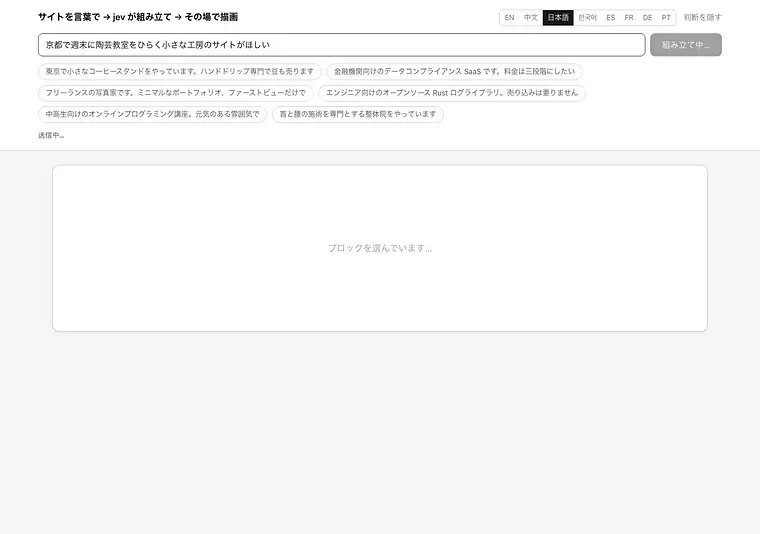
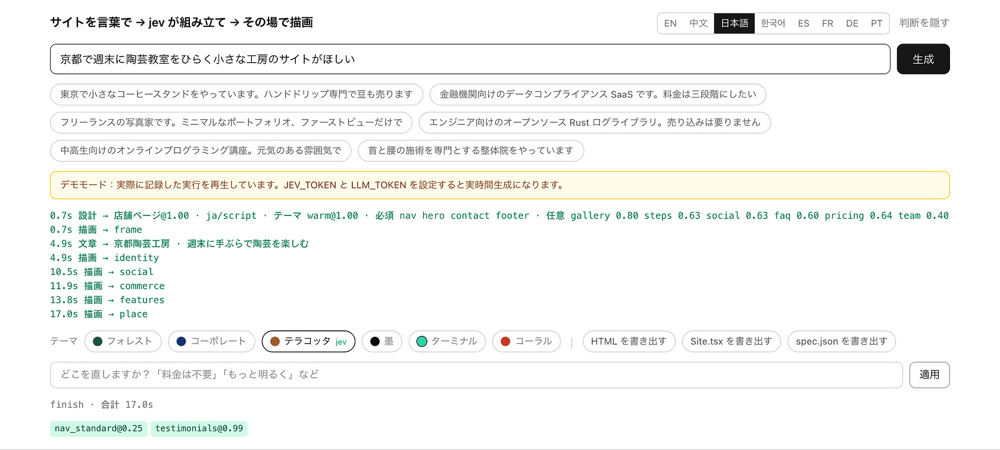
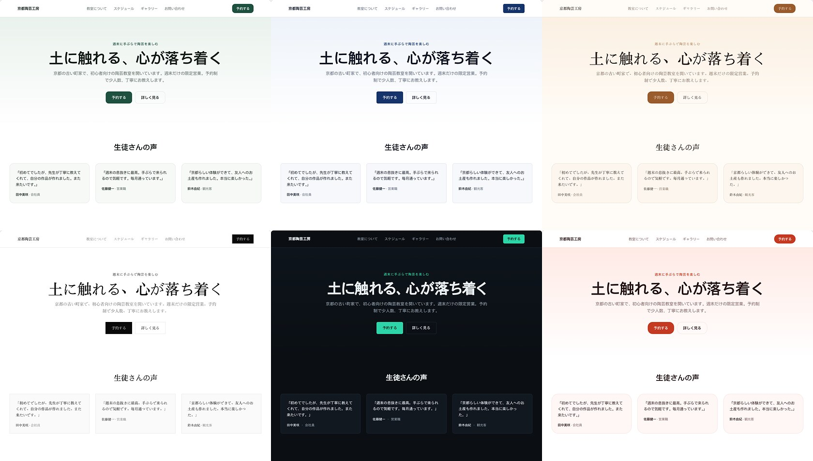

[English](../README.md) · [简体中文](README.zh.md) · **日本語** · [한국어](README.ko.md) · [Español](README.es.md) · [Français](README.fr.md) · [Deutsch](README.de.md) · [Português](README.pt.md)

# loom

<p align="center">
  <a href="https://github.com/yldm-tech/loom/actions/workflows/ci.yml"></a>
  <a href="LICENSE"></a>
  <a href="https://github.com/yldm-tech/loom/stargazers"></a>
  <a href="https://github.com/yldm-tech/loom/commits/main"></a>
  
  <a href="https://typesafe.ai"></a>
</p>


> 三本の糸を一枚の布に織る。文章は LLM、判断は Jev、規則はコード。

商売を一文で説明すると、そのまま使えるランディングページが返ってきます。

<p align="center">
  
</p>

```
「東京で小さなコーヒースタンドをやっています。ハンドドリップ専門です」

0.7 秒   ページ全体のスケルトン（ブロック・順序・配色まで決定済み）
4.5 秒   ファーストビューとフッターに実際の文章が入る
13 秒    全ブロックが揃う
```

設計が文章より先に返るので、スケルトンは最初のフレームからテーマ付きです。デモモードで記録したものなので、キーを設定せずに `npm run dev` した時に見えるものと同じです。

「また AI でサイトを作る話」ではありません。**三つの層がそれぞれ得意なことだけをやる**、そこが違います。

## なぜ三層に分けるのか

生成モデルは何でも書けますが、出てくる構造が妥当である保証はありません。制約モデルは常に妥当ですが、一文字も生み出せません。どちらか一方だけ、あるいは雑に混ぜると、必ずどこかで崩れます。

このプロジェクトは判断を**情報の出どころ**で切り分けます。

| 層 | 担当 | 理由 |
|---|---|---|
| **LLM** | 文章と、商売についての事実（売りが何個か、料金が何段階か、見せられる画面があるか） | システム上に存在しないので、生成するしかない |
| **[Jev](https://typesafe.ai)** | ページ原型、ビジュアルテーマ、そのブロックが要るか、どの社会的証明を使うか | 答えはユーザーの一文の中にある。つまり判断 |
| **コード** | レイアウト規則、ブロック順序、必須ブロック、準備完了の門 | これは規則であって、モデルに訊くものではない |

判定基準は単純です。**確信度が低いままなら、訊く相手を間違えている**——入力に答えが無いか、そもそも判断の要らない問いか、どちらかです。

開発中にこの型が四度出てきました。いずれも「問いを事実の問いに置き換え、コードの規則を一本足す」で解決しています。

```
jev に「機能欄はグリッドかリストか」      → 0.16  ← 依頼文に手がかりが無い
LLM に「売りは何個か」を報告させる        → コード：5 個以上ならグリッド      決定論的

jev に「ファーストビューは中央か分割か」  → 0.28  ← 同上
LLM に「画面写真があるか」を報告させる    → コード：写真がある時だけ分割      決定論的

jev に「これは何語か」                   → 0.76  ← しかも答えが誤り
コードで文字種を判定する                 → jev には「別の言語の要求があるか」だけ  分割

jev に「どのテーマか」                   → 0.99  ← 「元気に」「金融機関向け」が文中にある
そのまま残す                                                              判断
```

## Jev の実測

| 判断 | 確信度 |
|---|---|
| 要求された言語（9 択、要求があるとき） | 1.00 |
| ビジュアルテーマ（6 択） | 0.98 – 1.00 |
| ページ原型（6 択） | 0.62 – 1.00 |
| 修正の意図（6 択） | 0.98 – 1.00 |
| 社会的証明の種類（3 択） | 0.70 – 0.97 |

```
コーヒー店     → 店舗ページ@1.00  warm@0.99      → Nav HeroCentered Testimonials Gallery Pricing Contact FAQ Footer
写真家         → 店舗ページ@0.62  ink@1.00       → Nav HeroCentered Testimonials Gallery Pricing Contact Footer
コンプラ SaaS  → LP@1.00          corporate@1.00 → Nav HeroSplit Testimonials FeatureGrid Steps Pricing FAQ CTABand Footer
```

すべて**排他的な単一選択**です。確率の総和が 1 になるので、外れ候補が勝つには正解から確率を奪うしかありません。これを「候補ごとに独立した yes/no」にすると、40 候補の時点でおよそ 5% が偽陽性として紛れ込みます。この差は構造的なもので、プロンプトの言い回しでは消えません。

Jev は全体で約 3 回の呼び出し、1 秒未満、1 サイトあたり $0.001 程度。**ボトルネックは常に LLM の執筆側**です。

## 動かす

キーが無くても動きます。`npm run dev` して開けば**デモモード**——実際に記録した実行を、ストリーミングの間合いまでそのまま再生します。再生であることは画面にはっきり出ます。

```bash
git clone https://github.com/yldm-tech/loom
cd loom
npm install
npm run dev          # デモモード、設定不要
```

実時間で生成するにはキーを足します。

```bash
cp .env.example .env.local   # JEV_TOKEN と LLM_TOKEN を記入
```

`JEV_TOKEN` は [typesafe.ai](https://typesafe.ai) で取得します。`LLM_TOKEN` は OpenAI 互換のエンドポイントなら何でも構いません——OpenAI、OpenRouter、ゲートウェイ、ローカルの llama.cpp。`LLM_BASE_URL` と `LLM_MODEL` を変えるだけです。

`fixtures/` の中身は**実際に走らせた記録**であって、手書きではありません。誰も再現できない作り物で見栄えを取り繕うデモは、デモが無いより悪いからです。

デモモードでも編集はできますが、Jev は通しません——呼ぶための鍵が無いからです。単語リストがいくつかの指示を UI 単独で適用できる結果に対応づけており、そこで表示される確信度がすべて 1.00 なのはそのためです。このリストは UI の言語を増やしたときに静かに壊れる唯一の場所なので、各言語のプレースホルダーが出す提案をそのリストに通し直すテストがあります。四つのロケールはその検査が無いまま出荷され、そこでアプリが出した提案はどれも何も起こしませんでした。

## 生成後の修正

<p align="center">
  
</p>

Jev が下した判断と確信度、到着時刻がすべて並びます。修正が外れても原因を追えます。


普通の言葉で指示します。1 リクエスト、200–400 ms、**文章は一切再生成しません**。

| 入力 | 結果 |
|---|---|
| 料金は要らない | `remove` → pricing `1.00` |
| もっと明るい配色に | `theme` → coral `1.00` |
| ナビを中央揃えに | `restyle` → nav_centered `1.00` |
| ナビの見た目を変えて | `restyle` → 別のどれか（`0.34`、三つとも妥当） |
| 機能欄をリストに | `restyle` → features_list `1.00` |
| これを公開しておいて | `unclear` `1.00` |

最後の行が要点です。**できないことはできないと言う**——近そうな修正に無理やり寄せません。

ここでは[投機的ファンアウト](https://docs.typesafe.ai/patterns/fan-out.md)を使っています。どれを消すか、どれを足すか、どのテーマか、どのブロックの版を変えるか——全部を 1 リクエストで訊き、コードは勝った枝だけを読みます。トークンは余分に使いますが、往復が一つ減ります。

### 同じ 0.34 でも、止める時と止めない時がある

```
ナビの見た目を変えて   → restyle@1.00  variant=nav_centered@0.34   実行（任意）
ナビバーの様式を変えて → theme@0.87    theme_target=coral@0.15     停止
```

「変えて」は行き先を指定していないので、現在の版を除いた三つはどれも妥当で、確率が均等に散るのが**正しい答え**です。一方で「ナビバーの様式を変えて」がサイト全体の配色変更と誤読された時の 0.15 は、何に変えるか分かっていないという意味——こちらは必ず止めなければなりません。

**しきい値は定数ではなく、間違えた時の代償から決まります。**

## 言語は一つの問いではなく二つ

「このサイトは何語で書くべきか」は一つの判断に見えるし、ここでもしばらく一つとして扱っていた。十件のリクエストで測ったところ、その単一の Choice は英語のリクエストを確信度 0.76 で `zh` と答え、別の一件は正解だったが 0.63 しかなかった。十件中三件が 0.85 を下回った。

確信度の低さがサインだった——この問いは二つの問いが重なっていた。

| 問い | 誰が答えるか | どうやって |
|---|---|---|
| このリクエストはどの文字で書かれているか？ | コード | 仮名・ハングル・漢字は正規表現三本で足りる。ラテン文字はテキストだけではそれ以上絞れないので、エディタ自身の locale が決める |
| 書かれている言語とは別の言語を求めているか？ | Jev | 答えは文中にあり、読める者にしか見えない |

こう分けると両方とも鋭くなった。十一件のリクエストで、上書き要求の有無を問う側は二つの集団を 0.03 と 0.85 に分離し、一件も読み違えなかった。続く「ではどの言語か」は、要求のあった四件すべてを 1.00 で答えた。

```
我在杭州开了家咖啡店                         → zh  script
A small bakery in Brooklyn                 → en  locale
東京で小さなラーメン屋をやっています            → ja  script
我做外贸的，帮我做个英文站，客户都在北美         → en  request @1.00   ← 要求であって、検出ではない
```

四行目が要点なのは変わらない。**書いた言語と、書いてほしい言語は別物だ**——中国語で事業を説明しつつ、顧客は海外なので英語サイトが要る、そしてたいていその一文の中でそう言っている。ここは判断であり Jev に残す。どの文字で打ったかは判断ではない。

簡体字か繁体字かだけはコードが分けにいかない。文字ではなく市場と語彙の問題なので、漢字のリクエストには `zh` と `zh-Hant` の Choice が一つ追加される。

### 言語を決めただけでは半分

それでもサイトは中国語で返ってきた。文案層のフィールド schema は「字」数の指定に至るまで中国語で書かれていて、言語ルールが前置きにあると、モデルは指示ではなく schema に従った。フランス語のリクエスト一件で漢字が 476 文字、ドイツ語では 429 文字。ルールを schema の後ろに移すとフランス語は直り、ドイツ語は直らなかった。user メッセージでもう一度繰り返すと、フランス語・ドイツ語・韓国語・英語のすべてがゼロになった。

さらに三つのフィールド記述がそれ自体で中国語サイトを要求していた——チームメンバーの `name` は「中国語の氏名」、価格は `¥`、数値の単位は「万」。いまはどれも文案の言語に従う。通貨は言語ではなく事業の所在地に従うので、京都の工房の英語ページはいまも円で表示される。

対応は `en` / `zh` / `ja` / `ko` / `es` / `fr` / `de` / `pt` / `zh-Hant`。文字数の目安は中国語基準で書かれているため、他言語には換算の注記が付きます。

エディタ UI 自体は別の話です。8 言語、`navigator.languages` から自動選択、手動切り替えも可能。翻訳は `locales/*.json` にあり、言語を足すのはファイル一つと一行の追加だけ。**`zh.json` が基準で、他のファイルがそのキーを完全に持つことをテストが検証します**——中途半端な翻訳は実行時に黙って中国語へ落ちるのではなく、CI で落ちます。

## 書き出し

五種類、すべて**同じ描画結果**から作られます。レイアウトのコードが二重に存在することはありません。

| 書き出し | サイズ | 用途 |
|---|---|---|
| `site.html` | 36 KB | そのまま公開、ダブルクリックでも開く |
| `Site.tsx` | 34 KB | 開発を続ける用。`tsc --strict` を通る |
| `spec.json` | 数 KB | 保管、あるいは別のレンダラへ |
| `site.registry.json` | `Site.tsx` を包んだもの | すでに shadcn/ui を使っているプロジェクトへ導入する |
| `AGENTS.md` | 1 ページ | コーディングエージェントに渡す用。トークン、ブロック、コンポーネントの出どころ |

### Site.tsx

平坦なコンポーネント一つ、React 以外の依存はゼロ。色・書体・角丸はすべて最も外側の style オブジェクト一箇所にまとまっているので、着せ替えはそこだけ触ります。Tailwind のクラス名はそのまま残ります。

ページがマークアップではなく CSS で描いているものは、テキストとして一緒に持ち出さないと、スタイルシートを同梱しないファイルからは消えます。引用符が一度 `content: open-quote` に移ったとき、書き出しはそれを全部失い、同梱されない規則を指すクラス名だけが残りました。いまは解決してテキストとして JSX に書き込み、しかも本文に密着させています——JSX は二つのテキストの間の改行を空白に変えるので、`「 このように 」` は空白を求めないすべての言語で誤りだからです。

コンポーネント分割は意図的に行っていません——生成されたファイルは、上から下まで読んで自分で切り分けられる方が、先に構造を読み解かされるより良いからです。

検証は実際に `tsc --noEmit --strict --jsx react-jsx` を走らせ、**終了コードで判定**しています。初版がコンパイルできなかったのもこれで分かりました。CSS カスタムプロパティは `React.CSSProperties` では不正なので、現在は `as CSSProperties` を付けて出力します。

### site.html

描画結果と、**実際に使われている CSS 規則だけ**。

```
ページ上の全 CSS   22 KB      ← 本番ビルドでは Tailwind が既に不要分を落としている
実際の書き出し      29 KB      ← HTML 込み
エディタ自身の様式  除去済み    ← 入力欄・ボタン・判断ログは一行も入らない
```

絞り込みは各セレクタを `root.matches()` / `root.querySelector()` で試し、擬似クラスを剥がして基底セレクタで再試行、`@media` は再帰処理して中身が空なら丸ごと捨て、`:root` と `@font-face` は無条件に残します。**解析できないセレクタは捨てずに残します**——少し大きいファイルの方が、黙って壊れるより良い。

サイズ削減は 16% ほど（Tailwind はもともと大きくない）。本当の収穫は、書き出したサイトにエディタ自身の見た目が混ざらなくなったことです。実装は `lib/export.ts`。**第二のレンダラは存在せず**、ブロックのレイアウトは `app/registry.tsx` の一箇所だけです。

### site.registry.json

[shadcn registry](https://ui.shadcn.com/docs/registry) の item です。つまりこのページは、shadcn のコンポーネントと同じ手順で導入できます。

```bash
npx shadcn@latest add ./site.registry.json
```

一つのコマンドが、プロジェクトの `components.json` がコンポーネント置き場と呼んでいるディレクトリへコンポーネントを書き込み、テーマの 17 個のトークンをそのスタイルシートへ統合します。依存関係の一覧は意図的に空です。`Site.tsx` が読み込むのは React の型ひとつだけで、そこに何かを足せば、ファイルが使いもしないパッケージを CLI に入れさせることになります。CLI はローカルパスを受け取るので、先にどこかへ置く必要はありません——ブラウザがダウンロードしたそのファイルを、その場所のまま使えます。

item が抱えているのは同じ `Site.tsx` のソースであって、ページの二度目の描画ではありません。トークンは `cssVars` として一緒に運ばれます。自前の変数を定義しているプロジェクトに落とされたコンポーネントは、そのプロジェクトの色で描画されてしまい、それは誰かが書き出したページではないからです。キーは先頭の `--` を付けずに書きます。そこは CLI が足す部分で、`--accent` と書くとトークンは Tailwind 側で `var(----accent)` になり、何にも解決しないまま、インストールは成功したと報告します。

### AGENTS.md

書き出しを受け取るコーディングエージェント向けの短い説明書です。`spec.json` がこのページの正本であること、テーマの 17 個のトークンとその値、このページに実際にあるブロック、そしてそれらのブロックに関係するコンポーネントの供給元。作業を始める前に一度読ませるためのもので、人間向けのドキュメントではありません。

## 盗む価値のあるコンポーネント

やり方は横着なものです——良いライブラリをコーディングエージェントに教え、選ぶのも直すのも貼るのも任せる。`lib/sources.ts` はそのとき読ませる表です。五つのライブラリについて、役割、ライセンス、インストールコマンド、確認した時点で実際に応答した機械可読なエンドポイント、改善できるスロット、そして噛みつく注意点が載っています。

| 供給元 | 中身 | 入手手段 |
|---|---|---|
| [shadcn/ui](https://ui.shadcn.com) | Radix の上に載った 63 個のアクセシブルな React プリミティブと、他の四つが揃えにいく registry 仕様 | `npx shadcn@latest add <name>` |
| [beUI](https://beui.dev) | 85 個のアニメーション付きコンポーネント。shadcn 互換の registry と MCP エンドポイント付き | `npx shadcn@latest add https://beui.dev/r/<name>.json` |
| [Rare UI](https://rareui.com) | 単一ファイルのアニメーション部品が約 20 個——ぬるりと動くナビ、近接反応サイドバー、オドメーター | `npx shadcn@latest add swamimalode07/rare-ui/<name>` |
| [Transitions](https://transitions.dev) | 名前の付いたモーションが約 44 種。素の CSS で、`.t-*` の名前空間 | `npx transitions-dev add <slug>` |
| [Beautiful UI](https://beautifului.dev) | AI アプリケーションの画面向けプリミティブが 21 個 | ブラウザからのコピー&ペーストのみ。CLI も registry も無い |

**五つのどれ一つとして、マーケティングページのセクションを持っていません。** ファーストビューも、お客様の声も、チーム紹介も、フッターも、この五つのどこにもありません——あるのはプリミティブ、モーション、そしてアプリ寄りの部品です。つまりある供給元は loom がすでに描いているブロックを良くするのであって、置き換えるのではありません。どちらの改善なのかを言っているのが `role` です。この表をブロックのカタログとして読むエージェントは、shadcn/ui にファーストビューを探しに行き、`/blocks/login` を見つけることになります。

ライセンスも揃っていません。四つは MIT ですが、Transitions は独自ライセンスで、コレクションの実質的な部分の再配布を禁じています。サイトで使うのは構いませんが、このリポジトリに同梱してはいけません。

表にある url とエンドポイントはすべて、記憶ではなく実際に取得して確認したものです。それでもいずれ腐ります。

```bash
npm run sources   # 各エンドポイントを取り直し、いま何個のコンポーネントを列挙しているかを報告する
```

## テーマはデータ

<p align="center">
  
</p>

同じ文章を 6 テーマで。切り替えはクライアント側の prop 一つの変更で、モデルは呼ばれず再生成も起きません。


6 テーマ、それぞれが完結したデザイントークンの一式です。`app/registry.tsx` には**十六進数の色が一つもありません**——すべて CSS 変数経由です。

| テーマ | 特徴 | 向き先 |
|---|---|---|
| `forest` | 深緑 + 生成り | ツール、OSS、アウトドア |
| `corporate` | 濃紺 + 6px 角丸 | 金融、法務、法人 |
| `warm` | キャラメル + セリフ + 16px 角丸 | 飲食、手仕事、宿 |
| `ink` | 白黒のみ、角丸ゼロ、余白多め | 写真、ポートフォリオ、出版 |
| `terminal` | 暗色地 + 等幅 + 青緑 | 開発者ツール、インフラ |
| `coral` | 明るい橙 + 20px 角丸 | 消費者向け、教育、SNS |

したがってテーマ切り替えはクライアント側の prop 一つの変更です。モデルを呼ばず、文章も触らず、即座に終わります。内容・構造・見た目が完全に分離しているということです。

## 13 ブロック、6 原型

ブロック：ナビ（4 種）、ファーストビュー（2）、社会的証明（3）、機能欄（2）、作品展示、比較表、流れ、チーム、料金（2）、連絡先、FAQ、行動喚起帯、フッター。

原型がどのブロックを**必須**にするかを決めます。LP のファーストビューも、店舗ページの住所も、モデルには消す権限がありません。

| 原型 | 必須 | 任意 |
|---|---|---|
| ランディングページ | nav hero features cta footer | social pricing faq gallery steps |
| 店舗ページ | nav hero **contact** footer | gallery steps social faq pricing |
| 技術詳細ページ | nav hero features footer | faq social steps |
| 料金ページ | nav pricing faq cta footer | social hero |
| OSS トップ | nav hero features footer | faq social pricing |
| 最小一枚もの | hero | nav footer |

## テスト

アクセシビリティは二通りの方法で別々に確認しています。

`npm test` はテーマのトークン値から WCAG コントラストを計算し直します。ブラウザ不要なので CI で回ります。各テーマの accent/文字、帯/文字、背景/本文はすべて 4.5:1 以上、補助的にしか使わない muted は 3:1 以上が条件です。

```bash
npm run dev          # デモモードで十分
npm run audit:a11y   # 生成結果に axe-core、6 テーマすべて
```

監査にはサーバーの起動と `npx playwright install chromium` が必要なので、CI には入れずスクリプトのままにしてあります。これで見つかった実際の問題はひとつだけ、`coral` の accent が `#e2553d` で白文字との比が 3.75:1、AA 未満でした。色相はそのままに `#c53a22`（5.25:1）へ暗くしています。現在は 6 テーマとも違反ゼロです。


```bash
npm test          # 199 件、約 1.5 秒、ネットワーク不使用
```

中心は**モデルから取り戻した三つの規則**です——売りの個数がグリッドかリストかを決め、料金段階数が単一か比較かを決め、画面写真の有無がファーストビューの版を決める。ここが戻ると、判断は答えられないモデルに黙って返されてしまうので、最も動いてはいけない部分です。

ほかに準備完了の門（空配列は準備済みではなく欠落として扱う）、`asSettled` の完了順、そして JSX 直列化の落とし穴——カスタムプロパティには `as CSSProperties` が要る、グラデーション内のセミコロンは区切りではない、波括弧を含む文字列は包む必要がある、`blk-in` アニメーションクラスと `<style>` は書き出しに入れてはいけない。

構造の不変条件も：原型が参照するスロットは必ず存在すること、必須と任意が重ならないこと、`SLOT_ORDER` が全スロットを過不足なく覆うこと、各バリアントが必要なフィールドを宣言していること。

言語ファイルには別のセットがあります。キーが `zh.json` と完全一致すること、空文字が無いこと、例の数が同じこと、そして各言語の例が本当にその文字で書かれていること（漢字・仮名・ハングルを正規表現で確認）。

**テストは書いた後に必ず変異検証をしています。**書いた瞬間に全部通るテストは、何も証明しないからです。

```
グリッド閾値 5 → 4         → 赤 ✓    ja.json のキーを一つ削除    → 赤 ✓
ファーストビュー条件を反転  → 赤 ✓    ja.json の値を空に          → 赤 ✓
空配列を準備済み扱いに     → 赤 ✓    ja.json の例を二つ減らす    → 赤 ✓
CSSProperties キャスト除去 → 赤 ✓    ko.json に英語の例を混ぜる  → 赤 ✓
style ブロックの除去をやめる → 赤 ✓
```

## 構成

```
lib/
  catalog.ts           コンポーネント契約：出現しうるブロックとその props
  themes.ts            6 組のトークンと、Jev に渡す選択基準
  plan.ts              原型、スロットのバリアント、コード規則 layoutRules()
  content.ts           文章の形と、それを各ブロックへ流し込む処理
  content-parallel.ts  4 並列生成、再試行、形の検証、準備完了判定
  compose.ts           三層のオーケストレーション、ストリーム出力
  edit.ts              修正意図の識別（投機的ファンアウト）
  export.ts            自己完結 HTML、使っている CSS だけ
  export-tsx.ts        React ソース書き出し、DOM → JSX
  export-registry.ts   同じソースを shadcn registry item に。テーマトークン込み
  export-agents.ts     AGENTS.md：spec、トークン、ブロック、コンポーネントの出どころ
  i18n.ts              UI 言語、locales/*.json を読む
  sources.ts           エージェントが取りに行ける五つのコンポーネント供給元、役割と注意点つき
  *.test.ts            純粋ロジックのテスト、ネットワーク不使用
locales/
  en|zh|ja|ko|es|fr|de|pt.json   UI 翻訳、zh が基準
app/
  page.tsx             エディタ、ストリーム消費、クライアント側の再テーマ・再版
  registry.tsx         ブロックの見た目、すべて CSS 変数経由
  api/generate         生成
  api/edit             修正
```

## 既知の限界

- **LLM は不正な JSON を返します。** 実測でおよそ二回に一回。再試行と形の検証で拾っていますが、これは生成モデルの性質です——Jev 側は一度も形式エラーを出しませんでした。
- **13 秒は速くありません。** しかもその全部が LLM の執筆時間です。スケルトンで 0.7 秒から見えるようになりましたが、総時間は変わっていません。
- **ブロックは 13 種類**、問い合わせフォーム・動画・地図がまだありません。`Gallery` は色付きのプレースホルダと説明文を出すだけで、画像は生成しません。
- **`Site.tsx` は平坦な JSX の一塊**で、分割済みのコンポーネント木ではありません。コンパイルも編集もできますが、長く保守するなら自分で切り分ける必要があります。
- **文章の質はモデル次第。** 強いモデルにすれば明らかに良くなり、明らかに遅くなります。

## 参加する

[CONTRIBUTING.md](../CONTRIBUTING.md) を参照してください。ブロック・テーマ・UI 言語・コンポーネント供給元の追加には、それぞれ短い定石があります。

## Star History

この考え方が役に立ったら、star が一番わかりやすい反応です。

<a href="https://star-history.com/#yldm-tech/loom&Date">
  <picture>
    <source media="(prefers-color-scheme: dark)" srcset="https://api.star-history.com/svg?repos=yldm-tech/loom&type=Date&theme=dark" />
    
  </picture>
</a>

## ライセンス

Apache-2.0。[json-render](https://github.com/vercel-labs/json-render)（Vercel Labs、Apache-2.0）の公開 npm パッケージの上に構築しており、上流のソースは同梱していません。判断は [TypeSafe](https://typesafe.ai) の Jev モデルによるものです。詳細は `NOTICE` を参照してください。
