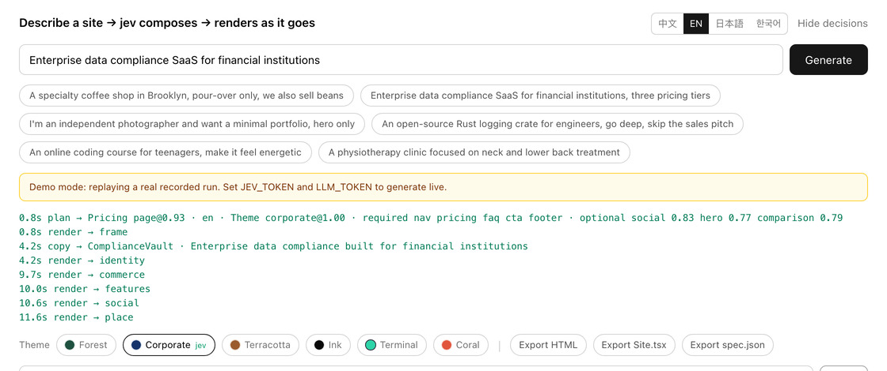
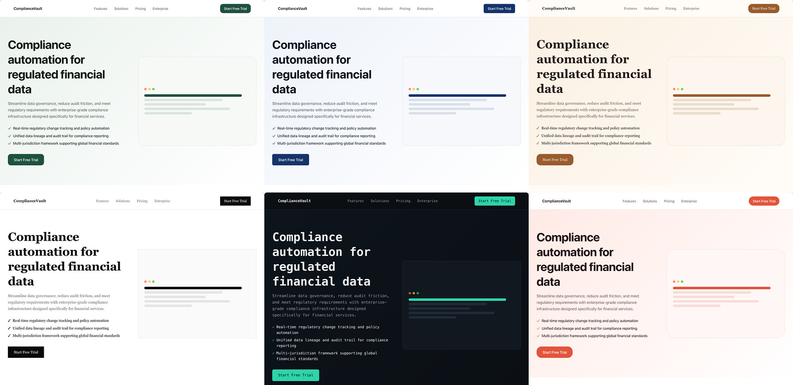

[English](../README.md) · [简体中文](README.zh.md) · [日本語](README.ja.md) · **한국어**

# loom

<p align="center">
  <a href="https://github.com/yldm-tech/loom/actions/workflows/ci.yml"></a>
  <a href="LICENSE"></a>
  <a href="https://github.com/yldm-tech/loom/stargazers"></a>
  <a href="https://github.com/yldm-tech/loom/commits/main"></a>
  
  <a href="https://typesafe.ai"></a>
</p>


> 세 가닥 실을 한 장의 천으로. 문구는 LLM이, 판단은 Jev가, 규칙은 코드가.

사업을 한 문장으로 설명하면, 바로 쓸 수 있는 랜딩 페이지가 나옵니다.

<p align="center">
  
</p>

```
"서울에서 핸드드립 전문 카페를 운영하고 원두도 판매합니다"

0.7초   페이지 전체 스켈레톤 (블록·순서·배색까지 이미 결정)
4.5초   첫 화면과 푸터에 실제 문구가 채워짐
13초    모든 블록 완성
```

설계가 문구보다 먼저 돌아오므로 스켈레톤은 첫 프레임부터 테마가 입혀져 있습니다. 데모 모드에서 기록한 것이라, 키 없이 `npm run dev` 했을 때 보이는 것과 같습니다.

"또 하나의 AI 사이트 빌더"가 아닙니다. **세 계층이 각자 잘하는 것만 한다**는 점이 다릅니다.

## 왜 세 계층인가

생성 모델은 무엇이든 쓰지만, 내놓는 구조가 유효하다는 보장이 없습니다. 제약 모델은 항상 유효하지만, 단 한 글자도 만들어내지 못합니다. 둘 중 하나만 쓰거나 대충 섞으면 어딘가에서 반드시 무너집니다.

이 프로젝트는 결정을 **정보가 어디에 있는지**로 나눕니다.

| 계층 | 담당 | 이유 |
|---|---|---|
| **LLM** | 문구, 그리고 사업에 관한 사실 (강점이 몇 개인지, 요금이 몇 단계인지, 보여줄 화면이 있는지) | 시스템에 존재하지 않으므로 생성할 수밖에 없음 |
| **[Jev](https://typesafe.ai)** | 페이지 원형, 비주얼 테마, 어떤 블록이 필요한지, 어떤 사회적 증명을 쓸지 | 답이 사용자의 그 문장 안에 있음. 즉 판단 |
| **코드** | 레이아웃 규칙, 블록 순서, 필수 블록, 준비 완료 게이트 | 이건 규칙이지 모델에게 물을 일이 아님 |

판정 기준은 단순합니다. **확신도가 계속 낮다면 물을 대상을 잘못 고른 것**입니다 — 입력에 답이 없거나, 애초에 판단이 필요 없는 질문이거나.

개발 중 이 패턴이 세 번 나왔고, 매번 "질문을 사실 질문으로 바꾸고 코드 규칙을 하나 더하기"로 해결했습니다.

```
jev에게 "기능 영역은 그리드인가 리스트인가"  → 0.16  ← 요청문에 단서가 없음
LLM이 "강점이 몇 개인지" 보고하게 함         → 코드: 5개 이상이면 그리드      결정론적

jev에게 "첫 화면은 중앙인가 분할인가"        → 0.28  ← 위와 같음
LLM이 "화면 스크린샷이 있는지" 보고하게 함    → 코드: 있을 때만 분할           결정론적

jev에게 "어떤 테마인가"                      → 0.99  ← "발랄하게", "금융권 대상"이 문장에 있음
그대로 유지                                                                  판단
```

## Jev 실측

| 판단 | 확신도 |
|---|---|
| 문구 언어 (4중 택 1) | 0.66 – 1.00 |
| 비주얼 테마 (6중 택 1) | 0.98 – 1.00 |
| 페이지 원형 (6중 택 1) | 0.62 – 1.00 |
| 수정 의도 (6중 택 1) | 0.98 – 1.00 |
| 사회적 증명 종류 (3중 택 1) | 0.70 – 0.97 |

```
카페            → 매장 페이지@1.00  warm@0.99      → Nav HeroCentered Testimonials Gallery Pricing Contact FAQ Footer
사진작가        → 매장 페이지@0.62  ink@1.00       → Nav HeroCentered Testimonials Gallery Pricing Contact Footer
컴플라이언스 SaaS → 랜딩@1.00        corporate@1.00 → Nav HeroSplit Testimonials FeatureGrid Steps Pricing FAQ CTABand Footer
```

전부 **상호 배타적 단일 선택**입니다. 확률의 합이 1이어야 하므로, 방해 후보가 이기려면 정답에서 확률을 빼앗아야 합니다. 이를 "후보마다 독립된 yes/no"로 바꾸면 40개 시점에서 약 5%가 거짓 양성으로 섞여 들어옵니다. 이 차이는 구조적인 것이라 프롬프트 표현으로는 없앨 수 없습니다.

Jev는 전체 약 3회 호출, 1초 미만, 사이트당 $0.001 수준입니다. **병목은 언제나 LLM의 집필 쪽**입니다.

## 실행

키 없이도 돌아갑니다. `npm run dev` 후 열면 **데모 모드**입니다 — 실제로 기록한 실행을 스트리밍 간격까지 그대로 재생하며, 재생이라는 사실을 화면에 분명히 표시합니다.

```bash
git clone https://github.com/yldm-tech/loom
cd loom
npm install
npm run dev          # 데모 모드, 설정 불필요
```

실시간 생성을 하려면 키를 추가하세요.

```bash
cp .env.example .env.local   # JEV_TOKEN 과 LLM_TOKEN 기입
```

`JEV_TOKEN` 은 [typesafe.ai](https://typesafe.ai) 에서 받습니다. `LLM_TOKEN` 은 OpenAI 호환 엔드포인트면 무엇이든 됩니다 — OpenAI, OpenRouter, 게이트웨이, 로컬 llama.cpp. `LLM_BASE_URL` 과 `LLM_MODEL` 만 바꾸면 됩니다.

`fixtures/` 안의 파일은 **실제로 돌린 기록**이지 손으로 쓴 것이 아닙니다. 아무도 재현할 수 없는 조작된 출력으로 버티는 데모는 데모가 없느니만 못하기 때문입니다.

## 생성 후 수정

<p align="center">
  
</p>

Jev가 내린 모든 판단과 확신도, 도착 시각이 그대로 드러납니다. 수정이 빗나가도 원인을 추적할 수 있습니다.


평범한 말로 지시하면 됩니다. 요청 1회, 200–400ms, **문구는 전혀 다시 생성하지 않습니다**.

| 입력 | 결과 |
|---|---|
| 가격표 빼줘 | `remove` → pricing `1.00` |
| 배색을 더 발랄하게 | `theme` → coral `1.00` |
| 내비게이션을 가운데로 | `restyle` → nav_centered `1.00` |
| 내비 스타일 바꿔줘 | `restyle` → 다른 것 아무거나 (`0.34`, 셋 다 타당) |
| 기능 영역을 리스트로 | `restyle` → features_list `1.00` |
| 이거 배포해줘 | `unclear` `1.00` |

마지막 줄이 핵심입니다. **못 하는 일은 못 한다고 말합니다** — 비슷해 보이는 수정에 억지로 끼워 맞추지 않습니다.

여기에는 [투기적 팬아웃](https://docs.typesafe.ai/patterns/fan-out.md)을 씁니다. 무엇을 지울지, 무엇을 더할지, 어떤 테마로 바꿀지, 어떤 블록의 판을 바꿀지를 한 요청에 모두 묻고, 코드는 이긴 가지만 읽습니다. 토큰은 더 쓰지만 왕복이 하나 줄어듭니다.

### 같은 0.34인데 막을 때와 막지 않을 때

```
내비 스타일 바꿔줘      → restyle@1.00  variant=nav_centered@0.34   실행 (임의)
내비게이션 양식 바꿔줘  → theme@0.87    theme_target=coral@0.15     차단
```

"바꿔줘"는 목적지를 지정하지 않으므로, 현재 변형을 제외한 셋은 모두 타당하고 확률이 고르게 퍼지는 것이 **정답**입니다. 반면 "내비게이션 양식 바꿔줘"가 사이트 전체 배색 변경으로 잘못 읽혔을 때의 0.15는 무엇으로 바꿀지 전혀 모른다는 뜻이며, 그건 반드시 막아야 합니다.

**임계값은 전역 상수가 아니라, 틀렸을 때의 대가에서 나옵니다.**

## 언어는 감지가 아니라 판단

사이트 문구를 어떤 언어로 쓸지도 Jev가 결정합니다. 테마·원형과 같은 요청이므로 왕복이 늘지 않습니다.

```
我在杭州开了家咖啡店                           → zh @1.00
我们做数据合规 SaaS，卖给海外客户，要做英文站     → en @1.00   ← 중국어로 설명, 영어 사이트 희망
A small bakery in Brooklyn                   → en @0.66
東京で小さなラーメン屋をやっています              → ja @0.99
```

두 번째 줄이 요점입니다. **무슨 언어로 썼는지와 무슨 언어로 써주길 원하는지는 다릅니다** — 중국어로 자기 사업을 설명하면서 해외 고객용 영어 사이트를 원하는 사람이 있고, 보통 그 문장 안에 그렇게 말합니다. 순수 감지는 이 줄을 반드시 틀리고, 판단은 맞힙니다.

Brooklyn 줄이 `0.66`으로 낮은 것도 타당합니다. 영어 한 문장이 어떤 언어로 써달라고 명시하지 않은 이상 `en`은 추론이지 지시가 아니므로, 확률은 퍼져야 합니다.

`zh` / `en` / `ja` / `ko` / `zh-Hant` 를 지원합니다. 글자 수 기준은 중국어로 쓰여 있어서 다른 언어에는 환산 안내가 덧붙습니다.

에디터 UI 자체는 별개입니다. 중국어·영어·일본어·한국어 네 가지, `navigator.languages` 로 자동 선택하고 수동 전환도 됩니다. 번역은 `locales/*.json` 에 있고, 언어를 추가하려면 파일 하나와 한 줄만 더하면 됩니다. **`zh.json` 이 기준이며 다른 파일이 그 키를 정확히 갖는지 테스트가 검증합니다** — 미완성 번역은 런타임에 조용히 중국어로 떨어지는 대신 CI에서 빨간불이 됩니다.

## 내보내기

세 가지, 모두 **같은 렌더링 결과**에서 나옵니다. 레이아웃 코드가 두 벌 존재하지 않습니다.

| 내보내기 | 크기 | 용도 |
|---|---|---|
| `site.html` | 36 KB | 그대로 올리거나 더블클릭으로 열기 |
| `Site.tsx` | 34 KB | 이어서 개발. `tsc --strict` 통과 |
| `spec.json` | 수 KB | 보관하거나 다른 렌더러에 투입 |

### Site.tsx

평평한 컴포넌트 하나, React 외 의존성 0. 색·글꼴·모서리 반경은 모두 최외곽 style 객체 한 곳에 모여 있어서 리테마는 그 한 곳만 고치면 됩니다. Tailwind 클래스명은 그대로 보존됩니다.

컴포넌트 분리는 일부러 하지 않았습니다 — 생성된 파일은 위에서 아래로 읽고 직접 잘라낼 수 있는 편이, 먼저 구조를 역추적해야 하는 것보다 낫기 때문입니다.

검증은 실제로 `tsc --noEmit --strict --jsx react-jsx` 를 돌리고 **종료 코드로 판정**합니다. 초판이 컴파일되지 않는다는 사실도 이렇게 드러났습니다. CSS 사용자 정의 속성은 `React.CSSProperties` 에서 유효하지 않아, 현재는 `as CSSProperties` 캐스트를 붙여 출력합니다.

### site.html

렌더링 결과와, **실제로 쓰이는 CSS 규칙만**.

```
페이지의 전체 CSS   22 KB      ← 프로덕션 빌드에서 Tailwind가 이미 불필요분을 제거
실제 내보내기        29 KB      ← HTML 포함
에디터 자체 스타일   제거됨      ← 입력창·버튼·판단 로그 한 줄도 없음
```

필터링은 각 셀렉터를 `root.matches()` / `root.querySelector()` 로 시험하고, 의사 클래스를 벗겨 기본 셀렉터로 재시도하며, `@media` 는 재귀 처리해 내부가 비면 통째로 버리고, `:root` 와 `@font-face` 는 무조건 남깁니다. **파싱할 수 없는 셀렉터는 버리지 않고 남깁니다** — 파일이 조금 큰 편이 조용히 망가지는 것보다 낫습니다.

크기로는 16% 정도만 줄어듭니다 (Tailwind는 원래 크지 않았습니다). 진짜 수확은 내보낸 사이트에 에디터 자신의 스타일이 섞이지 않게 된 것입니다. 구현은 `lib/export.ts`. **두 번째 렌더러는 없고**, 블록 레이아웃은 `app/registry.tsx` 한 곳뿐입니다.

## 테마는 데이터

<p align="center">
  
</p>

같은 문구를 여섯 테마로. 전환은 클라이언트 prop 하나를 바꾸는 일이며 모델 호출도 재생성도 없습니다.


6개 테마, 각각이 완결된 디자인 토큰 한 벌입니다. `app/registry.tsx` 에는 **16진수 색상이 하나도 없습니다** — 전부 CSS 변수를 거칩니다.

| 테마 | 특징 | 어울리는 곳 |
|---|---|---|
| `forest` | 짙은 녹색 + 미색 | 도구, 오픈소스, 아웃도어 |
| `corporate` | 남색 + 6px 반경 | 금융, 법무, 기업 |
| `warm` | 캐러멜 + 세리프 + 16px 반경 | 음식, 수공예, 숙소 |
| `ink` | 흑백만, 반경 0, 넉넉한 여백 | 사진, 포트폴리오, 출판 |
| `terminal` | 어두운 바탕 + 고정폭 + 청록 | 개발자 도구, 인프라 |
| `coral` | 밝은 주황 + 20px 반경 | 소비자, 교육, 소셜 |

따라서 테마 전환은 클라이언트 측 prop 하나를 바꾸는 일입니다. 모델을 부르지 않고, 문구를 건드리지 않고, 즉시 끝납니다. 내용·구조·외관이 완전히 분리되어 있다는 뜻입니다.

## 13개 블록, 6개 원형

블록: 내비게이션(4종), 첫 화면(2), 사회적 증명(3), 기능 영역(2), 작품 전시, 비교표, 절차, 팀, 가격(2), 연락처, FAQ, 행동 유도 띠, 푸터.

원형이 어떤 블록을 **필수**로 만들지 정합니다. 랜딩의 첫 화면도, 매장 페이지의 주소도 모델에게는 지울 권한이 없습니다.

| 원형 | 필수 | 선택 |
|---|---|---|
| 랜딩 페이지 | nav hero features cta footer | social pricing faq gallery steps |
| 매장 페이지 | nav hero **contact** footer | gallery steps social faq pricing |
| 기술 상세 | nav hero features footer | faq social steps |
| 가격 페이지 | nav pricing faq cta footer | social hero |
| 오픈소스 홈 | nav hero features footer | faq social pricing |
| 최소 원페이지 | hero | nav footer |

## 테스트

```bash
npm test          # 39개, 2.5초, 네트워크 미사용
```

핵심은 **모델에게서 되찾아온 세 규칙**입니다 — 강점 개수가 그리드냐 리스트냐를, 요금 단계 수가 단일이냐 비교냐를, 화면 스크린샷 유무가 첫 화면 판을 정합니다. 여기가 되돌아가면 결정이 답할 수 없는 모델에게 조용히 넘어가므로, 가장 흔들리면 안 되는 부분입니다.

그 밖에 준비 완료 게이트(빈 배열은 준비됨이 아니라 누락으로 취급), `asSettled` 의 완료 순서, 그리고 JSX 직렬화의 함정 — 사용자 정의 속성에는 `as CSSProperties` 가 필요하고, 그라디언트 안의 세미콜론은 구분자가 아니며, 중괄호를 포함한 텍스트는 감싸야 하고, `blk-in` 애니메이션 클래스와 `<style>` 블록은 내보내기에 들어가면 안 됩니다.

구조 불변식도 있습니다: 원형이 참조하는 슬롯은 반드시 존재할 것, 필수와 선택이 겹치지 않을 것, `SLOT_ORDER` 가 모든 슬롯을 빠짐없이 한 번씩 덮을 것, 각 변형이 필요한 필드를 선언할 것.

언어 파일에는 별도 세트가 있습니다: 키가 `zh.json` 과 정확히 일치할 것, 빈 문자열이 없을 것, 예시 개수가 같을 것, 그리고 각 언어의 예시가 실제로 그 문자로 쓰였을 것 (한자·가나·한글을 정규식으로 확인).

**테스트는 작성 후 반드시 변이 검증을 거쳤습니다.** 쓰자마자 전부 통과하는 테스트는 아무것도 증명하지 못하기 때문입니다.

```
그리드 임계값 5 → 4          → 빨강 ✓    ja.json 키 하나 삭제       → 빨강 ✓
첫 화면 조건 반전            → 빨강 ✓    ja.json 값을 공백으로      → 빨강 ✓
빈 배열을 준비됨으로 처리     → 빨강 ✓    ja.json 예시 두 개 감소    → 빨강 ✓
CSSProperties 캐스트 제거    → 빨강 ✓    ko.json 에 영어 예시 혼입  → 빨강 ✓
style 블록 제거를 중단       → 빨강 ✓
```

## 구성

```
lib/
  catalog.ts           컴포넌트 계약: 등장 가능한 블록과 그 props
  themes.ts            6벌의 토큰과, Jev에게 주는 선택 기준
  plan.ts              원형, 슬롯 변형, 코드 규칙 layoutRules()
  content.ts           문구의 형태와, 그것을 각 블록에 채우는 처리
  content-parallel.ts  4병렬 생성, 재시도, 형태 검증, 준비 완료 판정
  compose.ts           3계층 오케스트레이션, 스트림 출력
  edit.ts              수정 의도 식별 (투기적 팬아웃)
  export.ts            자기완결 HTML, 쓰이는 CSS만
  export-tsx.ts        React 소스 내보내기, DOM → JSX
  i18n.ts              UI 언어, locales/*.json 을 읽음
  *.test.ts            순수 로직 테스트, 네트워크 미사용
locales/
  zh|en|ja|ko.json     UI 번역, zh 가 기준
app/
  page.tsx             에디터, 스트림 소비, 클라이언트 측 리테마·리스타일
  registry.tsx         블록의 생김새, 전부 CSS 변수 경유
  api/generate         생성
  api/edit             수정
```

## 알려진 한계

- **LLM은 잘못된 JSON을 내놓습니다.** 실측으로 두 번에 한 번꼴. 재시도와 형태 검증으로 잡고 있지만 이건 생성 모델의 속성입니다 — Jev 쪽은 형식 오류를 단 한 번도 내지 않았습니다.
- **13초는 빠르지 않고**, 그 전부가 LLM의 집필 시간입니다. 스켈레톤으로 0.7초부터 보이게 됐지만 총 시간은 그대로입니다.
- **블록은 13종**, 문의 폼·동영상·지도가 아직 없습니다. `Gallery` 는 색조 플레이스홀더와 설명문만 내며 이미지를 생성하지 않습니다.
- **`Site.tsx` 는 평평한 JSX 한 덩어리**이지 분리된 컴포넌트 트리가 아닙니다. 컴파일도 수정도 되지만 오래 유지하려면 직접 잘라내야 합니다.
- **문구 품질은 모델에 달려 있습니다.** 더 강한 모델을 쓰면 눈에 띄게 좋아지고, 눈에 띄게 느려집니다.

## 기여

[CONTRIBUTING.md](../CONTRIBUTING.md) 를 참고하세요. 블록·테마·UI 언어 추가에는 각각 짧고 정해진 경로가 있습니다.

## Star History

이 접근이 도움이 됐다면, star가 가장 직접적인 피드백입니다.

<a href="https://star-history.com/#yldm-tech/loom&Date">
  <picture>
    <source media="(prefers-color-scheme: dark)" srcset="https://api.star-history.com/svg?repos=yldm-tech/loom&type=Date&theme=dark" />
    
  </picture>
</a>

## 라이선스

Apache-2.0. [json-render](https://github.com/vercel-labs/json-render)(Vercel Labs, Apache-2.0)의 공개 npm 패키지 위에 만들었으며 상류 소스를 내장하지 않았습니다. 판단은 [TypeSafe](https://typesafe.ai) 의 Jev 모델이 제공합니다. 자세한 내용은 `NOTICE` 를 참조하세요.
