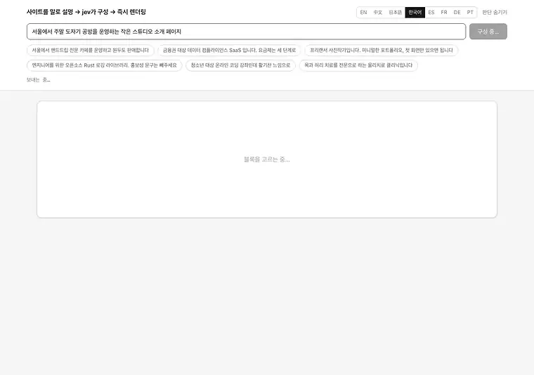
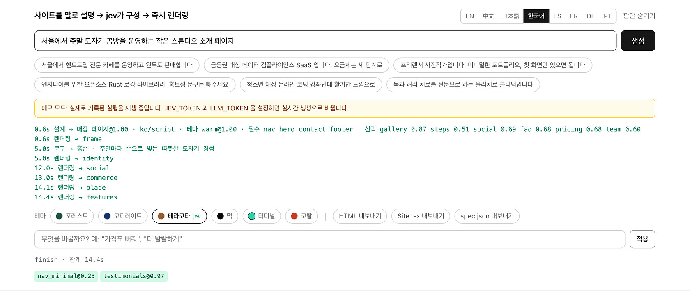
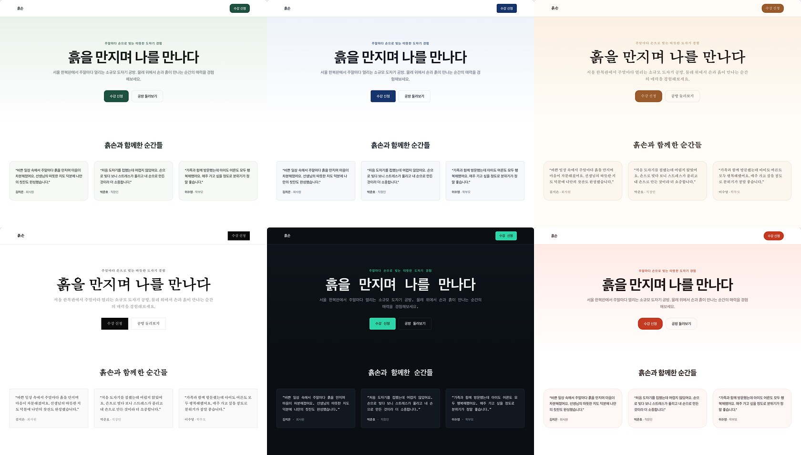

[English](../README.md) · [简体中文](README.zh.md) · [日本語](README.ja.md) · **한국어** · [Español](README.es.md) · [Français](README.fr.md) · [Deutsch](README.de.md) · [Português](README.pt.md)

# loom

<p align="center">
  <a href="https://github.com/yldm-tech/loom/actions/workflows/ci.yml"></a>
  <a href="LICENSE"></a>
  <a href="https://github.com/yldm-tech/loom/stargazers"></a>
  <a href="https://github.com/yldm-tech/loom/commits/main"></a>
  
  <a href="https://typesafe.ai"></a>
</p>


> 세 가닥 실을 한 장의 천으로. 문구는 LLM이, 판단은 Jev가, 규칙은 코드가.

사업을 한 문장으로 설명하면, 바로 쓸 수 있는 랜딩 페이지가 나옵니다.

<p align="center">
  
</p>

```
"서울에서 핸드드립 전문 카페를 운영하고 원두도 판매합니다"

0.7초   페이지 전체 스켈레톤 (블록·순서·배색까지 이미 결정)
4.5초   첫 화면과 푸터에 실제 문구가 채워짐
13초    모든 블록 완성
```

설계가 문구보다 먼저 돌아오므로 스켈레톤은 첫 프레임부터 테마가 입혀져 있습니다. 데모 모드에서 기록한 것이라, 키 없이 `npm run dev` 했을 때 보이는 것과 같습니다.

"또 하나의 AI 사이트 빌더"가 아닙니다. **세 계층이 각자 잘하는 것만 한다**는 점이 다릅니다.

## 왜 세 계층인가

생성 모델은 무엇이든 쓰지만, 내놓는 구조가 유효하다는 보장이 없습니다. 제약 모델은 항상 유효하지만, 단 한 글자도 만들어내지 못합니다. 둘 중 하나만 쓰거나 대충 섞으면 어딘가에서 반드시 무너집니다.

이 프로젝트는 결정을 **정보가 어디에 있는지**로 나눕니다.

| 계층 | 담당 | 이유 |
|---|---|---|
| **LLM** | 문구, 그리고 사업에 관한 사실 (강점이 몇 개인지, 요금이 몇 단계인지, 보여줄 화면이 있는지) | 시스템에 존재하지 않으므로 생성할 수밖에 없음 |
| **[Jev](https://typesafe.ai)** | 페이지 원형, 비주얼 테마, 어떤 블록이 필요한지, 어떤 사회적 증명을 쓸지 | 답이 사용자의 그 문장 안에 있음. 즉 판단 |
| **코드** | 레이아웃 규칙, 블록 순서, 필수 블록, 준비 완료 게이트 | 이건 규칙이지 모델에게 물을 일이 아님 |

판정 기준은 단순합니다. **확신도가 계속 낮다면 물을 대상을 잘못 고른 것**입니다 — 입력에 답이 없거나, 애초에 판단이 필요 없는 질문이거나.

개발 중 이 패턴이 네 번 나왔고, 매번 "질문을 사실 질문으로 바꾸고 코드 규칙을 하나 더하기"로 해결했습니다.

```
jev에게 "기능 영역은 그리드인가 리스트인가"  → 0.16  ← 요청문에 단서가 없음
LLM이 "강점이 몇 개인지" 보고하게 함         → 코드: 5개 이상이면 그리드      결정론적

jev에게 "첫 화면은 중앙인가 분할인가"        → 0.28  ← 위와 같음
LLM이 "화면 스크린샷이 있는지" 보고하게 함    → 코드: 있을 때만 분할           결정론적

jev에게 "이건 무슨 언어인가"                 → 0.76  ← 게다가 답이 틀렸음
코드로 문자 종류를 감지                      → jev에게는 "다른 언어 요구가 있는가"만  분리

jev에게 "어떤 테마인가"                      → 0.99  ← "발랄하게", "금융권 대상"이 문장에 있음
그대로 유지                                                                  판단
```

## Jev 실측

| 판단 | 확신도 |
|---|---|
| 요구된 언어 (9중 택 1, 요구가 있을 때) | 1.00 |
| 비주얼 테마 (6중 택 1) | 0.98 – 1.00 |
| 페이지 원형 (6중 택 1) | 0.62 – 1.00 |
| 수정 의도 (6중 택 1) | 0.98 – 1.00 |
| 사회적 증명 종류 (3중 택 1) | 0.70 – 0.97 |

```
카페            → 매장 페이지@1.00  warm@0.99      → Nav HeroCentered Testimonials Gallery Pricing Contact FAQ Footer
사진작가        → 매장 페이지@0.62  ink@1.00       → Nav HeroCentered Testimonials Gallery Pricing Contact Footer
컴플라이언스 SaaS → 랜딩@1.00        corporate@1.00 → Nav HeroSplit Testimonials FeatureGrid Steps Pricing FAQ CTABand Footer
```

전부 **상호 배타적 단일 선택**입니다. 확률의 합이 1이어야 하므로, 방해 후보가 이기려면 정답에서 확률을 빼앗아야 합니다. 이를 "후보마다 독립된 yes/no"로 바꾸면 40개 시점에서 약 5%가 거짓 양성으로 섞여 들어옵니다. 이 차이는 구조적인 것이라 프롬프트 표현으로는 없앨 수 없습니다.

Jev는 전체 약 3회 호출, 1초 미만, 사이트당 $0.001 수준입니다. **병목은 언제나 LLM의 집필 쪽**입니다.

## 실행

키 없이도 돌아갑니다. `npm run dev` 후 열면 **데모 모드**입니다 — 실제로 기록한 실행을 스트리밍 간격까지 그대로 재생하며, 재생이라는 사실을 화면에 분명히 표시합니다.

```bash
git clone https://github.com/yldm-tech/loom
cd loom
npm install
npm run dev          # 데모 모드, 설정 불필요
```

실시간 생성을 하려면 키를 추가하세요.

```bash
cp .env.example .env.local   # JEV_TOKEN 과 LLM_TOKEN 기입
```

`JEV_TOKEN` 은 [typesafe.ai](https://typesafe.ai) 에서 받습니다. `LLM_TOKEN` 은 OpenAI 호환 엔드포인트면 무엇이든 됩니다 — OpenAI, OpenRouter, 게이트웨이, 로컬 llama.cpp. `LLM_BASE_URL` 과 `LLM_MODEL` 만 바꾸면 됩니다.

`fixtures/` 안의 파일은 **실제로 돌린 기록**이지 손으로 쓴 것이 아닙니다. 아무도 재현할 수 없는 조작된 출력으로 버티는 데모는 데모가 없느니만 못하기 때문입니다.

데모 모드에서도 수정은 되지만 Jev를 거치지 않습니다 — 부를 키가 없으니까요. 단어 목록이 몇 가지 지시를 UI가 스스로 적용할 수 있는 결과에 대응시키며, 거기서 보고되는 확신도가 모두 1.00인 이유가 그것입니다. 이 목록은 UI 언어를 추가할 때 조용히 깨질 수 있는 유일한 지점이라, 각 언어의 플레이스홀더 제안을 그 목록에 다시 통과시키는 테스트가 있습니다. 네 개 로케일이 그 검사 없이 출시되었고, 그 언어들에서 앱이 제안한 것은 하나도 동작하지 않았습니다.

## 생성 후 수정

<p align="center">
  
</p>

Jev가 내린 모든 판단과 확신도, 도착 시각이 그대로 드러납니다. 수정이 빗나가도 원인을 추적할 수 있습니다.


평범한 말로 지시하면 됩니다. 요청 1회, 200–400ms, **문구는 전혀 다시 생성하지 않습니다**.

| 입력 | 결과 |
|---|---|
| 가격표 빼줘 | `remove` → pricing `1.00` |
| 배색을 더 발랄하게 | `theme` → coral `1.00` |
| 내비게이션을 가운데로 | `restyle` → nav_centered `1.00` |
| 내비 스타일 바꿔줘 | `restyle` → 다른 것 아무거나 (`0.34`, 셋 다 타당) |
| 기능 영역을 리스트로 | `restyle` → features_list `1.00` |
| 이거 배포해줘 | `unclear` `1.00` |

마지막 줄이 핵심입니다. **못 하는 일은 못 한다고 말합니다** — 비슷해 보이는 수정에 억지로 끼워 맞추지 않습니다.

여기에는 [투기적 팬아웃](https://docs.typesafe.ai/patterns/fan-out.md)을 씁니다. 무엇을 지울지, 무엇을 더할지, 어떤 테마로 바꿀지, 어떤 블록의 판을 바꿀지를 한 요청에 모두 묻고, 코드는 이긴 가지만 읽습니다. 토큰은 더 쓰지만 왕복이 하나 줄어듭니다.

### 같은 0.34인데 막을 때와 막지 않을 때

```
내비 스타일 바꿔줘      → restyle@1.00  variant=nav_centered@0.34   실행 (임의)
내비게이션 양식 바꿔줘  → theme@0.87    theme_target=coral@0.15     차단
```

"바꿔줘"는 목적지를 지정하지 않으므로, 현재 변형을 제외한 셋은 모두 타당하고 확률이 고르게 퍼지는 것이 **정답**입니다. 반면 "내비게이션 양식 바꿔줘"가 사이트 전체 배색 변경으로 잘못 읽혔을 때의 0.15는 무엇으로 바꿀지 전혀 모른다는 뜻이며, 그건 반드시 막아야 합니다.

**임계값은 전역 상수가 아니라, 틀렸을 때의 대가에서 나옵니다.**

## 언어는 하나가 아니라 두 개의 질문

"이 사이트는 어떤 언어로 써야 하는가"는 하나의 판단처럼 보이고, 여기서도 한동안 하나로 다뤘다. 열 건의 요청으로 측정했더니 그 단일 Choice는 영어 요청을 확신도 0.76으로 `zh`라고 답했고, 다른 한 건은 맞혔지만 0.63에 그쳤다. 열 건 중 세 건이 0.85 아래였다.

낮은 확신도가 신호였다 — 이 질문은 두 질문이 포개진 것이었다.

| 질문 | 누가 답하는가 | 어떻게 |
|---|---|---|
| 이 요청은 어떤 문자로 쓰였는가? | 코드 | 가나·한글·한자는 정규식 세 개면 된다. 라틴 문자는 텍스트만으로 더 좁힐 수 없으니 편집기 자신의 locale이 결정한다 |
| 쓰인 언어가 아닌 다른 언어를 요구하는가? | Jev | 답은 문장 안에 있고, 읽을 수 있는 쪽만 볼 수 있다 |

이렇게 나누니 양쪽 모두 선명해졌다. 열한 건의 요청에서 요구 여부를 묻는 쪽은 두 집단을 0.03과 0.85로 갈랐고 한 건도 잘못 읽지 않았으며, 이어지는 "그럼 어떤 언어인가"는 요구가 있던 네 건 모두를 1.00으로 답했다.

```
我在杭州开了家咖啡店                         → zh  script
A small bakery in Brooklyn                 → en  locale
東京で小さなラーメン屋をやっています            → ja  script
我做外贸的，帮我做个英文站，客户都在北美         → en  request @1.00   ← 감지된 것이 아니라 요청된 것
```

네 번째 줄이 여전히 핵심이다. **쓴 언어와 원하는 언어는 다르다** — 중국어로 사업을 설명하면서도 고객이 해외에 있어 영어 사이트가 필요한 사람은, 대개 바로 그 문장에서 그렇게 말한다. 그 부분은 판단이고 Jev에 남는다. 어떤 문자로 입력했는지는 아니다.

간체와 번체만은 코드가 나누러 가지 않는다. 문자가 아니라 시장과 어휘의 문제라, 한자 요청에는 `zh`와 `zh-Hant` 사이의 Choice가 하나 더 붙는다.

### 언어를 정한 건 절반일 뿐

그래도 사이트는 중국어로 돌아왔다. 카피 계층의 필드 schema는 "字" 수 제한까지 중국어로 쓰여 있고, 언어 규칙이 앞머리에 있을 때 모델은 지시가 아니라 schema를 따랐다. 프랑스어 요청 한 건에서 한자 476자, 독일어에서는 429자가 나왔다. 규칙을 schema 뒤로 옮기니 프랑스어는 고쳐졌고 독일어는 아니었다. user 메시지에서 한 번 더 반복하자 프랑스어·독일어·한국어·영어가 모두 0이 되었다.

게다가 세 개의 필드 설명이 그 자체로 중국어 사이트를 요구하고 있었다 — 팀 구성원의 `name`은 "중국어 이름", 가격은 `¥`, 수치 단위는 "만". 이제 모두 카피 언어를 따른다. 통화는 언어가 아니라 사업장 위치를 따르므로, 교토 공방의 영어 페이지는 여전히 엔으로 표시된다.

`en` / `zh` / `ja` / `ko` / `es` / `fr` / `de` / `pt` / `zh-Hant` 를 지원합니다. 글자 수 기준은 중국어로 쓰여 있어서 다른 언어에는 환산 안내가 덧붙습니다.

에디터 UI 자체는 별개입니다. 여덟 가지 언어를 지원하며 `navigator.languages` 로 자동 선택하고 수동 전환도 됩니다. 번역은 `locales/*.json` 에 있고, 언어를 추가하려면 파일 하나와 한 줄만 더하면 됩니다. **`zh.json` 이 기준이며 다른 파일이 그 키를 정확히 갖는지 테스트가 검증합니다** — 미완성 번역은 런타임에 조용히 중국어로 떨어지는 대신 CI에서 빨간불이 됩니다.

## 내보내기

여섯 가지, 모두 **같은 렌더링 결과**에서 나옵니다. 레이아웃 코드가 두 벌 존재하지 않습니다.

| 내보내기 | 크기 | 용도 |
|---|---|---|
| `site.html` | 36 KB | 그대로 올리거나 더블클릭으로 열기 |
| `Site.tsx` | 34 KB | 이어서 개발. `tsc --strict` 통과 |
| `spec.json` | 수 KB | 보관하거나 다른 렌더러에 투입 |
| `site.registry.json` | `Site.tsx` 를 감싼 것 | 이미 shadcn/ui 를 쓰는 프로젝트에 설치 |
| `AGENTS.md` | 한 쪽 | 코딩 에이전트에게 넘기기: 토큰, 블록, 컴포넌트 출처 |
| `bundle.zip` | 나머지 다섯 | 한 번에 전부 넘기기. 브리핑을 가리키는 `CLAUDE.md` 포함 |

### Site.tsx

평평한 컴포넌트 하나, React 외 의존성 0. 색·글꼴·모서리 반경은 모두 최외곽 style 객체 한 곳에 모여 있어서 리테마는 그 한 곳만 고치면 됩니다. Tailwind 클래스명은 그대로 보존됩니다.

페이지가 마크업이 아니라 CSS로 그리는 것은 텍스트로 함께 가져가지 않으면, 스타일시트를 동봉하지 않는 파일에서는 사라집니다. 따옴표가 한때 `content: open-quote`로 옮겨갔을 때 내보내기는 그것을 모두 잃었고, 동봉되지 않는 규칙을 가리키는 클래스 이름만 남았습니다. 지금은 해석해서 JSX에 텍스트로 써 넣으며, 본문에 붙여 씁니다 — JSX는 두 텍스트 사이의 줄바꿈을 공백으로 바꾸고, `「 이렇게 」` 는 공백을 원하지 않는 모든 언어에서 틀리기 때문입니다.

컴포넌트 분리는 일부러 하지 않았습니다 — 생성된 파일은 위에서 아래로 읽고 직접 잘라낼 수 있는 편이, 먼저 구조를 역추적해야 하는 것보다 낫기 때문입니다.

검증은 실제로 `tsc --noEmit --strict --jsx react-jsx` 를 돌리고 **종료 코드로 판정**합니다. 초판이 컴파일되지 않는다는 사실도 이렇게 드러났습니다. CSS 사용자 정의 속성은 `React.CSSProperties` 에서 유효하지 않아, 현재는 `as CSSProperties` 캐스트를 붙여 출력합니다.

### site.html

렌더링 결과와, **실제로 쓰이는 CSS 규칙만**.

```
페이지의 전체 CSS   22 KB      ← 프로덕션 빌드에서 Tailwind가 이미 불필요분을 제거
실제 내보내기        29 KB      ← HTML 포함
에디터 자체 스타일   제거됨      ← 입력창·버튼·판단 로그 한 줄도 없음
```

필터링은 각 셀렉터를 `root.matches()` / `root.querySelector()` 로 시험하고, 의사 클래스를 벗겨 기본 셀렉터로 재시도하며, `@media` 는 재귀 처리해 내부가 비면 통째로 버리고, `:root` 와 `@font-face` 는 무조건 남깁니다. **파싱할 수 없는 셀렉터는 버리지 않고 남깁니다** — 파일이 조금 큰 편이 조용히 망가지는 것보다 낫습니다.

크기로는 16% 정도만 줄어듭니다 (Tailwind는 원래 크지 않았습니다). 진짜 수확은 내보낸 사이트에 에디터 자신의 스타일이 섞이지 않게 된 것입니다. 구현은 `lib/export.ts`. **두 번째 렌더러는 없고**, 블록 레이아웃은 `app/registry.tsx` 한 곳뿐입니다.

### site.registry.json

[shadcn registry](https://ui.shadcn.com/docs/registry) 항목입니다. 그래서 이 페이지는 여느 shadcn 컴포넌트와 똑같은 방식으로 설치됩니다.

```bash
npx shadcn@latest add ./site.registry.json
```

명령 하나가 프로젝트의 `components.json` 이 컴포넌트 폴더라고 부르는 곳에 컴포넌트를 쓰고, 테마의 토큰 17개를 그 스타일시트에 합칩니다. 의존성 목록은 일부러 비워 두었습니다. `Site.tsx` 는 React 에서 타입 하나만 가져올 뿐이고, 목록을 채우면 파일이 쓰지도 않는 패키지를 CLI 가 설치하게 됩니다. CLI 가 로컬 경로를 받으므로 어딘가에 먼저 올릴 필요가 없습니다 — 브라우저가 방금 내려받은 그 파일을, 내려받은 자리에서 그대로 씁니다.

항목이 품고 있는 것은 같은 `Site.tsx` 소스이지 페이지를 두 번째로 렌더링한 결과가 아닙니다. 토큰은 `cssVars` 로 함께 따라갑니다. 자기 변수를 정의해 둔 프로젝트에 떨어진 컴포넌트는 그 프로젝트의 색으로 그려지고, 그건 누구도 내보낸 적 없는 페이지이기 때문입니다. 키는 앞의 `--` 없이 씁니다. 그 두 글자는 CLI 가 붙이는 몫이라, `--accent` 라고 쓰면 토큰은 Tailwind 쪽에서 `var(----accent)` 가 되어 아무것도 가리키지 못하는데, 설치는 그래도 성공했다고 보고합니다.

### AGENTS.md

내보낸 결과를 집어 드는 코딩 에이전트를 위한 짧은 브리핑입니다. `spec.json` 이 이 페이지의 정본이라는 것, 테마의 토큰 17개와 그 값, 이 페이지에 실제로 있는 블록, 그리고 그 블록들과 관련된 컴포넌트 출처. 작업을 시작하기 전에 한 번 읽히려고 쓴 것이지, 사람을 위한 문서가 아닙니다.

### bundle.zip

나머지 다섯을 한 압축 파일로 묶고, 내용이 `@AGENTS.md` 한 줄뿐인 `CLAUDE.md` 를 덧붙인 것입니다 — Claude Code 는 이 파일 이름을 찾고 그 줄이 가리키는 곳을 읽어 들이므로, 브리핑이 마크업 옆에 펼쳐지지도 않은 채 남지 않고 실제로 읽힙니다. 사본이 아니라 가리키는 것입니다.

버튼이 다섯 개라는 건 파일을 흘릴 기회가 다섯 번이라는 뜻이고, 흘리는 건 늘 `AGENTS.md` 입니다. 다섯 중 페이지처럼 보이지 않는 유일한 것이기 때문입니다. 그러면 받는 쪽 에이전트의 손에는 마크업만 남고, 무엇을 고쳐도 되는지, 테마의 계약이 무엇인지, 더 나은 컴포넌트가 어디에 있는지는 아무것도 알 수 없습니다.

zip 은 손으로 썼고, 압축 없는 STORE 입니다 — 다른 선택지는 의존성을 늘리는 것이었고, 내용물은 도착해서 한 번 풀리면 끝인 텍스트입니다. 결정적인 부분이 둘 있습니다. 크기와 CRC 는 문자열 길이가 아니라 UTF-8 바이트로 잽니다. 문구에 CJK 가 섞이는 건 흔한 일이고, JavaScript 문자열에서 잰 길이는 더 작게 나오기 때문입니다. 그렇게 만들어진 압축 파일은 그 필드를 무시하는 도구에서만 열리고 나머지 전부에서 실패합니다. 그리고 타임스탬프는 시계에서 읽지 않고 고정해 두었습니다. 같은 페이지를 두 번 내보내면 바이트까지 같고, 테스트가 그렇게 단언할 수 있습니다.

## 훔칠 만한 컴포넌트

방식은 게으른 쪽입니다 — 괜찮은 라이브러리를 코딩 에이전트에게 알려 주고, 고르고 고치고 붙여 넣는 일을 맡깁니다. `lib/sources.ts` 가 에이전트가 읽는 표입니다. 라이브러리 다섯 곳 각각의 역할, 라이선스, 설치 명령, 확인 당시 실제로 응답한 기계 판독용 엔드포인트, 개선할 수 있는 슬롯, 그리고 무는 주의사항이 들어 있습니다.

| 출처 | 무엇인가 | 가져오는 법 |
|---|---|---|
| [shadcn/ui](https://ui.shadcn.com) | Radix 위에 올린 접근성 React 프리미티브 63개, 그리고 나머지 넷이 맞추는 registry 명세 | `npx shadcn@latest add <name>` |
| [beUI](https://beui.dev) | 애니메이션 컴포넌트 85개. shadcn 호환 registry 와 MCP 엔드포인트까지 | `npx shadcn@latest add https://beui.dev/r/<name>.json` |
| [Rare UI](https://rareui.com) | 단일 파일 애니메이션 위젯 약 20개 — 끈적이는 내비, 근접 반응 사이드바, 오도미터 카운터 | `npx shadcn@latest add swamimalode07/rare-ui/<name>` |
| [Transitions](https://transitions.dev) | 이름 붙은 모션 스니펫 약 44개. 순수 CSS, `.t-*` 네임스페이스 | `npx transitions-dev add <slug>` |
| [Beautiful UI](https://beautifului.dev) | AI 애플리케이션 화면용 프리미티브 21개 | 브라우저에서 복사·붙여넣기만. CLI 도 registry 도 없음 |

**다섯 곳 중 어디도 마케팅 페이지 섹션을 제공하지 않습니다.** 첫 화면도, 고객 후기도, 팀 소개도, 푸터도 이 다섯 곳 어디에도 없습니다 — 있는 것은 프리미티브와 모션, 그리고 앱 모양의 위젯입니다. 그래서 어떤 출처는 loom 이 이미 그리고 있는 블록을 개선할 뿐, 대체하지 않습니다. 어느 쪽 개선인지를 말해 주는 필드가 `role` 입니다. 이 표를 블록 카탈로그로 읽는 에이전트는 shadcn/ui 에서 첫 화면을 찾다가 `/blocks/login` 을 만나게 됩니다.

라이선스도 균일하지 않습니다. 넷은 MIT 이고, Transitions 는 컬렉션의 실질적인 부분을 재배포하는 것을 금지하는 자체 라이선스입니다. 사이트에 쓰는 것은 되지만 이 저장소에 담아 함께 배포해서는 안 됩니다.

표에 있는 url 과 엔드포인트는 기억이 아니라 실제로 가져와 확인한 것입니다. 그래도 언젠가는 썩습니다.

```bash
npm run sources   # 각 엔드포인트를 다시 불러, 지금 몇 개의 컴포넌트를 나열하는지 보고
```

## 브라우저 없이 닿는 곳

그 표의 정렬 기준은, 각 라이브러리를 기계가 사람 손 없이 얼마나 가져갈 수 있느냐입니다 — 셋은 `llms.txt` 를 내고, 하나는 MCP 서버를 돌리고, 셋은 CLI 로 설치됩니다. 그리고 그 표를 쓴 loom 은 그중 아무것도 내놓지 않았습니다. 자기 블록과 테마와 출처에 대해 아는 전부가, 사람이 탭을 열고 눌러야만 닿는 곳에 있었습니다. 이번에 붙인 것은 loom 이 남을 채점하는 데 쓰던 바로 그 면들입니다.

### MCP 서버

```bash
claude mcp add loom -- npm run --silent mcp
```

읽기 전용 도구 다섯 개: 컴포넌트 출처 표, 지정한 블록에 맞는 출처, 블록 13종과 각각의 변형 및 어느 원형이 그것을 요구하는지, 테마 6종과 Jev 가 고를 때 쓰는 기준, 그리고 한 테마의 토큰 17개와 그 값.

모든 답은 호출이 도착한 시점에 `lib/plan.ts`, `lib/themes.ts`, `lib/sources.ts` 에서 읽어 옵니다. `lib/mcp.ts` 는 그중 어느 것도 다시 적어 두지 않습니다. 블록 목록의 사본을 스스로 들고 있는 도구는 목록이 바뀐 뒤에도 자신 있게 계속 답하고, 반대편의 에이전트에게는 그것을 알아챌 방법이 없습니다.

JSON-RPC 틀은 MCP SDK 에서 가져오지 않고 직접 적었습니다. **이번 변경은 의존성을 하나도 늘리지 않았기** 때문입니다. 도구만 제공하는 서버가 클라이언트에 지는 빚은 `initialize`, `tools/list`, `tools/call`, 그리고 `notifications/initialized` 에 아무것도 돌려주지 않는 절제뿐입니다 — 아무도 기다리지 않는 답장은 그 뒤의 모든 응답을 엉뚱한 요청에 붙여 버립니다. `scripts/mcp.mjs` 는 펌프일 뿐입니다. stdin 을 줄바꿈으로 자르고 잘린 줄의 꼬리를 남겨 둡니다. 청크 경계는 메시지 경계가 아니고, 실제 클라이언트는 두 메시지가 한 청크에 담길 만큼 빠르게 핸드셰이크를 보내기 때문입니다.

두 가지 답은 의도적으로 단순 조회 이상을 합니다. loom 에 없는 블록 이름에는 빈 목록과 *설명*이 함께 돌아가며, 추측은 절대 돌아가지 않습니다. 실제로 있지만 어느 출처도 다루지 않는 블록에는 그렇다고 분명히 말합니다 — 빈 목록만으로는 조회 실패처럼 읽히기 때문입니다. 모르는 테마 이름에는 대체 팔레트가 돌아가되 **대체라고 표시됩니다**. `themeVars()` 는 모르는 이름 전부에 `forest` 를 주는데, 렌더링으로는 옳고 설명 없이 에이전트에게 건네면 틀립니다. `terminal` 을 요청했다고 믿은 채 초록 버튼을 붙여 넣게 되니까요.

### /llms.txt

다섯 곳 중 셋이 내고 있는 바로 그 형식이며, 요청마다 `lib/plan.ts`, `lib/themes.ts`, `lib/sources.ts` 에서 생성됩니다. 그래서 실제로 돌아가는 배포와 어긋날 수가 없습니다. 테스트가 진짜 표를 하나씩 훑으므로, `lib/llms.ts` 를 건드리지 않고 블록이나 테마나 출처를 더하면 누락된 문서가 나가기 전에 그 자리에서 빨갛게 됩니다.

형태는 llmstxt.org 그대로입니다. H1 하나, 인용 하나, 제목이 하나도 들어가지 않는 본문, 그리고 모든 줄이 링크 항목이어야 하는 H2 절들. 마지막 규칙이 바로 블록·테마·토큰·내보내기·출처를 각각의 절이 아니라 본문에 둔 이유입니다 — 어느 것도 URL 이 없고, 형태를 맞추려고 `/docs/blocks` 를 지어내면 에이전트를 404 로 보내게 됩니다. 남의 엔드포인트는 코드 조각으로 적었으므로, 에이전트가 따라갈 수 있는 링크는 전부 이 origin 이 직접 답하는 것입니다.

origin 은 빌드 시점 상수가 아니라 요청에서 가져옵니다. 같은 빌드가 localhost 에서도, 프리뷰 호스트에서도, 자체 도메인에서도 답하기 때문이고, 구워 넣은 주소는 아무도 시험해 보지 않은 그 한 환경에서만 드러나는 종류의 오류입니다. 진짜 링크인 절은 `POST /api/generate` 와 `POST /api/edit` 둘이며, 각각의 요청 본문과 돌아오는 것의 형태가 적혀 있습니다.

## 테마는 데이터

<p align="center">
  
</p>

같은 문구를 여섯 테마로. 전환은 클라이언트 prop 하나를 바꾸는 일이며 모델 호출도 재생성도 없습니다.


6개 테마, 각각이 완결된 디자인 토큰 한 벌입니다. `app/registry.tsx` 의 색은 전부 CSS 변수를 거치고 **예외는 딱 한 군데**이며, 테스트가 그 수를 하나로 붙들어 둡니다 — 분할 히어로 안 목업 스크린샷의 macOS 신호등 점 3개로, loom 의 팔레트가 아니라 다른 운영체제의 창 장식을 그린 것입니다.

| 테마 | 특징 | 어울리는 곳 |
|---|---|---|
| `forest` | 짙은 녹색 + 미색 | 도구, 오픈소스, 아웃도어 |
| `corporate` | 남색 + 6px 반경 | 금융, 법무, 기업 |
| `warm` | 캐러멜 + 세리프 + 16px 반경 | 음식, 수공예, 숙소 |
| `ink` | 흑백만, 반경 0, 넉넉한 여백 | 사진, 포트폴리오, 출판 |
| `terminal` | 어두운 바탕 + 고정폭 + 청록 | 개발자 도구, 인프라 |
| `coral` | 밝은 주황 + 20px 반경 | 소비자, 교육, 소셜 |

따라서 테마 전환은 클라이언트 측 prop 하나를 바꾸는 일입니다. 모델을 부르지 않고, 문구를 건드리지 않고, 즉시 끝납니다. 내용·구조·외관이 완전히 분리되어 있다는 뜻입니다.

## 13개 블록, 6개 원형

블록: 내비게이션(4종), 첫 화면(2), 사회적 증명(3), 기능 영역(2), 작품 전시, 비교표, 절차, 팀, 가격(2), 연락처, FAQ, 행동 유도 띠, 푸터.

원형이 어떤 블록을 **필수**로 만들지 정합니다. 랜딩의 첫 화면도, 매장 페이지의 주소도 모델에게는 지울 권한이 없습니다.

| 원형 | 필수 | 선택 |
|---|---|---|
| 랜딩 페이지 | nav hero features cta footer | social pricing faq gallery steps |
| 매장 페이지 | nav hero **contact** footer | gallery steps social faq pricing |
| 기술 상세 | nav hero features footer | faq social steps |
| 가격 페이지 | nav pricing faq cta footer | social hero |
| 오픈소스 홈 | nav hero features footer | faq social pricing |
| 최소 원페이지 | hero | nav footer |

## 테스트

접근성은 서로 다른 두 가지 방식으로 각각 확인합니다.

`npm test` 는 테마 토큰 값에서 WCAG 대비를 다시 계산합니다. 브라우저가 필요 없어 CI 에서 돕니다. 각 테마의 accent/글자, 띠/글자, 배경/본문은 모두 4.5:1 이상이어야 하고, 보조로만 쓰는 muted 는 3:1 이상이어야 합니다.

```bash
npm run dev          # 데모 모드로 충분
npm run audit:a11y   # 생성 결과에 axe-core, 여섯 테마 전부
```

감사는 서버 구동과 `npx playwright install chromium` 이 필요해서 CI 에 넣지 않고 스크립트로 남겨 두었습니다. 여기서 나온 실제 문제는 하나뿐이었습니다. `coral` 의 accent 가 `#e2553d` 라 흰 글자와의 대비가 3.75:1, AA 미만이었습니다. 색상은 유지한 채 `#c53a22`(5.25:1) 로 어둡게 했습니다. 지금은 여섯 테마 모두 위반 없음입니다.


```bash
npm test          # 362개, 약 1.5초, 네트워크 미사용
```

핵심은 **모델에게서 되찾아온 세 규칙**입니다 — 강점 개수가 그리드냐 리스트냐를, 요금 단계 수가 단일이냐 비교냐를, 화면 스크린샷 유무가 첫 화면 판을 정합니다. 여기가 되돌아가면 결정이 답할 수 없는 모델에게 조용히 넘어가므로, 가장 흔들리면 안 되는 부분입니다.

그 밖에 카탈로그 계약 — 이제 선언에 그치지 않고 실제로 검사됩니다. `lib/catalog.ts` 가 정한 스키마를 props 가 만족하지 못하는 블록은 타입을 그대로 믿는 렌더러에 닿지 않고 스켈레톤으로 자리를 지킵니다. 그리고 준비 완료 게이트(빈 배열은 준비됨이 아니라 누락으로 취급), `asSettled` 의 완료 순서, 그리고 JSX 직렬화의 함정 — 사용자 정의 속성에는 `as CSSProperties` 가 필요하고, 그라디언트 안의 세미콜론은 구분자가 아니며, 중괄호를 포함한 텍스트는 감싸야 하고, `blk-in` 애니메이션 클래스와 `<style>` 블록은 내보내기에 들어가면 안 됩니다. 에이전트를 향한 면들도 같은 대우를 받습니다. `bundle.zip` 은 그것을 만든 쓰기 쪽이 아니라 테스트 파일에 따로 쓴, 일부러 느리게 만든 zip 리더로 다시 읽습니다. `/llms.txt` 는 llmstxt.org 형태로 파싱해 실제 블록·테마·출처 표와 한 줄씩 대조합니다. MCP 서버는 핸드셰이크와, 스스로 광고하는 모든 도구와, 망가진 채로 도착하는 일련의 메시지를 통해 돌려 봅니다.

구조 불변식도 있습니다: 원형이 참조하는 슬롯은 반드시 존재할 것, 필수와 선택이 겹치지 않을 것, `SLOT_ORDER` 가 모든 슬롯을 빠짐없이 한 번씩 덮을 것, 각 변형이 필요한 필드를 선언할 것.

언어 파일에는 별도 세트가 있습니다: 키가 `zh.json` 과 정확히 일치할 것, 빈 문자열이 없을 것, 예시 개수가 같을 것, 그리고 각 언어의 예시가 실제로 그 문자로 쓰였을 것 (한자·가나·한글을 정규식으로 확인).

**테스트는 작성 후 반드시 변이 검증을 거쳤습니다.** 쓰자마자 전부 통과하는 테스트는 아무것도 증명하지 못하기 때문입니다.

```
그리드 임계값 5 → 4          → 빨강 ✓    ja.json 키 하나 삭제       → 빨강 ✓
첫 화면 조건 반전            → 빨강 ✓    ja.json 값을 공백으로      → 빨강 ✓
빈 배열을 준비됨으로 처리     → 빨강 ✓    ja.json 예시 두 개 감소    → 빨강 ✓
CSSProperties 캐스트 제거    → 빨강 ✓    ko.json 에 영어 예시 혼입  → 빨강 ✓
style 블록 제거를 중단       → 빨강 ✓
```

## 구성

```
lib/
  catalog.ts           컴포넌트 계약: 등장 가능한 블록과 그 props
  themes.ts            6벌의 토큰과, Jev에게 주는 선택 기준
  plan.ts              원형, 슬롯 변형, 코드 규칙 layoutRules()
  content.ts           문구의 형태와, 그것을 각 블록에 채우는 처리
  content-parallel.ts  4병렬 생성, 재시도, 형태 검증, 준비 완료 판정
  compose.ts           3계층 오케스트레이션, 스트림 출력
  edit.ts              수정 의도 식별 (투기적 팬아웃)
  export.ts            자기완결 HTML, 쓰이는 CSS만
  export-tsx.ts        React 소스 내보내기, DOM → JSX
  export-registry.ts   같은 소스를 shadcn registry 항목으로, 테마 토큰 포함
  export-agents.ts     AGENTS.md: spec, 토큰, 블록, 컴포넌트 출처
  export-bundle.ts     내보내기 다섯과 CLAUDE.md 를 직접 쓴 zip 으로 묶음
  llms.ts              /llms.txt, plan.ts·themes.ts·sources.ts 에서 생성
  mcp.ts               MCP 도구 다섯과 JSON-RPC 틀, 순수하고 동기적
  i18n.ts              UI 언어, locales/*.json 을 읽음
  sources.ts           에이전트가 가져다 쓸 수 있는 컴포넌트 출처 다섯 곳, 역할과 주의사항 포함
  *.test.ts            순수 로직 테스트, 네트워크 미사용
locales/
  en|zh|ja|ko|es|fr|de|pt.json   UI 번역, zh 가 기준
app/
  page.tsx             에디터, 스트림 소비, 클라이언트 측 리테마·리스타일
  registry.tsx         블록의 생김새, CSS 변수 경유
  llms.txt/            /llms.txt 라우트
  api/generate         생성
  api/edit             수정
scripts/
  mcp.mjs              MCP 서버의 stdio 펌프, 프로토콜 자체는 lib/mcp.ts
  sources.mjs          sources.ts 의 url 과 엔드포인트를 다시 확인
  record-fixture.mjs   실제 실행을 fixtures/ 에 기록
  capture-docs.mjs     README 의 스크린샷과 녹화
  audit-a11y.mjs       떠 있는 데모 모드 서버에 axe-core 실행
```

## 알려진 한계

- **LLM은 잘못된 JSON을 내놓습니다.** 실측으로 두 번에 한 번꼴. 재시도와 형태 검증으로 잡고 있지만 이건 생성 모델의 속성입니다 — Jev 쪽은 형식 오류를 단 한 번도 내지 않았습니다.
- **13초는 빠르지 않고**, 그 전부가 LLM의 집필 시간입니다. 스켈레톤으로 0.7초부터 보이게 됐지만 총 시간은 그대로입니다.
- **블록은 13종**, 문의 폼·동영상·지도가 아직 없습니다. `Gallery` 는 색조 플레이스홀더와 설명문만 내며 이미지를 생성하지 않습니다.
- **`Site.tsx` 는 평평한 JSX 한 덩어리**이지 분리된 컴포넌트 트리가 아닙니다. 컴파일도 수정도 되지만 오래 유지하려면 직접 잘라내야 합니다.
- **문구 품질은 모델에 달려 있습니다.** 더 강한 모델을 쓰면 눈에 띄게 좋아지고, 눈에 띄게 느려집니다.
- **MCP 서버는 loom 에 대해 답할 뿐, loom 을 움직이지는 않습니다.** 도구 다섯은 블록·테마·출처 표를 읽습니다. 페이지를 만들거나 고치려면 여전히 `/api/generate` 와 `/api/edit` 를 부르거나 에디터를 열어야 합니다.

## 기여

[CONTRIBUTING.md](../CONTRIBUTING.md) 를 참고하세요. 블록·테마·UI 언어·컴포넌트 출처·MCP 도구 추가에는 각각 짧고 정해진 경로가 있습니다.

## Star History

이 접근이 도움이 됐다면, star가 가장 직접적인 피드백입니다.

<a href="https://star-history.com/#yldm-tech/loom&Date">
  <picture>
    <source media="(prefers-color-scheme: dark)" srcset="https://api.star-history.com/svg?repos=yldm-tech/loom&type=Date&theme=dark" />
    
  </picture>
</a>

## 라이선스

Apache-2.0. [json-render](https://github.com/vercel-labs/json-render)(Vercel Labs, Apache-2.0)의 공개 npm 패키지 위에 만들었으며 상류 소스를 내장하지 않았습니다. 판단은 [TypeSafe](https://typesafe.ai) 의 Jev 모델이 제공합니다. 자세한 내용은 `NOTICE` 를 참조하세요.
