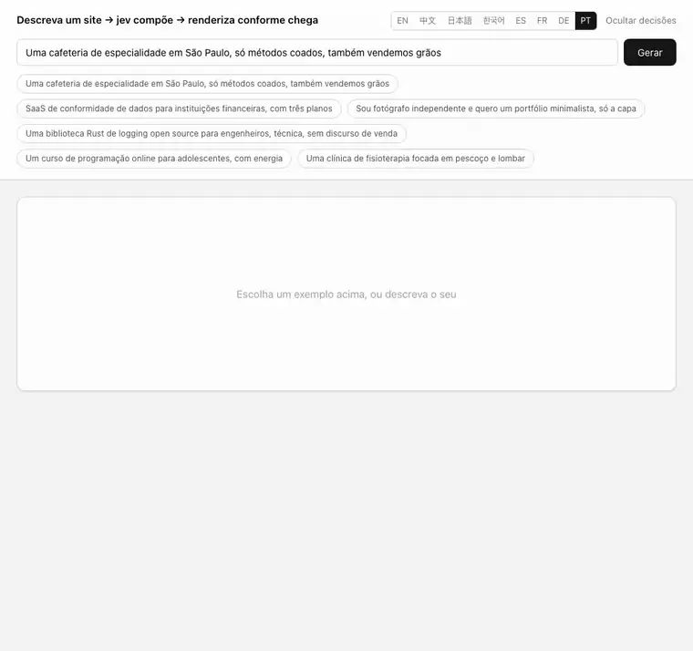
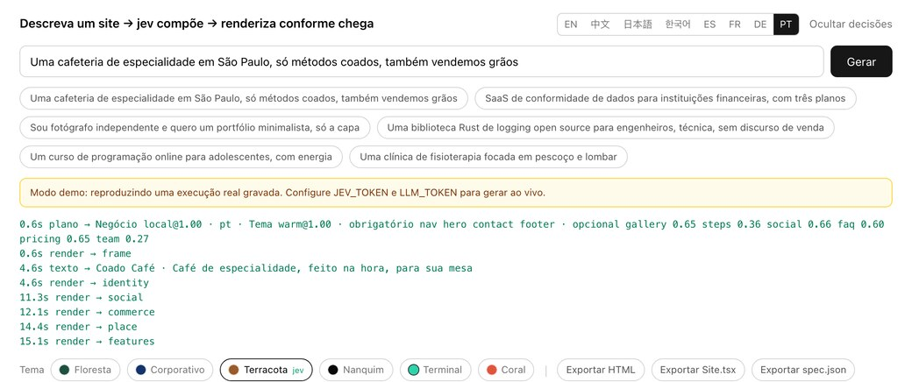
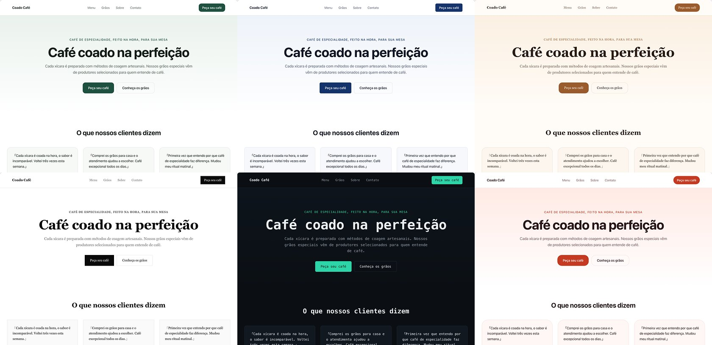

[English](../README.md) · [简体中文](README.zh.md) · [日本語](README.ja.md) · [한국어](README.ko.md) · [Español](README.es.md) · [Français](README.fr.md) · [Deutsch](README.de.md) · **Português**

# loom

<p align="center">
  <a href="https://github.com/yldm-tech/loom/actions/workflows/ci.yml"></a>
  <a href="../LICENSE"></a>
  <a href="https://github.com/yldm-tech/loom/stargazers"></a>
  <a href="https://github.com/yldm-tech/loom/commits/main"></a>
  
  <a href="https://typesafe.ai"></a>
</p>

> Três fios tecidos em um só pano: o texto vem de um LLM, o julgamento vem do Jev, as regras vêm do código.

Descreva seu negócio em uma frase e receba uma landing page que dá para usar de verdade.

<p align="center">
  
</p>

```
“Uma cafeteria de especialidade em São Paulo, só métodos coados”

0,7 s   esqueleto completo (blocos, ordem e paleta já decididos)
4,5 s   topo e rodapé preenchidos com texto real
13 s    todos os blocos no lugar
```

O esqueleto já vem tematizado desde o primeiro quadro, porque o plano chega antes de qualquer texto. Gravado em modo demo: é exatamente o que se vê depois de `npm run dev`, sem nenhuma chave.

O diferencial não é uma IA montar um site. É que **cada uma das três camadas faz apenas aquilo em que é boa**.

## Por que três camadas

Um modelo generativo escreve qualquer coisa, mas não há como garantir que a estrutura que ele emite seja válida. Um modelo restrito é sempre válido, mas não inventa uma única palavra. Use só um dos dois, ou misture sem critério, e algo desaba.

Este projeto divide as decisões conforme **onde a informação está**:

| Camada | Do que cuida | Porque |
|---|---|---|
| **LLM** | O texto, mais os fatos do negócio (quantos diferenciais, quantos planos de preço, existe uma interface para mostrar) | Nada disso existe no sistema; só pode ser gerado |
| **[Jev](https://typesafe.ai)** | Arquétipo de página, tema visual, se um bloco cabe ali, que tipo de prova social | A resposta já está no que a pessoa disse — é um julgamento |
| **Código** | Regras de layout, ordem dos blocos, blocos obrigatórios, liberação por prontidão | Isso são regras; perguntar a um modelo é endereçar errado |

O critério é simples: **confiança persistentemente baixa significa que você perguntou à parte errada** — ou a entrada não contém a resposta, ou a pergunta não exigia julgamento nenhum.

Esse padrão apareceu três vezes durante o desenvolvimento. Em todas elas a correção foi trocar a pergunta por uma factual somada a uma regra em código:

```
perguntar ao jev “grade ou lista?”             → 0,16  ← o pedido não diz nada a respeito
fazer o LLM informar “quantos diferenciais?”   → código: >= 5 vira grade          determinístico

perguntar ao jev “topo centralizado ou dividido?” → 0,28  ← mesmo problema
fazer o LLM informar “existe captura de tela?”    → código: dividido só se existir determinístico

perguntar ao jev “qual tema visual?”           → 0,99  ← “com energia”, “clientes financeiros” estão ali
fica como está                                                                      julgamento
```

## Comportamento medido do Jev

| Julgamento | Confiança |
|---|---|
| Idioma do texto (1 de 9) | 0,66 – 1,00 |
| Tema visual (1 de 6) | 0,98 – 1,00 |
| Arquétipo de página (1 de 6) | 0,62 – 1,00 |
| Intenção de edição (1 de 6) | 0,98 – 1,00 |
| Tipo de prova social (1 de 3) | 0,70 – 0,97 |

```
cafeteria            → negócio local@1,00  warm@0,99      → Nav HeroCentered Testimonials Gallery Pricing Contact FAQ Footer
fotógrafo            → negócio local@0,62  ink@1,00       → Nav HeroCentered Testimonials Gallery Pricing Contact Footer
SaaS de conformidade → landing@1,00        corporate@1,00 → Nav HeroSplit Testimonials FeatureGrid Steps Pricing FAQ CTABand Footer
```

Cada uma é **uma única escolha mutuamente exclusiva**: as probabilidades têm de somar um, então uma opção distratora só vence tirando massa da resposta certa. Se em vez disso você perguntar “um sim/não independente por candidato”, com 40 opções cerca de 5 % entram como falsos positivos. Essa diferença é estrutural, não se resolve reescrevendo o prompt.

O Jev custa umas três chamadas, menos de um segundo, na ordem de US$ 0,001 por site. **O gargalo é sempre o LLM escrevendo.**

## Como rodar

Funciona sem chaves. `npm run dev` e abra — esse é o **modo demo**: uma execução real gravada, reproduzida no ritmo original, e a interface diz isso com todas as letras.

```bash
git clone https://github.com/yldm-tech/loom
cd loom
npm install
npm run dev          # modo demo, sem configuração
```

Adicione as chaves para gerar de verdade:

```bash
cp .env.example .env.local   # preencha JEV_TOKEN e LLM_TOKEN
```

O `JEV_TOKEN` sai do [typesafe.ai](https://typesafe.ai). O `LLM_TOKEN` funciona com qualquer endpoint compatível com OpenAI — OpenAI, OpenRouter, um gateway, um llama.cpp local — basta ajustar `LLM_BASE_URL` e `LLM_MODEL`.

Os arquivos em `fixtures/` são **execuções realmente gravadas**, não escritas à mão. Uma demo apoiada em uma saída inventada que ninguém consegue reproduzir é pior do que não ter demo.

## Editar depois

<p align="center">
  
</p>

Cada julgamento que o Jev fez, com a confiança e o momento em que chegou. Uma edição que erra dá para rastrear, em vez de virar mistério.

Diga o que quer em linguagem comum. Uma requisição, 200–400 ms, e **nenhum texto é regerado**:

| Você diz | Resultado |
|---|---|
| tire os preços | `remove` → pricing `1,00` |
| uma paleta mais animada | `theme` → coral `1,00` |
| centralize a barra de navegação | `restyle` → nav_centered `1,00` |
| mude o estilo da navegação | `restyle` → qualquer outro (`0,34`, os três servem) |
| ponha os recursos em lista | `restyle` → features_list `1,00` |
| publica isso pra mim | `unclear` `1,00` |

A última linha é a que mais importa: **quando não consegue, ele diz que não consegue**, em vez de empurrar o pedido para a edição mais parecida que tiver à mão.

Isso usa [fan-out especulativo](https://docs.typesafe.ai/patterns/fan-out.md): qual bloco remover, qual acrescentar, qual tema, qual bloco reestilizar — tudo perguntado numa requisição só, e o código lê apenas o ramo vencedor. Mais tokens, uma ida e volta a menos.

### O mesmo 0,34, às vezes bloqueado e às vezes não

```
mude o estilo da navegação   → restyle@1,00  variant=nav_centered@0,34   executado (qualquer)
mude o estilo da barra       → theme@0,87    theme_target=coral@0,15     bloqueado
```

“Mude” não nomeia destino: excluída a variante atual, as três restantes são todas aceitáveis e uma divisão uniforme é a **resposta certa**. Já quando “mude o estilo da barra” foi lido como recolorir o site inteiro, aquele 0,15 significava que ele não fazia ideia para o quê mudar — e esse precisa ser bloqueado.

**Um limiar não é uma constante global. Ele decorre do custo de errar.**

## Idioma é julgamento, não detecção

O idioma em que o site é escrito também passa pelo Jev, na mesma requisição do tema e do arquétipo, sem nenhuma ida e volta a mais.

```
我在杭州开了家咖啡店                           → zh @1,00
我们做数据合规 SaaS，卖给海外客户，要做英文站     → en @1,00   ← descrito em chinês, quer em inglês
A small bakery in Brooklyn                   → en @0,66
東京で小さなラーメン屋をやっています              → ja @0,99
```

A segunda linha é o ponto. **O idioma em que você escreve não é o idioma em que você quer que escrevam**: alguém descreve o negócio em chinês mas precisa de um site em inglês para clientes de fora, e normalmente diz isso na mesma frase. Detecção pura erra sempre aqui; julgamento acerta.

O `0,66` da linha de Brooklyn também está certo: uma frase em inglês que não declara idioma-alvo torna `en` uma inferência, não uma instrução, então a probabilidade deve se espalhar.

Suporta `en` / `zh` / `ja` / `ko` / `es` / `fr` / `de` / `pt` / `zh-Hant`. As indicações de tamanho foram escritas para o chinês, então os demais idiomas recebem uma nota de conversão.

A interface do editor é outra história: oito idiomas, escolhidos a partir de `navigator.languages` e alternáveis manualmente. As traduções ficam em `locales/*.json`; acrescentar um idioma é acrescentar um arquivo e uma linha. **`zh.json` é a referência e os testes verificam que os demais arquivos tenham exatamente as mesmas chaves** — uma tradução pela metade derruba a CI em vez de cair silenciosamente para o chinês em tempo de execução.

## Exportação

Três formatos, todos derivados **do mesmo resultado renderizado**. Não existe uma segunda cópia do código de layout.

| Exportação | Tamanho | Para |
|---|---|---|
| `site.html` | 36 KB | Subir para a web, ou só dar dois cliques |
| `Site.tsx` | 34 KB | Continuar desenvolvendo; compila com `tsc --strict` |
| `spec.json` | alguns KB | Arquivar, ou alimentar outro renderizador |

### Site.tsx

Um único componente plano, sem dependência além do React. Cores, fontes e raios ficam todos em um único objeto de estilo no elemento mais externo, então trocar de tema é editar um lugar só. Os nomes de classe do Tailwind são preservados.

A divisão em componentes foi deixada de fora de propósito: um arquivo gerado que dá para ler de cima a baixo e recortar você mesmo vale mais do que uma estrutura que precisa ser decifrada antes.

A verificação é uma execução real de `tsc --noEmit --strict --jsx react-jsx`, **julgada pelo código de saída**. Foi assim que se descobriu que a primeira versão não compilava: propriedades customizadas de CSS não são válidas em `React.CSSProperties`. Agora sai com um `as CSSProperties`.

### site.html

O resultado renderizado mais **apenas as regras CSS realmente usadas**.

```
todo o CSS da página     22 KB      ← o Tailwind já remove o que não é usado no build de produção
exportação real          29 KB      ← incluindo o HTML
estilos do próprio editor removidos ← sem campo de texto, botões ou log
```

O filtro testa cada seletor com `root.matches()` / `root.querySelector()`, remove pseudoclasses e tenta de novo com o seletor base, entra recursivamente em `@media` e descarta o bloco inteiro quando nada sobrevive dentro, e mantém `:root` e `@font-face` incondicionalmente. **Um seletor que ele não consegue analisar é mantido em vez de descartado** — um arquivo um pouco maior é melhor do que um quebrado em silêncio.

Em tamanho economiza só 16 % (o Tailwind nunca foi o problema). O ganho real é que o site exportado não carrega mais o estilo do próprio editor. Veja `lib/export.ts`; **não há um segundo renderizador**, o layout dos blocos existe apenas em `app/registry.tsx`.

## Temas são dados

<p align="center">
  
</p>

O mesmo texto gerado sob os seis temas. Trocar de tema é mudar uma prop no cliente: sem chamada ao modelo, sem regeração.

Seis temas, cada um um conjunto completo de tokens de design. `app/registry.tsx` **não contém nenhum valor hexadecimal** — tudo vem de variáveis CSS.

| Tema | Caráter | Combina com |
|---|---|---|
| `forest` | Verde profundo + off-white | Ferramentas, código aberto, ar livre |
| `corporate` | Azul-marinho + raio de 6px | Finanças, jurídico, corporativo |
| `warm` | Caramelo + serifa + raio de 16px | Gastronomia, artesanato, pousadas |
| `ink` | Preto e branco puros, raio zero, muito espaço | Fotografia, portfólios, editorial |
| `terminal` | Fundo escuro + monoespaçada + turquesa | Ferramentas de dev, infraestrutura |
| `coral` | Laranja vivo + raio de 20px | Consumo, educação, social |

Conteúdo, estrutura e aparência estão completamente desacoplados.

## 13 blocos, 6 arquétipos de página

Blocos: navegação (4 variantes), topo (2), prova social (3), recursos (2), galeria, comparativo, etapas, equipe, preços (2), contato, perguntas frequentes, faixa de chamada, rodapé.

O arquétipo decide quais blocos são **obrigatórios** — nenhum modelo pode remover o topo de uma landing page nem o endereço de um negócio local.

| Arquétipo | Obrigatório | Opcional |
|---|---|---|
| Landing page | nav hero features cta footer | social pricing faq gallery steps |
| Negócio local | nav hero **contact** footer | gallery steps social faq pricing |
| Página técnica | nav hero features footer | faq social steps |
| Página de preços | nav pricing faq cta footer | social hero |
| Início open source | nav hero features footer | faq social pricing |
| Página única mínima | hero | nav footer |

## Testes

A acessibilidade é verificada duas vezes, de duas maneiras diferentes.

`npm test` recalcula o contraste WCAG a partir dos tokens do tema — sem navegador, então roda no CI. Cada par destaque/texto, faixa/texto e fundo/texto precisa passar de 4,5:1; o texto atenuado, que nunca é o único, precisa passar de 3:1.

```bash
npm run dev          # o modo demo já basta
npm run audit:a11y   # axe-core sobre o site gerado, nos seis temas
```

A auditoria precisa do servidor no ar e de `npx playwright install chromium`, por isso continua como script e não entra no CI. Ela encontrou exatamente um problema real: o destaque do `coral` era `#e2553d`, que com texto branco dá 3,75:1, abaixo de AA. Escurecido para `#c53a22` (5,25:1), mesmo matiz. Os seis temas agora não relatam nenhuma violação.


```bash
npm test          # 125 deles, cerca de 4 s, sem rede
```

Eles cobrem **as três regras retomadas do modelo**: a quantidade de diferenciais decide grade ou lista, a quantidade de planos decide cartão único ou comparativo, e a existência de uma captura de interface decide o layout do topo. Se alguma delas escorregar, a decisão volta em silêncio para um modelo que não consegue tomá-la — são as que não podem se mexer.

Também são cobertos: a liberação por prontidão (um array vazio conta como ausente, não como pronto), a ordem de conclusão do `asSettled`, e as arestas do serializador de JSX — propriedades customizadas precisam de `as CSSProperties`, ponto e vírgula dentro de um gradiente não é separador, texto com chaves precisa ser envolvido, e nem a classe de animação `blk-in` nem o bloco `<style>` podem chegar à exportação.

Mais invariantes estruturais: todo slot referenciado por um arquétipo precisa existir, obrigatórios e opcionais não podem se sobrepor, `SLOT_ORDER` precisa cobrir cada slot exatamente uma vez, e cada variante precisa declarar os campos de que depende.

Os arquivos de idioma têm o seu próprio conjunto: as chaves precisam bater exatamente com `zh.json`, sem valores vazios, com a mesma quantidade de exemplos, e os exemplos de cada idioma precisam estar realmente escritos naquela escrita.

**Todo teste passou por verificação por mutação depois de escrito**, porque uma suíte que passa assim que você a escreve não prova nada:

```
limiar da grade 5 → 4               → vermelho ✓   chave faltando em ja.json     → vermelho ✓
inverter a condição do topo         → vermelho ✓   valor vazio em ja.json        → vermelho ✓
deixar array vazio contar as pronto → vermelho ✓   dois exemplos a menos         → vermelho ✓
remover o cast CSSProperties        → vermelho ✓   exemplo em inglês em ko.json  → vermelho ✓
parar de filtrar blocos style       → vermelho ✓
```

## Estrutura

```
lib/
  catalog.ts           contrato de componentes: quais blocos podem aparecer e suas props
  themes.ts            6 conjuntos de tokens, e o critério com que o Jev escolhe
  plan.ts              arquétipos, variantes de slot, regras de código em layoutRules()
  content.ts           o formato do texto, e como ele preenche cada bloco
  content-parallel.ts  quatro lotes em paralelo, retentativa, validação de formato, prontidão
  compose.ts           orquestração das três camadas, em streaming
  edit.ts              reconhecimento da intenção de edição (fan-out especulativo)
  export.ts            HTML autocontido, só com o CSS em uso
  export-tsx.ts        exportação de fonte React, DOM → JSX
  i18n.ts              idioma da interface, lê locales/*.json
  demo.ts              reproduz fixtures/ quando não há chaves
  *.test.ts            testes de lógica pura, sem rede
locales/
  en|zh|ja|ko|es|fr|de|pt.json   traduções da interface, zh é a referência
fixtures/
  en|zh|ja|ko.jsonl    execuções reais gravadas, para o modo demo
app/
  page.tsx             o editor, consumo do stream, troca de tema e variante no cliente
  registry.tsx         a aparência de cada bloco, tudo via variáveis CSS
  api/generate         geração
  api/edit             edições
```

## Limites conhecidos

- **O LLM emite JSON inválido.** Medido: cerca de uma execução em cada duas. A retentativa e a validação de formato pegam isso, mas é inerente a modelos generativos; do lado do Jev não houve uma única resposta malformada.
- **13 segundos não é rápido**, e tudo isso é o LLM escrevendo. O esqueleto deixa a primeira pintura visível aos 0,7 s, mas o total não muda.
- **13 tipos de bloco**, ainda faltam formulário de contato, vídeo e mapas. O `Gallery` desenha blocos coloridos com legenda; ele não gera imagens.
- **`Site.tsx` é um trecho único e plano de JSX**, não uma árvore de componentes já separada. Compila e dá para editar, mas manter a longo prazo significa separá-lo você mesmo.
- **A qualidade do texto acompanha o modelo.** Um modelo mais forte se nota bastante — e que ele é mais lento, também.

## Contribuir

Veja [CONTRIBUTING.md](../CONTRIBUTING.md). Acrescentar um bloco, um tema ou um idioma de interface tem, cada um, um caminho curto e já definido.

## Star History

Se a abordagem for útil para você, uma estrela é o retorno mais direto.

<a href="https://star-history.com/#yldm-tech/loom&Date">
  <picture>
    <source media="(prefers-color-scheme: dark)" srcset="https://api.star-history.com/svg?repos=yldm-tech/loom&type=Date&theme=dark" />
    
  </picture>
</a>

## Licença

Apache-2.0. Construído sobre os pacotes npm publicados do [json-render](https://github.com/vercel-labs/json-render) (Vercel Labs, Apache-2.0); nenhum código-fonte upstream é embutido. Os julgamentos vêm do modelo Jev da [TypeSafe](https://typesafe.ai). Veja `NOTICE`.
