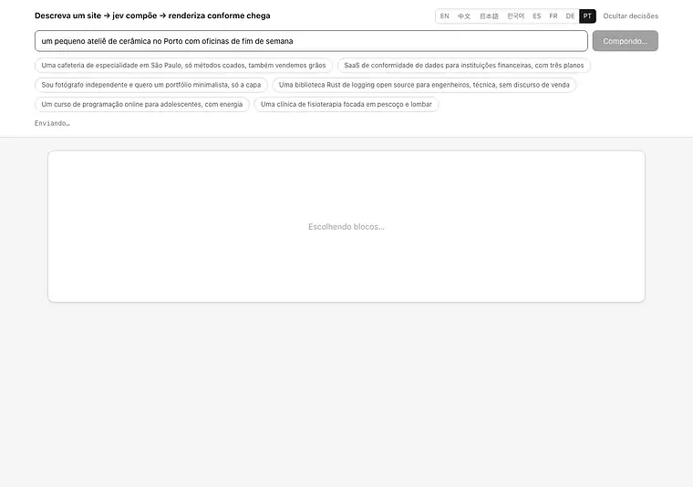
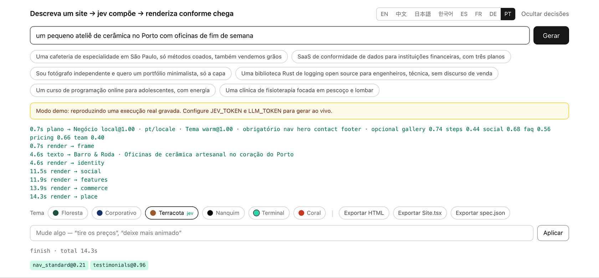
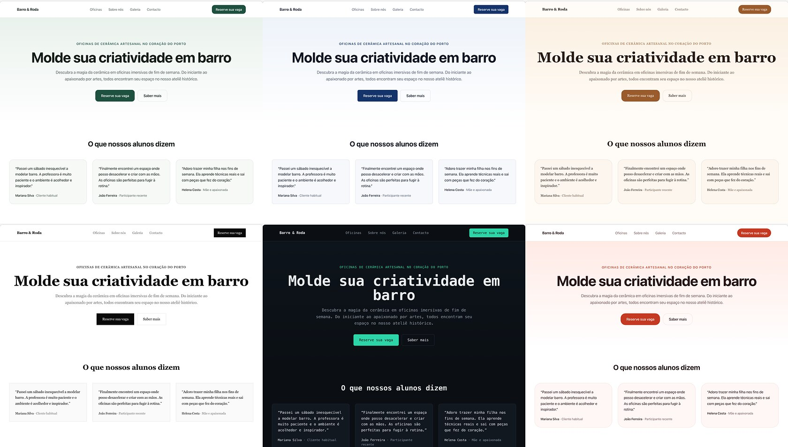

[English](../README.md) · [简体中文](README.zh.md) · [日本語](README.ja.md) · [한국어](README.ko.md) · [Español](README.es.md) · [Français](README.fr.md) · [Deutsch](README.de.md) · **Português**

# loom

<p align="center">
  <a href="https://github.com/yldm-tech/loom/actions/workflows/ci.yml"></a>
  <a href="../LICENSE"></a>
  <a href="https://github.com/yldm-tech/loom/stargazers"></a>
  <a href="https://github.com/yldm-tech/loom/commits/main"></a>
  
  <a href="https://typesafe.ai"></a>
</p>

> Três fios tecidos em um só pano: o texto vem de um LLM, o julgamento vem do Jev, as regras vêm do código.

Descreva seu negócio em uma frase e receba uma landing page que dá para usar de verdade.

<p align="center">
  
</p>

```
“Uma cafeteria de especialidade em São Paulo, só métodos coados”

0,7 s   esqueleto completo (blocos, ordem e paleta já decididos)
4,5 s   topo e rodapé preenchidos com texto real
13 s    todos os blocos no lugar
```

O esqueleto já vem tematizado desde o primeiro quadro, porque o plano chega antes de qualquer texto. Gravado em modo demo: é exatamente o que se vê depois de `npm run dev`, sem nenhuma chave.

O diferencial não é uma IA montar um site. É que **cada uma das três camadas faz apenas aquilo em que é boa**.

## Por que três camadas

Um modelo generativo escreve qualquer coisa, mas não há como garantir que a estrutura que ele emite seja válida. Um modelo restrito é sempre válido, mas não inventa uma única palavra. Use só um dos dois, ou misture sem critério, e algo desaba.

Este projeto divide as decisões conforme **onde a informação está**:

| Camada | Do que cuida | Porque |
|---|---|---|
| **LLM** | O texto, mais os fatos do negócio (quantos diferenciais, quantos planos de preço, existe uma interface para mostrar) | Nada disso existe no sistema; só pode ser gerado |
| **[Jev](https://typesafe.ai)** | Arquétipo de página, tema visual, se um bloco cabe ali, que tipo de prova social | A resposta já está no que a pessoa disse — é um julgamento |
| **Código** | Regras de layout, ordem dos blocos, blocos obrigatórios, liberação por prontidão | Isso são regras; perguntar a um modelo é endereçar errado |

O critério é simples: **confiança persistentemente baixa significa que você perguntou à parte errada** — ou a entrada não contém a resposta, ou a pergunta não exigia julgamento nenhum.

Esse padrão apareceu quatro vezes durante o desenvolvimento. Em todas elas a correção foi trocar a pergunta por uma factual somada a uma regra em código:

```
perguntar ao jev “grade ou lista?”             → 0,16  ← o pedido não diz nada a respeito
fazer o LLM informar “quantos diferenciais?”   → código: >= 5 vira grade          determinístico

perguntar ao jev “topo centralizado ou dividido?” → 0,28  ← mesmo problema
fazer o LLM informar “existe captura de tela?”    → código: dividido só se existir determinístico

perguntar ao jev “que idioma é este?”       → 0,76  ← e a resposta estava errada
detectar a escrita no código                → jev só: “pedem outro idioma?”   dividir

perguntar ao jev “qual tema visual?”           → 0,99  ← “com energia”, “clientes financeiros” estão ali
fica como está                                                                      julgamento
```

## Comportamento medido do Jev

| Julgamento | Confiança |
|---|---|
| Idioma pedido (1 de 9, quando é pedido) | 1,00 |
| Tema visual (1 de 6) | 0,98 – 1,00 |
| Arquétipo de página (1 de 6) | 0,62 – 1,00 |
| Intenção de edição (1 de 6) | 0,98 – 1,00 |
| Tipo de prova social (1 de 3) | 0,70 – 0,97 |

```
cafeteria            → negócio local@1,00  warm@0,99      → Nav HeroCentered Testimonials Gallery Pricing Contact FAQ Footer
fotógrafo            → negócio local@0,62  ink@1,00       → Nav HeroCentered Testimonials Gallery Pricing Contact Footer
SaaS de conformidade → landing@1,00        corporate@1,00 → Nav HeroSplit Testimonials FeatureGrid Steps Pricing FAQ CTABand Footer
```

Cada uma é **uma única escolha mutuamente exclusiva**: as probabilidades têm de somar um, então uma opção distratora só vence tirando massa da resposta certa. Se em vez disso você perguntar “um sim/não independente por candidato”, com 40 opções cerca de 5 % entram como falsos positivos. Essa diferença é estrutural, não se resolve reescrevendo o prompt.

O Jev custa umas três chamadas, menos de um segundo, na ordem de US$ 0,001 por site. **O gargalo é sempre o LLM escrevendo.**

## Como rodar

Funciona sem chaves. `npm run dev` e abra — esse é o **modo demo**: uma execução real gravada, reproduzida no ritmo original, e a interface diz isso com todas as letras.

```bash
git clone https://github.com/yldm-tech/loom
cd loom
npm install
npm run dev          # modo demo, sem configuração
```

Adicione as chaves para gerar de verdade:

```bash
cp .env.example .env.local   # preencha JEV_TOKEN e LLM_TOKEN
```

O `JEV_TOKEN` sai do [typesafe.ai](https://typesafe.ai). O `LLM_TOKEN` funciona com qualquer endpoint compatível com OpenAI — OpenAI, OpenRouter, um gateway, um llama.cpp local — basta ajustar `LLM_BASE_URL` e `LLM_MODEL`.

Os arquivos em `fixtures/` são **execuções realmente gravadas**, não escritas à mão. Uma demo apoiada em uma saída inventada que ninguém consegue reproduzir é pior do que não ter demo.

No modo demo também dá para editar, mas não através do Jev: não há chaves para chamá-lo. Uma lista de palavras mapeia um punhado de instruções para resultados que a interface consegue aplicar sozinha, e é por isso que toda confiança relatada ali é 1,00. Essa lista é o único ponto onde acrescentar um idioma de interface pode quebrar algo em silêncio, então um teste devolve a ela as sugestões do placeholder de cada idioma: quatro locales saíram sem essa verificação, e nenhuma das sugestões que a aplicação fazia neles fazia coisa alguma.

## Editar depois

<p align="center">
  
</p>

Cada julgamento que o Jev fez, com a confiança e o momento em que chegou. Uma edição que erra dá para rastrear, em vez de virar mistério.

Diga o que quer em linguagem comum. Uma requisição, 200–400 ms, e **nenhum texto é regerado**:

| Você diz | Resultado |
|---|---|
| tire os preços | `remove` → pricing `1,00` |
| uma paleta mais animada | `theme` → coral `1,00` |
| centralize a barra de navegação | `restyle` → nav_centered `1,00` |
| mude o estilo da navegação | `restyle` → qualquer outro (`0,34`, os três servem) |
| ponha os recursos em lista | `restyle` → features_list `1,00` |
| publica isso pra mim | `unclear` `1,00` |

A última linha é a que mais importa: **quando não consegue, ele diz que não consegue**, em vez de empurrar o pedido para a edição mais parecida que tiver à mão.

Isso usa [fan-out especulativo](https://docs.typesafe.ai/patterns/fan-out.md): qual bloco remover, qual acrescentar, qual tema, qual bloco reestilizar — tudo perguntado numa requisição só, e o código lê apenas o ramo vencedor. Mais tokens, uma ida e volta a menos.

### O mesmo 0,34, às vezes bloqueado e às vezes não

```
mude o estilo da navegação   → restyle@1,00  variant=nav_centered@0,34   executado (qualquer)
mude o estilo da barra       → theme@0,87    theme_target=coral@0,15     bloqueado
```

“Mude” não nomeia destino: excluída a variante atual, as três restantes são todas aceitáveis e uma divisão uniforme é a **resposta certa**. Já quando “mude o estilo da barra” foi lido como recolorir o site inteiro, aquele 0,15 significava que ele não fazia ideia para o quê mudar — e esse precisa ser bloqueado.

**Um limiar não é uma constante global. Ele decorre do custo de errar.**

## Idioma são duas perguntas, não uma

Perguntar "em que idioma este site deve ser escrito?" parece um único julgamento, e aqui foi um durante algum tempo. Medido em dez pedidos, esse Choice único respondeu `zh` a um pedido em inglês com 0.76 de confiança, e acertou mas com apenas 0.63 em outro. Três dos dez voltaram abaixo de 0.85.

A confiança baixa era o sinal: a pergunta eram duas perguntas empilhadas.

| Pergunta | Quem responde | Como |
|---|---|---|
| Em que escrita este pedido está escrito? | Código | Kana, hangul e han são três expressões regulares. A escrita latina não pode ser estreitada mais a partir do texto, então decide o locale do próprio editor |
| Pede um idioma diferente daquele em que está escrito? | Jev | A resposta está na frase, e só quem lê consegue vê-la |

Separadas assim, as duas metades ficaram nítidas. Em onze pedidos, a pergunta sobre o pedido explícito separou suas duas populações em 0.03 contra 0.85 sem ler nenhuma errada, e a seguinte — "então qual?" — respondeu aos quatro casos com 1.00.

```
我在杭州开了家咖啡店                         → zh  script
A small bakery in Brooklyn                 → en  locale
東京で小さなラーメン屋をやっています            → ja  script
我做外贸的，帮我做个英文站，客户都在北美         → en  request @1.00   ← pedido, não detectado
```

A quarta linha continua sendo o ponto. **Aquilo em que você escreve não é aquilo que você quer escrito** — alguém descreve o negócio em chinês mas precisa de um site em inglês para clientes no exterior, e normalmente diz isso nessa mesma frase. Essa parte é julgamento e fica com o Jev. Em que escrita digitou, não.

Simplificado contra tradicional é a única divisão que o código não tenta: é uma questão de mercado e de vocabulário, não de escrita, então um pedido em han recebe um Choice adicional entre `zh` e `zh-Hant`.

### Decidir o idioma é só metade

O site continuava voltando em chinês. O schema de campos da camada de copy está escrito em chinês até nas contagens de `字`, e com a regra de idioma no preâmbulo o modelo seguia o schema em vez da instrução: um pedido em francês produziu 476 caracteres chineses e um em alemão, 429. Mover a regra para depois do schema corrigiu o francês e não o alemão. Repeti-la também no turno do usuário levou francês, alemão, coreano e inglês todos a zero.

Além disso, três descrições de campo exigiam por conta própria um site chinês — o `name` de um membro da equipe estava especificado como "um nome chinês", os preços como `¥`, os números em `万`. Agora todas seguem o idioma do copy, e a moeda segue a localização do negócio em vez do idioma, então uma página em inglês para um ateliê de Quioto continua cotando em ienes.

Suporta `en` / `zh` / `ja` / `ko` / `es` / `fr` / `de` / `pt` / `zh-Hant`. As indicações de tamanho foram escritas para o chinês, então os demais idiomas recebem uma nota de conversão.

A interface do editor é outra história: oito idiomas, escolhidos a partir de `navigator.languages` e alternáveis manualmente. As traduções ficam em `locales/*.json`; acrescentar um idioma é acrescentar um arquivo e uma linha. **`zh.json` é a referência e os testes verificam que os demais arquivos tenham exatamente as mesmas chaves** — uma tradução pela metade derruba a CI em vez de cair silenciosamente para o chinês em tempo de execução.

## Exportação

Seis formatos, todos derivados **do mesmo resultado renderizado**. Não existe uma segunda cópia do código de layout.

| Exportação | Tamanho | Para |
|---|---|---|
| `site.html` | 36 KB | Subir para a web, ou só dar dois cliques |
| `Site.tsx` | 34 KB | Continuar desenvolvendo; compila com `tsc --strict` |
| `spec.json` | alguns KB | Arquivar, ou alimentar outro renderizador |
| `site.registry.json` | `Site.tsx`, embrulhado | Instalar a página num projeto que já usa shadcn/ui |
| `AGENTS.md` | uma página | Entregar a página a um agente de código: tokens, blocos e de onde vêm os componentes |
| `bundle.zip` | os outros cinco | Entregar tudo de uma vez, com um `CLAUDE.md` apontando para o informe |

### Site.tsx

Um único componente plano, sem dependência além do React. Cores, fontes e raios ficam todos em um único objeto de estilo no elemento mais externo, então trocar de tema é editar um lugar só. Os nomes de classe do Tailwind são preservados.

Tudo o que a página desenha com CSS em vez de marcação precisa ir junto como texto, senão desaparece de um arquivo que não leva folha de estilo. As aspas passaram em algum momento para `content: open-quote` e a exportação perdeu todas elas, guardando apenas o nome de classe que apontava para uma regra que não vai junto. Agora são resolvidas e escritas no JSX, coladas ao texto: o JSX transforma em espaço a quebra de linha entre dois trechos de texto, e `« assim »` está errado em todo idioma que não peça um.

A divisão em componentes foi deixada de fora de propósito: um arquivo gerado que dá para ler de cima a baixo e recortar você mesmo vale mais do que uma estrutura que precisa ser decifrada antes.

A verificação é uma execução real de `tsc --noEmit --strict --jsx react-jsx`, **julgada pelo código de saída**. Foi assim que se descobriu que a primeira versão não compilava: propriedades customizadas de CSS não são válidas em `React.CSSProperties`. Agora sai com um `as CSSProperties`.

### site.html

O resultado renderizado mais **apenas as regras CSS realmente usadas**.

```
todo o CSS da página     22 KB      ← o Tailwind já remove o que não é usado no build de produção
exportação real          29 KB      ← incluindo o HTML
estilos do próprio editor removidos ← sem campo de texto, botões ou log
```

O filtro testa cada seletor com `root.matches()` / `root.querySelector()`, remove pseudoclasses e tenta de novo com o seletor base, entra recursivamente em `@media` e descarta o bloco inteiro quando nada sobrevive dentro, e mantém `:root` e `@font-face` incondicionalmente. **Um seletor que ele não consegue analisar é mantido em vez de descartado** — um arquivo um pouco maior é melhor do que um quebrado em silêncio.

Em tamanho economiza só 16 % (o Tailwind nunca foi o problema). O ganho real é que o site exportado não carrega mais o estilo do próprio editor. Veja `lib/export.ts`; **não há um segundo renderizador**, o layout dos blocos existe apenas em `app/registry.tsx`.

### site.registry.json

Um item de [registro shadcn](https://ui.shadcn.com/docs/registry), então a página se instala como qualquer componente shadcn:

```bash
npx shadcn@latest add ./site.registry.json
```

Um único comando escreve o componente no diretório que o `components.json` do projeto chama de componentes e funde os 17 tokens do tema com a folha de estilo dele. A lista de dependências está vazia de propósito: o `Site.tsx` importa um tipo do React e mais nada, e enchê-la faria a CLI instalar pacotes que o arquivo não usa. A CLI aceita um caminho local, então nada precisa ser hospedado antes — o arquivo que o navegador acabou de baixar serve de onde caiu.

O item carrega o mesmo código de `Site.tsx`; não é uma segunda renderização da página. Os tokens viajam junto como `cssVars` porque um componente largado num projeto que define as próprias variáveis é desenhado com as cores daquele projeto, e essa não é a página que alguém exportou. As chaves vão sem o `--` inicial, que é justamente o que a CLI acrescenta: escrito `--accent`, o token chega à ponte do Tailwind como `var(----accent)`, não resolve nada, e a instalação ainda assim relata sucesso.

### AGENTS.md

Um informe curto para o agente de código que pega a exportação: `spec.json` é a descrição autoritativa da página, aqui estão os 17 tokens do tema com seus valores, aqui estão os blocos que esta página realmente tem, e aqui estão as fontes de componentes relevantes para esses blocos. Foi escrito para ser lido uma vez antes de começar, não como documentação para uma pessoa.

### bundle.zip

Os outros cinco em um único arquivo compactado, mais um `CLAUDE.md` cujo conteúdo inteiro é `@AGENTS.md` — o Claude Code procura esse nome de arquivo e importa aquilo para onde a linha aponta, então o informe é lido em vez de ficar fechado ao lado da marcação. É um ponteiro, não uma segunda cópia.

Cinco botões são cinco chances de perder um arquivo, e o que se perde é o `AGENTS.md`, porque é o único dos cinco que não se parece com a página. O que sobra então para o agente que recebe é marcação sem nenhuma explicação do que pode ser editado, de qual é o contrato do tema, ou de onde estão componentes melhores.

O zip é escrito à mão, com STORE e sem compressão — a alternativa era uma dependência, e a carga é texto que se descompacta uma vez na chegada. Dois detalhes sustentam o resto. Tamanhos e CRCs são medidos em bytes UTF-8 e não no comprimento da string, porque o texto costuma trazer CJK e um comprimento tirado da string de JavaScript dá um número menor; o arquivo então abre na ferramenta que ignora esse campo e falha em todas as outras. E o carimbo de tempo é fixo em vez de lido do relógio, então a mesma página exportada duas vezes dá bytes idênticos e um teste pode afirmar isso.

## Componentes que vale a pena roubar

O método é o preguiçoso: apontar uma boa biblioteca para um agente de código e deixar que ele escolha, adapte e cole. `lib/sources.ts` é a tabela que ele lê: cinco bibliotecas, cada uma com seu papel, sua licença, seu comando de instalação, os endpoints legíveis por máquina que responderam quando foram conferidos, os slots que ela pode melhorar e a ressalva que morde.

| Fonte | O que é | Como se pega |
|---|---|---|
| [shadcn/ui](https://ui.shadcn.com) | 63 primitivos React acessíveis sobre o Radix, mais a especificação de registro que as outras quatro seguem | `npx shadcn@latest add <name>` |
| [beUI](https://beui.dev) | 85 componentes animados como registro compatível com shadcn, com endpoint MCP | `npx shadcn@latest add https://beui.dev/r/<name>.json` |
| [Rare UI](https://rareui.com) | Cerca de 20 widgets animados de arquivo único — navegação gosmenta, barra lateral por proximidade, contador de odômetro | `npx shadcn@latest add swamimalode07/rare-ui/<name>` |
| [Transitions](https://transitions.dev) | Cerca de 44 trechos de movimento nomeados, em CSS puro, no espaço de nomes `.t-*` | `npx transitions-dev add <slug>` |
| [Beautiful UI](https://beautifului.dev) | 21 primitivos para interfaces de aplicações de IA | Copiar e colar pelo navegador; sem CLI, sem registro |

**Nenhuma das cinco traz uma seção de página de marketing.** Não há topo, nem depoimentos, nem grade de equipe, nem rodapé em todo o conjunto — são primitivos, movimento e widgets em formato de aplicativo. Então uma fonte melhora um bloco que o loom já desenha; ela nunca o substitui, e `role` é o campo que diz que tipo de melhoria esperar. Um agente que leia a tabela como um catálogo de blocos vai procurar um topo no shadcn/ui e encontrar `/blocks/login`.

As licenças também não são uniformes. Quatro são MIT; a Transitions tem licença própria, que proíbe redistribuir parte substancial da coleção, então seus trechos podem ser usados num site mas não embutidos neste repositório.

Cada url e cada endpoint dessa tabela foram buscados e conferidos em vez de lembrados, e ainda assim vão apodrecer:

```bash
npm run sources   # busca cada endpoint de novo e informa quantos componentes ele ainda lista
```

## Alcançável sem navegador

Aquela tabela ordena as cinco por quanto de cada uma uma máquina consegue alcançar sem ninguém por perto: três publicam um `llms.txt`, uma roda um servidor MCP, três se instalam por CLI. O loom, que escreveu a tabela, não publicava nada disso — tudo o que ele sabia sobre os próprios blocos, temas e fontes só era alcançável se uma pessoa clicasse numa aba. Estas são as superfícies pelas quais ele estava avaliando as outras.

### Servidor MCP

```bash
claude mcp add loom -- npm run --silent mcp
```

Cinco ferramentas, todas somente de leitura: a tabela de fontes de componentes, as fontes que servem para um bloco indicado, os 13 blocos com suas variantes e quais arquétipos os exigem, os seis temas com o critério que o Jev usa para escolher, e os 17 tokens de um tema com seus valores.

Toda resposta é lida de `lib/plan.ts`, `lib/themes.ts` e `lib/sources.ts` no momento em que a chamada chega; nada é repetido em `lib/mcp.ts`. Uma ferramenta que carrega a própria cópia da lista de blocos continua respondendo com confiança depois que a lista muda, e o agente do outro lado não tem como perceber.

A armação JSON-RPC foi escrita à mão em vez de tirada do SDK do MCP, porque **nada aqui acrescentou uma dependência**. Um servidor que só oferece ferramentas deve ao cliente `initialize`, `tools/list`, `tools/call` e a disciplina de não responder absolutamente nada a `notifications/initialized` — uma resposta que ninguém espera desloca todas as seguintes para a requisição errada. O `scripts/mcp.mjs` é só a bomba: parte a entrada padrão nas quebras de linha e guarda o resto de uma linha incompleta, porque a fronteira de um pedaço não é a fronteira de uma mensagem e um cliente de verdade manda o aperto de mão rápido o bastante para duas mensagens chegarem juntas.

Duas das respostas são deliberadamente mais do que uma consulta. Um nome de bloco que o loom não tem volta como lista vazia *com uma explicação*, nunca como um palpite, e um bloco real que nenhuma fonte cobre diz isso — uma lista vazia sozinha se lê como uma consulta que falhou. Um nome de tema desconhecido volta com a paleta de reserva **identificada como reserva**: `themeVars()` responde `forest` a tudo que não reconhece, o que está certo para renderizar e errado para entregar a um agente sem aviso, porque ele colaria um botão verde acreditando ter pedido `terminal`.

### /llms.txt

O mesmo formato que três das cinco fontes catalogadas publicam, gerado a cada requisição a partir de `lib/plan.ts`, `lib/themes.ts` e `lib/sources.ts`, de modo que não pode divergir do que o deploy está de fato executando. Um teste percorre as tabelas reais, então acrescentar um bloco, um tema ou uma fonte sem tocar em `lib/llms.ts` falha em vez de publicar um documento que os omite.

Ele segue o llmstxt.org ao pé da letra: um H1, uma citação, prosa que não contém nenhum título, e então seções H2 em que cada linha é um item de link. É essa última regra que explica por que blocos, temas, tokens, exportações e fontes estão em prosa e não em seções próprias: nenhum deles tem URL, e inventar `/docs/blocks` para cumprir o formato mandaria um agente para um 404. Os endpoints dos outros aparecem como trechos de código, então todo link que um agente pode seguir é um que esta origem responde.

A origem vem da requisição e não de uma constante de build, porque o mesmo build responde em localhost, num host de preview e num domínio próprio, e um endereço embutido é o erro que só aparece no único ambiente que ninguém testou. As duas seções que são links de verdade são `POST /api/generate` e `POST /api/edit`, com seus corpos de requisição e o formato do que volta.

## Temas são dados

<p align="center">
  
</p>

O mesmo texto gerado sob os seis temas. Trocar de tema é mudar uma prop no cliente: sem chamada ao modelo, sem regeração.

Seis temas, cada um um conjunto completo de tokens de design. Todas as cores em `app/registry.tsx` vêm de variáveis CSS, com **uma única exceção** que um teste mantém em uma: os três pontos do semáforo do macOS na captura simulada do hero dividido, que desenham a moldura de janela de outro sistema operacional e não a paleta do loom.

| Tema | Caráter | Combina com |
|---|---|---|
| `forest` | Verde profundo + off-white | Ferramentas, código aberto, ar livre |
| `corporate` | Azul-marinho + raio de 6px | Finanças, jurídico, corporativo |
| `warm` | Caramelo + serifa + raio de 16px | Gastronomia, artesanato, pousadas |
| `ink` | Preto e branco puros, raio zero, muito espaço | Fotografia, portfólios, editorial |
| `terminal` | Fundo escuro + monoespaçada + turquesa | Ferramentas de dev, infraestrutura |
| `coral` | Laranja vivo + raio de 20px | Consumo, educação, social |

Conteúdo, estrutura e aparência estão completamente desacoplados.

## 13 blocos, 6 arquétipos de página

Blocos: navegação (4 variantes), topo (2), prova social (3), recursos (2), galeria, comparativo, etapas, equipe, preços (2), contato, perguntas frequentes, faixa de chamada, rodapé.

O arquétipo decide quais blocos são **obrigatórios** — nenhum modelo pode remover o topo de uma landing page nem o endereço de um negócio local.

| Arquétipo | Obrigatório | Opcional |
|---|---|---|
| Landing page | nav hero features cta footer | social pricing faq gallery steps |
| Negócio local | nav hero **contact** footer | gallery steps social faq pricing |
| Página técnica | nav hero features footer | faq social steps |
| Página de preços | nav pricing faq cta footer | social hero |
| Início open source | nav hero features footer | faq social pricing |
| Página única mínima | hero | nav footer |

## Testes

A acessibilidade é verificada duas vezes, de duas maneiras diferentes.

`npm test` recalcula o contraste WCAG a partir dos tokens do tema — sem navegador, então roda no CI. Cada par destaque/texto, faixa/texto e fundo/texto precisa passar de 4,5:1; o texto atenuado, que nunca é o único, precisa passar de 3:1.

```bash
npm run dev          # o modo demo já basta
npm run audit:a11y   # axe-core sobre o site gerado, nos seis temas
```

A auditoria precisa do servidor no ar e de `npx playwright install chromium`, por isso continua como script e não entra no CI. Ela encontrou exatamente um problema real: o destaque do `coral` era `#e2553d`, que com texto branco dá 3,75:1, abaixo de AA. Escurecido para `#c53a22` (5,25:1), mesmo matiz. Os seis temas agora não relatam nenhuma violação.


```bash
npm test          # 347 deles, cerca de 1,5 s, sem rede
```

Eles cobrem **as três regras retomadas do modelo**: a quantidade de diferenciais decide grade ou lista, a quantidade de planos decide cartão único ou comparativo, e a existência de uma captura de interface decide o layout do topo. Se alguma delas escorregar, a decisão volta em silêncio para um modelo que não consegue tomá-la — são as que não podem se mexer.

Também são cobertos: a liberação por prontidão (um array vazio conta como ausente, não como pronto), a ordem de conclusão do `asSettled`, e as arestas do serializador de JSX — propriedades customizadas precisam de `as CSSProperties`, ponto e vírgula dentro de um gradiente não é separador, texto com chaves precisa ser envolvido, e nem a classe de animação `blk-in` nem o bloco `<style>` podem chegar à exportação. As superfícies voltadas a agentes recebem o mesmo tratamento: o `bundle.zip` é relido por um segundo leitor de zip, deliberadamente lento, escrito no próprio arquivo de teste e não pelo escritor que o produziu; o `/llms.txt` é analisado contra o formato do llmstxt.org e conferido linha a linha com as tabelas reais de blocos, temas e fontes; e o servidor MCP é conduzido pelo aperto de mão, por cada ferramenta que ele anuncia e por uma série de mensagens que chegam quebradas.

Mais invariantes estruturais: todo slot referenciado por um arquétipo precisa existir, obrigatórios e opcionais não podem se sobrepor, `SLOT_ORDER` precisa cobrir cada slot exatamente uma vez, e cada variante precisa declarar os campos de que depende.

Os arquivos de idioma têm o seu próprio conjunto: as chaves precisam bater exatamente com `zh.json`, sem valores vazios, com a mesma quantidade de exemplos, e os exemplos de cada idioma precisam estar realmente escritos naquela escrita.

**Todo teste passou por verificação por mutação depois de escrito**, porque uma suíte que passa assim que você a escreve não prova nada:

```
limiar da grade 5 → 4               → vermelho ✓   chave faltando em ja.json     → vermelho ✓
inverter a condição do topo         → vermelho ✓   valor vazio em ja.json        → vermelho ✓
deixar array vazio contar as pronto → vermelho ✓   dois exemplos a menos         → vermelho ✓
remover o cast CSSProperties        → vermelho ✓   exemplo em inglês em ko.json  → vermelho ✓
parar de filtrar blocos style       → vermelho ✓
```

## Estrutura

```
lib/
  catalog.ts           contrato de componentes: quais blocos podem aparecer e suas props
  themes.ts            6 conjuntos de tokens, e o critério com que o Jev escolhe
  plan.ts              arquétipos, variantes de slot, regras de código em layoutRules()
  content.ts           o formato do texto, e como ele preenche cada bloco
  content-parallel.ts  quatro lotes em paralelo, retentativa, validação de formato, prontidão
  compose.ts           orquestração das três camadas, em streaming
  edit.ts              reconhecimento da intenção de edição (fan-out especulativo)
  export.ts            HTML autocontido, só com o CSS em uso
  export-tsx.ts        exportação de fonte React, DOM → JSX
  export-registry.ts   o mesmo código como item de registro shadcn, com os tokens
  export-agents.ts     AGENTS.md: spec, tokens, blocos e de onde vêm os componentes
  export-bundle.ts     as cinco exportações mais um CLAUDE.md, zipadas à mão
  llms.ts              /llms.txt, gerado a partir de plan.ts, themes.ts e sources.ts
  mcp.ts               as cinco ferramentas MCP e a armação JSON-RPC, pura e síncrona
  i18n.ts              idioma da interface, lê locales/*.json
  demo.ts              reproduz fixtures/ quando não há chaves
  sources.ts           cinco bibliotecas de componentes de onde um agente pode puxar, com papéis e ressalvas
  *.test.ts            testes de lógica pura, sem rede
locales/
  en|zh|ja|ko|es|fr|de|pt.json   traduções da interface, zh é a referência
fixtures/
  en|zh|ja|ko.jsonl    execuções reais gravadas, para o modo demo
app/
  page.tsx             o editor, consumo do stream, troca de tema e variante no cliente
  registry.tsx         a aparência de cada bloco, via variáveis CSS
  llms.txt/            a rota /llms.txt
  api/generate         geração
  api/edit             edições
scripts/
  mcp.mjs              bomba de stdio do servidor MCP; o protocolo está em lib/mcp.ts
  sources.mjs          reconfere cada url e endpoint de sources.ts
  record-fixture.mjs   grava execuções reais em fixtures/
  capture-docs.mjs     as capturas e gravações do README
  audit-a11y.mjs       axe-core contra um servidor em modo demo
```

## Limites conhecidos

- **O LLM emite JSON inválido.** Medido: cerca de uma execução em cada duas. A retentativa e a validação de formato pegam isso, mas é inerente a modelos generativos; do lado do Jev não houve uma única resposta malformada.
- **13 segundos não é rápido**, e tudo isso é o LLM escrevendo. O esqueleto deixa a primeira pintura visível aos 0,7 s, mas o total não muda.
- **13 tipos de bloco**, ainda faltam formulário de contato, vídeo e mapas. O `Gallery` desenha blocos coloridos com legenda; ele não gera imagens.
- **`Site.tsx` é um trecho único e plano de JSX**, não uma árvore de componentes já separada. Compila e dá para editar, mas manter a longo prazo significa separá-lo você mesmo.
- **A qualidade do texto acompanha o modelo.** Um modelo mais forte se nota bastante — e que ele é mais lento, também.
- **O servidor MCP responde perguntas sobre o loom; ele não o opera.** As cinco ferramentas leem as tabelas de blocos, temas e fontes. Gerar ou editar uma página ainda passa por `/api/generate` e `/api/edit`, ou por abrir o editor.

## Contribuir

Veja [CONTRIBUTING.md](../CONTRIBUTING.md). Acrescentar um bloco, um tema, um idioma de interface, uma fonte de componentes ou uma ferramenta MCP tem, cada um, um caminho curto e já definido.

## Star History

Se a abordagem for útil para você, uma estrela é o retorno mais direto.

<a href="https://star-history.com/#yldm-tech/loom&Date">
  <picture>
    <source media="(prefers-color-scheme: dark)" srcset="https://api.star-history.com/svg?repos=yldm-tech/loom&type=Date&theme=dark" />
    
  </picture>
</a>

## Licença

Apache-2.0. Construído sobre os pacotes npm publicados do [json-render](https://github.com/vercel-labs/json-render) (Vercel Labs, Apache-2.0); nenhum código-fonte upstream é embutido. Os julgamentos vêm do modelo Jev da [TypeSafe](https://typesafe.ai). Veja `NOTICE`.
