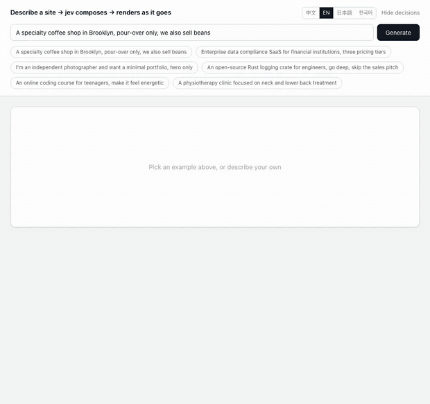

[English](../README.md) · **简体中文** · [日本語](README.ja.md) · [한국어](README.ko.md)

# loom

<p align="center">
  <a href="https://github.com/yldm-tech/loom/actions/workflows/ci.yml"></a>
  <a href="LICENSE"></a>
  <a href="https://github.com/yldm-tech/loom/stargazers"></a>
  <a href="https://github.com/yldm-tech/loom/commits/main"></a>
  
  <a href="https://typesafe.ai"></a>
</p>


> 把三股线织成一块布：LLM 写的文案、Jev 做的判断、代码定的规则。

一句话描述你的生意，得到一个能用的落地页。

<p align="center">
  
</p>

```
「我在杭州开了家咖啡店，主打手冲单品豆」

0.7s   整页骨架（区块、顺序、配色全部就位）
4.5s   首屏和页脚填入真实文案
13s    全部区块落地
```

骨架从第一帧起就带主题，因为规划比文案先回来。这段是在演示模式下录的——`npm run dev` 不配任何 key 看到的就是这个。

区别不在于「又一个 AI 建站」，而在于**三层各司其职**，每一层只做自己擅长的事。

## 为什么要分三层

生成式模型什么都能写，但你没法保证它写出来的结构合法。约束式模型永远合法，但它一个字都造不出来。把两者混着用，或者只用其中一个，都会在某个地方塌掉。

这个项目把决策按**信息来源**切开：

| 层 | 负责 | 因为 |
|---|---|---|
| **LLM** | 文案 + 业务事实（几条卖点、几档价格、有没有界面截图） | 这些系统里不存在，只能生成 |
| **[Jev](https://typesafe.ai)** | 页面原型、视觉主题、要不要某个区块、哪种社会证明 | 答案在用户那句话里，是判断 |
| **代码** | 排版规则、区块顺序、必需区块、就绪度门控 | 这些是规则，不该问模型 |

判据很简单：**置信度持续偏低，说明问错了对象**——要么输入里没有答案，要么这件事根本不需要判断。

开发过程中这条规律出现了三次，每次都靠「把问题换成一个事实问题 + 一条代码规则」解决：

```
问 jev「功能区用网格还是列表」   → 0.16  ← 用户那句话里没有答案
改成 LLM 报告「有几条卖点」     → 代码：>= 5 条用网格          确定性

问 jev「首屏用居中还是分栏」     → 0.28  ← 同上
改成 LLM 报告「有没有界面截图」  → 代码：有截图才用分栏        确定性

问 jev「用哪套视觉主题」         → 0.99  ← 「活泼」「金融客户」就在那句话里
保留                                                      判断
```

## Jev 实测表现

| 判断 | 置信度 |
|---|---|
| 文案语言（4 选 1） | 0.66 – 1.00 |
| 视觉主题（6 选 1） | 0.98 – 1.00 |
| 页面原型（6 选 1） | 0.62 – 1.00 |
| 修改意图（6 选 1） | 0.98 – 1.00 |
| 哪种社会证明（3 选 1） | 0.70 – 0.97 |

```
咖啡店   → 线下门店页@1.00  warm@0.99   → Nav HeroCentered Testimonials Gallery Pricing Contact FAQ Footer
摄影师   → 线下门店页@0.62  ink@1.00    → Nav HeroCentered Testimonials Gallery Pricing Contact Footer
合规SaaS → 完整落地页@1.00  corporate@1 → Nav HeroSplit Testimonials FeatureGrid Steps Pricing FAQ CTABand Footer
```

全部是**互斥单选**——概率必须和为 1，干扰项要赢就得抢走概率质量。换成「每个候选一个独立 yes/no」，40 个选项时就会有约 5% 的假阳性混进结果。这个差别是结构性的，不是调提示词能解决的。

jev 全程约 3 次调用、不到 1 秒、$0.001 量级。**瓶颈始终是 LLM 写文案**。

## 跑起来

不配 key 也能跑。`npm run dev` 之后直接打开就是**演示模式**：回放一段真实录制的运行，连流式时序都是原样的，界面上会明说这是回放。

```bash
git clone https://github.com/yldm-tech/loom
cd loom
npm install
npm run dev          # 演示模式，零配置
```

要实时生成就补上 key：

```bash
cp .env.example .env.local   # 填 JEV_TOKEN 和 LLM_TOKEN
```

`JEV_TOKEN` 从 [typesafe.ai](https://typesafe.ai) 拿。`LLM_TOKEN` 可以是任何 OpenAI 兼容端点——OpenAI、OpenRouter、网关、本地 llama.cpp 都行，改 `LLM_BASE_URL` 和 `LLM_MODEL` 即可。

`fixtures/*.jsonl` 是**真跑出来的**，不是手写的。一个靠人工编造的漂亮输出来撑场面的 demo，比没有 demo 更糟。

## 能改什么

生成完之后直接用大白话改，每次一个请求、200–400ms、**不重新生成任何文案**：

| 你说 | 结果 |
|---|---|
| 不要定价了 | `remove` → pricing `1.00` |
| 换个更活泼的配色 | `theme` → coral `1.00` |
| 导航条居中 | `restyle` → nav_centered `1.00` |
| 换个nav样式 | `restyle` → 任取一个不同的（`0.34`，三个都行） |
| 功能区改成列表 | `restyle` → features_list `1.00` |
| 帮我部署上线 | `unclear` `1.00` |

最后一条是重点：**做不到的事就说做不到**，不硬凑成某个修改。

这里用的是[投机扇出](https://docs.typesafe.ai/patterns/fan-out.md)——「删哪个」「加哪个」「换哪个主题」「哪个区块换版式」全部在同一个请求里问，代码只读赢的那个分支。多花 token，省掉往返。

### 同一个 0.34，有时要拦有时不用

```
换个nav样式   → restyle@1.00  variant=nav_centered@0.34   执行（任取）
换个导航栏样式 → theme@0.87    theme_target=coral@0.15     拦截
```

「换一个」本来就不指定换成哪个，排除当前变体后三个都可以，概率均分是**正确答案**。而「换个导航栏样式」被误判成换整站配色时，0.15 说明它压根不知道换成什么——那个必须拦。

**阈值不是全局常数，取决于选错的代价。**

## 语言是判断，不是检测

站点文案的语言也走 jev，和主题、原型同在一次请求里，不多一次往返。

```
我在杭州开了家咖啡店                        → zh @1.00
我们做数据合规 SaaS，卖给海外客户，要做英文站   → en @1.00   ← 中文描述，英文站
A small bakery in Brooklyn                → en @0.66
東京で小さなラーメン屋をやっています            → ja @0.99
```

第二条是重点。**用什么语言写不等于用什么语言描述**——有人用中文讲自己的生意，但要做给海外客户看的英文站，而且他通常会在那句话里说出来。纯检测必然答错这条，判断能答对。

Brooklyn 那条 `0.66` 偏低也是对的：一句英文描述没有明示要什么语言，`en` 是推断不是明示，概率该分散一些。

支持 `zh` / `en` / `ja` / `ko` / `zh-Hant`。字数约束是按中文写的，其它语言会附一条换算提示。

编辑器界面本身是另一回事：中日英韩四种，按 `navigator.languages` 自动选，也能手动切。翻译在 `locales/*.json`，加一种语言就是加一个文件加一行。**`zh.json` 是基准，测试断言其它文件的 key 完全一致**——半拉翻译会让 CI 红，而不是运行时静默回落成中文。

## 导出

三种，都从**同一份渲染结果**生成，不存在第二套布局代码。

| 导出 | 大小 | 给谁 |
|---|---|---|
| `site.html` | 36 KB | 直接挂上去，双击就开 |
| `Site.tsx` | 34 KB | 拿去继续开发，`tsc --strict` 编译通过 |
| `spec.json` | 几 KB | 存起来或喂给别的渲染器 |

### Site.tsx

一个扁平组件，除 React 外零依赖。主题色、字体、圆角全在最外层那一个 style 对象里，换皮就改那一处。Tailwind 类名保留。

刻意不做组件拆分——生成出来的文件，能从头读到尾自己拆，好过一个得先反推的结构。

验证方式是真跑 `tsc --noEmit --strict --jsx react-jsx` 并**按退出码判定**。第一版就是这么发现 CSS 自定义属性在 `React.CSSProperties` 里不合法的，现在带 `as CSSProperties` 断言。

### site.html

渲染结果 + 它**真正用到的那些 CSS 规则**。

```
页面全部 CSS   22 KB      ← 生产构建下 Tailwind 已经 tree-shake 过
实际导出       29 KB      ← 含 HTML
编辑器自身样式  已剔除      ← 输入框、按钮、决策日志一条不带
```

过滤靠 `root.matches()` / `root.querySelector()` 逐条试选择器，伪类剥掉后用基础选择器试，`@media` 递归处理且内部为空则整条丢，`:root` 和 `@font-face` 无条件保留，**解析不了的选择器保留而不是丢弃**——文件大一点好过悄悄坏掉。

体积上只省 16%（Tailwind 本来就不大），真正的收获是导出的网站里不再混进编辑器自己的样式。实现见 `lib/export.ts`，**没有第二套渲染器**，区块布局只有 `app/registry.tsx` 一份。

## 主题即数据

<p align="center">
  
</p>

同一份生成的文案，六套主题。切换只是客户端改一个 prop——不调模型，不重新生成。


6 套主题，每套是一组完整的设计 token。`app/registry.tsx` 里**没有任何十六进制色值**，全部走 CSS 变量：

| 主题 | 特征 | 适合 |
|---|---|---|
| `forest` | 墨绿 + 米白 | 工具、开源、户外 |
| `corporate` | 藏蓝 + 6px 小圆角 | 金融、法务、企业 |
| `warm` | 焦糖棕 + 衬线字 + 16px 圆角 | 餐饮、手作、民宿 |
| `ink` | 纯黑白 + 零圆角 + 大留白 | 摄影、作品集、出版 |
| `terminal` | 深色底 + 等宽字 + 青绿 | 开发者工具、基础设施 |
| `coral` | 明亮橙 + 20px 大圆角 | 消费、教育、社交 |

所以换主题是纯客户端的一个 prop 改动：不调模型、不动文案、瞬间完成。内容、结构、外观三者彻底解耦。

## 13 个区块，6 种页面原型

区块：导航（4 个变体）、首屏（2）、社会证明（3）、功能区（2）、作品展示、对比表、流程、团队、价格（2）、联系信息、常见问题、转化条、页脚。

原型决定哪些区块是**必需**的——模型无权删掉落地页的首屏，也无权删掉门店页的联系方式：

| 原型 | 必需 | 可选 |
|---|---|---|
| 完整落地页 | nav hero features cta footer | social pricing faq gallery steps |
| 线下门店页 | nav hero **contact** footer | gallery steps social faq pricing |
| 工程向详情页 | nav hero features footer | faq social steps |
| 定价页 | nav pricing faq cta footer | social hero |
| 开源项目主页 | nav hero features footer | faq social pricing |
| 极简单页 | hero | nav footer |

## 测试

```bash
npm test          # 39 个，2.5 秒，不碰网络
```

测的是**三条被从模型手里拿回来的规则**——卖点条数决定网格还是列表、价格档数决定单档还是对比、有没有界面截图决定首屏版式。这几条一旦回归，决策就悄悄还给了一个答不了的模型，所以它们最不该漂。

另外测了就绪度门控（空数组算缺失而不是就绪）、`asSettled` 的完成顺序、以及 JSX 序列化的几个坑：CSS 自定义属性要带 `as CSSProperties`、渐变里的分号不能当分隔符、含花括号的文本要包起来、`blk-in` 动画类和 `<style>` 块不能带进导出。

还有几条结构不变量：每个原型引用的槽位必须存在、必需和可选不能重叠、`SLOT_ORDER` 必须不重不漏覆盖全部槽位、每个变体都得声明自己需要哪些字段。

语言文件另有一组：key 必须和 `zh.json` 完全一致、不能有空串、例子条数要一样、而且每种语言的例子必须真的用那种文字写（用正则查汉字 / 假名 / 谚文）。

**测试写完都做了变异验证**，第一次写就全过的测试是可疑的：

```
把网格阈值 5 改成 4      → 红 ✓      ja.json 少一个 key    → 红 ✓
把首屏条件反过来         → 红 ✓      ja.json 某个值留空     → 红 ✓
让空数组算就绪          → 红 ✓      ja.json 例子少两条     → 红 ✓
去掉 CSSProperties 断言 → 红 ✓      ko.json 混进英文例子   → 红 ✓
不再剔除 style 块       → 红 ✓
```

## 结构

```
lib/
  catalog.ts           组件契约：允许出现的区块和它们的 props
  themes.ts            6 套设计 token + 给 jev 的选择依据
  plan.ts              页面原型、槽位变体、代码规则 layoutRules()
  content.ts           文案的形状 + 把文案填进区块
  content-parallel.ts  四块并行生成 + 重试 + 形状校验 + 就绪度
  compose.ts           三层编排，流式吐出
  edit.ts              修改意图识别（投机扇出）
  export.ts            自包含 HTML 导出，只带用到的 CSS
  export-tsx.ts        React 源码导出，DOM → JSX
  i18n.ts              界面语言，读 locales/*.json
  demo.ts              无 key 时回放 fixtures/ 里的真实录制
  *.test.ts            纯逻辑的测试，不碰网络
locales/
  zh|en|ja|ko.json     界面翻译，zh 为基准
fixtures/
  zh|en|ja|ko.jsonl    真实录制的运行，供演示模式回放
app/
  page.tsx             界面、流式消费、客户端改主题和版式
  registry.tsx         区块长什么样，全部读 CSS 变量
  api/generate         生成
  api/edit             改
```

## 已知边界

- **LLM 会吐非法 JSON。** 实测两次里错过一次。已有重试和形状校验兜底，但这是生成式模型的固有属性——jev 那一侧从头到尾没出过一次格式错误。
- **13 秒不算快**，而且全在 LLM 写文案上。骨架屏让首屏 0.7 秒可见，但总时长没变。
- **区块类型 13 种**，还缺联系表单、视频、地图。`Gallery` 只出占位色块加文字说明，不生成图片。
- **`Site.tsx` 是扁平的一大段 JSX**，不是拆好的组件树。能编译、能改，但要长期维护还得自己拆。
- **文案质量取决于模型。** 换更强的模型会明显变好，也会明显变慢。

## 参与

改动请看 [CONTRIBUTING.md](../CONTRIBUTING.md)。加区块、加主题、加界面语言各有一条既定路径，都不长。

## Star History

如果这个思路对你有用，点个 star 是最直接的反馈。

<a href="https://star-history.com/#yldm-tech/loom&Date">
  <picture>
    <source media="(prefers-color-scheme: dark)" srcset="https://api.star-history.com/svg?repos=yldm-tech/loom&type=Date&theme=dark" />
    
  </picture>
</a>

## 许可

Apache-2.0。基于 [json-render](https://github.com/vercel-labs/json-render)（Vercel Labs，Apache-2.0）的已发布 npm 包，未内嵌其源码。判断由 [TypeSafe](https://typesafe.ai) 的 Jev 模型提供。详见 `NOTICE`。
