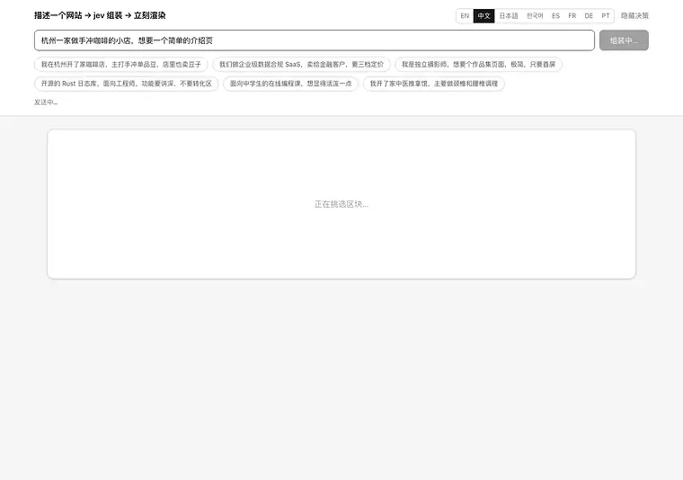
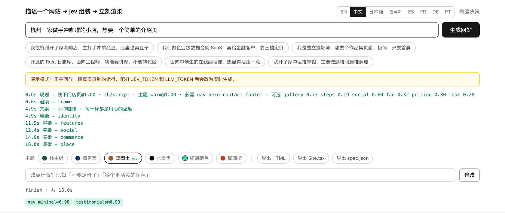
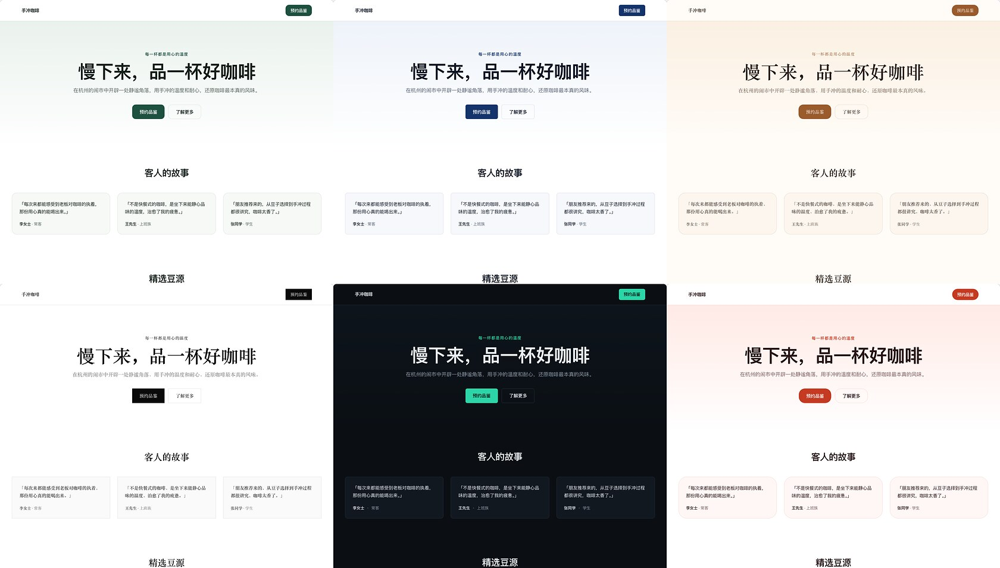

[English](../README.md) · **简体中文** · [日本語](README.ja.md) · [한국어](README.ko.md) · [Español](README.es.md) · [Français](README.fr.md) · [Deutsch](README.de.md) · [Português](README.pt.md)

# loom

<p align="center">
  <a href="https://github.com/yldm-tech/loom/actions/workflows/ci.yml"></a>
  <a href="LICENSE"></a>
  <a href="https://github.com/yldm-tech/loom/stargazers"></a>
  <a href="https://github.com/yldm-tech/loom/commits/main"></a>
  
  <a href="https://typesafe.ai"></a>
</p>


> 把三股线织成一块布：LLM 写的文案、Jev 做的判断、代码定的规则。

一句话描述你的生意，得到一个能用的落地页。

<p align="center">
  
</p>

```
「我在杭州开了家咖啡店，主打手冲单品豆」

0.7s   整页骨架（区块、顺序、配色全部就位）
4.5s   首屏和页脚填入真实文案
13s    全部区块落地
```

骨架从第一帧起就带主题，因为规划比文案先回来。这段是在演示模式下录的——`npm run dev` 不配任何 key 看到的就是这个。

区别不在于「又一个 AI 建站」，而在于**三层各司其职**，每一层只做自己擅长的事。

## 为什么要分三层

生成式模型什么都能写，但你没法保证它写出来的结构合法。约束式模型永远合法，但它一个字都造不出来。把两者混着用，或者只用其中一个，都会在某个地方塌掉。

这个项目把决策按**信息来源**切开：

| 层 | 负责 | 因为 |
|---|---|---|
| **LLM** | 文案 + 业务事实（几条卖点、几档价格、有没有界面截图） | 这些系统里不存在，只能生成 |
| **[Jev](https://typesafe.ai)** | 页面原型、视觉主题、要不要某个区块、哪种社会证明 | 答案在用户那句话里，是判断 |
| **代码** | 排版规则、区块顺序、必需区块、就绪度门控 | 这些是规则，不该问模型 |

判据很简单：**置信度持续偏低，说明问错了对象**——要么输入里没有答案，要么这件事根本不需要判断。

开发过程中这条规律出现了四次，每次都靠「把问题换成一个事实问题 + 一条代码规则」解决：

```
问 jev「功能区用网格还是列表」   → 0.16  ← 用户那句话里没有答案
改成 LLM 报告「有几条卖点」     → 代码：>= 5 条用网格          确定性

问 jev「首屏用居中还是分栏」     → 0.28  ← 同上
改成 LLM 报告「有没有界面截图」  → 代码：有截图才用分栏        确定性

问 jev「这是什么语言」         → 0.76  ← 而且答错了
改成代码检测文字种类           → jev 只答「有没有要求换一种语言」  拆开

问 jev「用哪套视觉主题」         → 0.99  ← 「活泼」「金融客户」就在那句话里
保留                                                      判断
```

## Jev 实测表现

| 判断 | 置信度 |
|---|---|
| 被要求的语言（9 选 1，有要求时） | 1.00 |
| 视觉主题（6 选 1） | 0.98 – 1.00 |
| 页面原型（6 选 1） | 0.62 – 1.00 |
| 修改意图（6 选 1） | 0.98 – 1.00 |
| 哪种社会证明（3 选 1） | 0.70 – 0.97 |

```
咖啡店   → 线下门店页@1.00  warm@0.99   → Nav HeroCentered Testimonials Gallery Pricing Contact FAQ Footer
摄影师   → 线下门店页@0.62  ink@1.00    → Nav HeroCentered Testimonials Gallery Pricing Contact Footer
合规SaaS → 完整落地页@1.00  corporate@1 → Nav HeroSplit Testimonials FeatureGrid Steps Pricing FAQ CTABand Footer
```

全部是**互斥单选**——概率必须和为 1，干扰项要赢就得抢走概率质量。换成「每个候选一个独立 yes/no」，40 个选项时就会有约 5% 的假阳性混进结果。这个差别是结构性的，不是调提示词能解决的。

jev 全程约 3 次调用、不到 1 秒、$0.001 量级。**瓶颈始终是 LLM 写文案**。

## 跑起来

不配 key 也能跑。`npm run dev` 之后直接打开就是**演示模式**：回放一段真实录制的运行，连流式时序都是原样的，界面上会明说这是回放。

```bash
git clone https://github.com/yldm-tech/loom
cd loom
npm install
npm run dev          # 演示模式，零配置
```

要实时生成就补上 key：

```bash
cp .env.example .env.local   # 填 JEV_TOKEN 和 LLM_TOKEN
```

`JEV_TOKEN` 从 [typesafe.ai](https://typesafe.ai) 拿。`LLM_TOKEN` 可以是任何 OpenAI 兼容端点——OpenAI、OpenRouter、网关、本地 llama.cpp 都行，改 `LLM_BASE_URL` 和 `LLM_MODEL` 即可。

`fixtures/*.jsonl` 是**真跑出来的**，不是手写的。一个靠人工编造的漂亮输出来撑场面的 demo，比没有 demo 更糟。

演示模式下也能改，但走的不是 Jev——没有 key 可以调它。一张词表把少数几条指令映射到界面自己能落地的结果，所以那里报出来的置信度全是 1.00。这张表是「新增一种界面语言」最容易悄悄弄坏的地方，因此有测试把每种语言自己的占位符建议再喂回这张表：有四种语言就是在没有这道检查的情况下发布的，应用在那四种语言下建议的每一条都不起作用。

## 能改什么

<p align="center">
  
</p>

jev 做过的每个判断、置信度和落地时间都摊开。改错了能查，而不是一团迷雾。


生成完之后直接用大白话改，每次一个请求、200–400ms、**不重新生成任何文案**：

| 你说 | 结果 |
|---|---|
| 不要定价了 | `remove` → pricing `1.00` |
| 换个更活泼的配色 | `theme` → coral `1.00` |
| 导航条居中 | `restyle` → nav_centered `1.00` |
| 换个nav样式 | `restyle` → 任取一个不同的（`0.34`，三个都行） |
| 功能区改成列表 | `restyle` → features_list `1.00` |
| 帮我部署上线 | `unclear` `1.00` |

最后一条是重点：**做不到的事就说做不到**，不硬凑成某个修改。

这里用的是[投机扇出](https://docs.typesafe.ai/patterns/fan-out.md)——「删哪个」「加哪个」「换哪个主题」「哪个区块换版式」全部在同一个请求里问，代码只读赢的那个分支。多花 token，省掉往返。

### 同一个 0.34，有时要拦有时不用

```
换个nav样式   → restyle@1.00  variant=nav_centered@0.34   执行（任取）
换个导航栏样式 → theme@0.87    theme_target=coral@0.15     拦截
```

「换一个」本来就不指定换成哪个，排除当前变体后三个都可以，概率均分是**正确答案**。而「换个导航栏样式」被误判成换整站配色时，0.15 说明它压根不知道换成什么——那个必须拦。

**阈值不是全局常数，取决于选错的代价。**

## 语言是两个问题，不是一个

「这个站该用什么语言写」看着是一道判断题，这里也确实当成一道问了一阵子。十条请求测下来，这一个 Choice 把一条英文请求答成了 `zh`，置信度 0.76；另一条答对了但只有 0.63。十条里有三条低于 0.85。

低置信度就是信号——这道题其实是两道题叠在一起：

| 问题 | 谁来答 | 怎么答 |
|---|---|---|
| 这段请求是用哪种文字写的？ | 代码 | 假名、谚文、汉字三个正则就够了。拉丁字母没法从文本再往下分，交给编辑器自己的 locale |
| 有没有要求换一种语言，而不是这段话本身用的那种？ | Jev | 答案就在句子里，只有读得懂的人才看得见 |

这么一拆，两半都干净了。十一条请求里，判断「有没有明确要求」的那道题把两群答案分在了 0.03 和 0.85，一条都没读错；追问「那是哪种语言」的那道，四条要求换语言的全是 1.00。

```
我在杭州开了家咖啡店                         → zh  script
A small bakery in Brooklyn                 → en  locale
東京で小さなラーメン屋をやっています            → ja  script
我做外贸的，帮我做个英文站，客户都在北美         → en  request @1.00   ← 是要求的，不是检测出来的
```

第四行仍然是重点。**你用什么语言写，和你要什么语言的站，是两回事**——有人用中文描述业务，但客户在海外、要的是英文站，而且这句话他通常就说了。这部分是判断，留给 Jev；他敲的是什么文字，不是。

简体还是繁体是代码唯一不去分的：那是关于市场和用词的判断，不是文字本身，所以汉字请求会多带一道 `zh` 和 `zh-Hant` 之间的 Choice。

### 判对语言只做了一半

站点还是出的中文。文案层的字段 schema 从「字」数约束起就是中文写的，语言规则放在开头时，模型跟着 schema 走而不是跟着指令走：一条法语请求出了 476 个汉字，德语那条 429 个。把规则移到 schema 之后，法语好了，德语没好。在 user 消息里再重申一遍，法、德、韩、英四种全部归零。

另外有三处字段描述本身就在要中文站——团队成员的 `name` 写的是「中文姓名」，价格写的是 `¥`，数字单位写的是「万」。现在这些都跟着文案语言走，而货币跟业务所在地走、不跟语言走，所以京都工作室的英文页仍然标日元。

支持 `en` / `zh` / `ja` / `ko` / `es` / `fr` / `de` / `pt` / `zh-Hant`。字数约束是按中文写的，其它语言会附一条换算提示。

编辑器界面本身是另一回事：八种语言，按 `navigator.languages` 自动选，也能手动切。翻译在 `locales/*.json`，加一种语言就是加一个文件加一行。**`zh.json` 是基准，测试断言其它文件的 key 完全一致**——半拉翻译会让 CI 红，而不是运行时静默回落成中文。

## 导出

六种，都从**同一份渲染结果**生成，不存在第二套布局代码。

| 导出 | 大小 | 给谁 |
|---|---|---|
| `site.html` | 36 KB | 直接挂上去，双击就开 |
| `Site.tsx` | 34 KB | 拿去继续开发，`tsc --strict` 编译通过 |
| `spec.json` | 几 KB | 存起来或喂给别的渲染器 |
| `site.registry.json` | `Site.tsx` 包一层 | 装进已经在用 shadcn/ui 的项目 |
| `AGENTS.md` | 一页 | 把页面交给 coding agent：token、区块、组件从哪来 |
| `bundle.zip` | 其余五份 | 一次把整摊交出去，附一份指向简报的 `CLAUDE.md` |

### Site.tsx

一个扁平组件，除 React 外零依赖。主题色、字体、圆角全在最外层那一个 style 对象里，换皮就改那一处。Tailwind 类名保留。

页面上凡是用 CSS 而不是标记画出来的东西，都得作为文本一起带走，否则在一个不附带样式表的文件里就会消失。引号一度被挪进 `content: open-quote`，导出于是把它们全丢了，只留下一个指向不随行规则的类名。现在它们会被解析出来写进 JSX，并且紧贴文本——JSX 会把两段文本之间的换行变成一个空格，而 `「 这样 」` 在任何不要求空格的语言里都是错的。

刻意不做组件拆分——生成出来的文件，能从头读到尾自己拆，好过一个得先反推的结构。

验证方式是真跑 `tsc --noEmit --strict --jsx react-jsx` 并**按退出码判定**。第一版就是这么发现 CSS 自定义属性在 `React.CSSProperties` 里不合法的，现在带 `as CSSProperties` 断言。

### site.html

渲染结果 + 它**真正用到的那些 CSS 规则**。

```
页面全部 CSS   22 KB      ← 生产构建下 Tailwind 已经 tree-shake 过
实际导出       29 KB      ← 含 HTML
编辑器自身样式  已剔除      ← 输入框、按钮、决策日志一条不带
```

过滤靠 `root.matches()` / `root.querySelector()` 逐条试选择器，伪类剥掉后用基础选择器试，`@media` 递归处理且内部为空则整条丢，`:root` 和 `@font-face` 无条件保留，**解析不了的选择器保留而不是丢弃**——文件大一点好过悄悄坏掉。

体积上只省 16%（Tailwind 本来就不大），真正的收获是导出的网站里不再混进编辑器自己的样式。实现见 `lib/export.ts`，**没有第二套渲染器**，区块布局只有 `app/registry.tsx` 一份。

### site.registry.json

一个 [shadcn registry](https://ui.shadcn.com/docs/registry) item，所以这个页面按任何 shadcn 组件的方式安装：

```bash
npx shadcn@latest add ./site.registry.json
```

一条命令把组件写进项目 `components.json` 指定的组件目录，并把主题的 17 个 token 合进它的样式表。依赖列表是故意留空的：`Site.tsx` 只从 React 引入一个类型，别的什么都不引，往列表里塞东西只会让 CLI 装上这个文件根本不用的包。CLI 接受本地路径，所以不用先找地方托管——浏览器刚下载下来的那个文件，落在哪就能从哪装。

item 里带的就是同一份 `Site.tsx` 源码，不是页面的第二次渲染。token 以 `cssVars` 一起走，因为组件丢进一个自己定义了变量的项目，会按那个项目的颜色渲染，那就不是任何人导出的那个页面了。key 不带前面的 `--`，那两个短横由 CLI 自己补：写成 `--accent`，token 到了 Tailwind 那一层就成了 `var(----accent)`，解析不出任何东西，而安装照样报成功。

### AGENTS.md

给接手这份导出的 coding agent 的一页简报：`spec.json` 是这个页面的权威描述，主题的 17 个 token 连同取值，这个页面实际有哪些区块，以及和这些区块相关的组件来源。它是写给动手之前读一遍的，不是给人看的文档。

### bundle.zip

其余五份打成一个压缩包，再加一份内容只有 `@AGENTS.md` 一行的 `CLAUDE.md`——Claude Code 会找这个文件名，并把这一行指向的文件导进来，于是简报会被读到，而不是原封不动地躺在标记旁边。它是一个指针，不是第二份副本。

五个按钮就是五次漏掉文件的机会，而漏掉的总是 `AGENTS.md`，因为只有它看起来不像那个页面。接手的 agent 于是拿到一堆标记，不知道哪些能改、主题的契约是什么、更好的组件在哪。

压缩包是手写的，STORE，不做压缩——另一条路是加依赖，而这些内容是文本，到手解一次就完了。有两处是要命的。尺寸和 CRC 按 UTF-8 字节算，不按字符串长度，因为文案里中日韩文字是常态，从 JavaScript 字符串上量出来的数会偏小；这样的包在忽略该字段的工具里能打开，在别处一律失败。另外时间戳是写死的，不读时钟，所以同一个页面导出两次字节完全一致，测试因此能断言这件事。

## 值得抄的组件

懒人玩法：把 coding agent 指到一个好库上，让它自己挑、自己改、自己贴进来。`lib/sources.ts` 就是它读的那张表：五个库，每个都带角色、许可证、安装命令、核对时确实有响应的机器可读端点、能改进哪些槽位，以及会咬人的那条注意事项。

| 来源 | 是什么 | 怎么拿 |
|---|---|---|
| [shadcn/ui](https://ui.shadcn.com) | 63 个基于 Radix 的无障碍 React 基础组件，外加另外四家都在对齐的 registry 规范 | `npx shadcn@latest add <name>` |
| [beUI](https://beui.dev) | 85 个带动效的组件，shadcn 兼容的 registry，还有 MCP 端点 | `npx shadcn@latest add https://beui.dev/r/<name>.json` |
| [Rare UI](https://rareui.com) | 约 20 个单文件动效小部件——粘液态导航、临近感应侧栏、里程表计数 | `npx shadcn@latest add swamimalode07/rare-ui/<name>` |
| [Transitions](https://transitions.dev) | 约 44 段有名字的动效，纯 CSS，`.t-*` 命名空间 | `npx transitions-dev add <slug>` |
| [Beautiful UI](https://beautifului.dev) | 21 个面向 AI 应用界面的基础组件 | 只能从浏览器里复制粘贴，没有 CLI，没有 registry |

**五个里没有一个提供落地页区块。** 整套里找不到首屏、客户评价、团队墙和页脚——它们是基础组件、动效和应用形态的小部件。所以一个来源改进的是 loom 已经在渲染的区块，而不是替换它，`role` 这个字段说的正是该期待哪一种改进。把这张表当区块目录读的 agent，会跑去 shadcn/ui 找首屏，然后找到 `/blocks/login`。

许可证也不齐。四个是 MIT；Transitions 是自定义许可证，禁止再分发这套集合的实质部分，所以它的片段可以用在站点上，但不能内嵌进这个仓库。

表里每个 url 和端点都是真去取过、核对过的，不是凭印象写的，而且它们早晚会失效：

```bash
npm run sources   # 逐个重新请求端点，报出各家现在还列着多少组件
```

## 不开浏览器也够得着

那张表排序的依据，是每一家有多少东西能被机器无人值守地取到——三家发布 `llms.txt`，一家跑着 MCP 服务，三家能用 CLI 装。而写这张表的 loom，一样都没有：它关于自己的区块、主题和来源所知道的一切，只有人点开一个标签页才够得着。这次补的就是它拿去给别人打分的那几样。

### MCP 服务

```bash
claude mcp add loom -- npm run --silent mcp
```

五个只读工具：组件来源表、某个区块对应的来源、13 个区块连同各自的变体和哪些原型要求它、六套主题连同 Jev 判断时用的依据、以及某套主题的 17 个 token 及其取值。

每个回答都是在调用到达时从 `lib/plan.ts`、`lib/themes.ts` 和 `lib/sources.ts` 里读出来的，`lib/mcp.ts` 不复述任何一项。一个自带区块清单副本的工具，会在清单变了以后继续信心十足地作答，而另一头的 agent 没有任何办法察觉。

JSON-RPC 那层是手写的，没用 MCP SDK，因为**这次改动没有加任何依赖**。一个只提供工具的服务欠客户端的东西就这么几样：`initialize`、`tools/list`、`tools/call`，外加对 `notifications/initialized` 一声不吭的自制力——没人在等的那条回复，会让之后每一条响应都对错请求。`scripts/mcp.mjs` 只是个泵：它按换行切 stdin 并留住半行的尾巴，因为分块边界不是消息边界，而真实客户端握手发得够快，两条消息会落在同一块里。

有两处回答是刻意不止于查表的。loom 没有的区块名，返回的是空列表*外加一句解释*，绝不瞎猜；而一个确实存在、却没有任何来源覆盖的区块，会明说这件事——光一个空列表读起来像是查失败了。不认识的主题名返回的是兜底配色，并且**标明这是兜底**：`themeVars()` 对任何不认识的名字都给 `forest`，这在渲染上是对的，直接不加说明地交给 agent 就是错的，因为它会以为自己要到的是 `terminal`，然后贴进去一个绿色按钮。

### /llms.txt

就是那五家里三家在发布的同一种格式，每次请求时从 `lib/plan.ts`、`lib/themes.ts` 和 `lib/sources.ts` 现生成，所以它不会和部署实际在跑的东西对不上。有测试拿真实的表逐项走一遍，所以加了区块、主题或来源却没动 `lib/llms.ts`，是当场红掉，而不是发出去一份漏项的文档。

它严格照 llmstxt.org 的形状写：一个 H1、一段引言、一段里面不带任何标题的正文，然后是每一行都得是链接条目的 H2 小节。最后那条规则正是区块、主题、token、导出和来源都写成正文而不是各自成节的原因——它们都没有 URL，为了凑形状编一个 `/docs/blocks` 出来，等于把 agent 送去 404。别家的端点一律以代码块形式出现，所以 agent 能点进去的每一个链接，都是这个源站自己答得上来的。

源站地址取自请求，而不是构建期写死的常量，因为同一份构建要在 localhost、预览域名和自定义域名上作答，而写死的地址正是那种只在没人测过的那个环境里才冒出来的错。真正是链接的两节是 `POST /api/generate` 和 `POST /api/edit`，带着各自的请求体和返回的形状。

## 主题即数据

<p align="center">
  
</p>

同一份生成的文案，六套主题。切换只是客户端改一个 prop——不调模型，不重新生成。


6 套主题，每套是一组完整的设计 token。`app/registry.tsx` 里**没有任何十六进制色值**，全部走 CSS 变量：

| 主题 | 特征 | 适合 |
|---|---|---|
| `forest` | 墨绿 + 米白 | 工具、开源、户外 |
| `corporate` | 藏蓝 + 6px 小圆角 | 金融、法务、企业 |
| `warm` | 焦糖棕 + 衬线字 + 16px 圆角 | 餐饮、手作、民宿 |
| `ink` | 纯黑白 + 零圆角 + 大留白 | 摄影、作品集、出版 |
| `terminal` | 深色底 + 等宽字 + 青绿 | 开发者工具、基础设施 |
| `coral` | 明亮橙 + 20px 大圆角 | 消费、教育、社交 |

所以换主题是纯客户端的一个 prop 改动：不调模型、不动文案、瞬间完成。内容、结构、外观三者彻底解耦。

## 13 个区块，6 种页面原型

区块：导航（4 个变体）、首屏（2）、社会证明（3）、功能区（2）、作品展示、对比表、流程、团队、价格（2）、联系信息、常见问题、转化条、页脚。

原型决定哪些区块是**必需**的——模型无权删掉落地页的首屏，也无权删掉门店页的联系方式：

| 原型 | 必需 | 可选 |
|---|---|---|
| 完整落地页 | nav hero features cta footer | social pricing faq gallery steps |
| 线下门店页 | nav hero **contact** footer | gallery steps social faq pricing |
| 工程向详情页 | nav hero features footer | faq social steps |
| 定价页 | nav pricing faq cta footer | social hero |
| 开源项目主页 | nav hero features footer | faq social pricing |
| 极简单页 | hero | nav footer |

## 测试

无障碍用两种方式各查一遍。

`npm test` 直接从主题 token 重算 WCAG 对比度——不需要浏览器，所以进 CI。每套主题的 accent/文字、深色带/文字、背景/正文都必须过 4.5:1；次要文字（muted）至少过 3:1。

```bash
npm run dev          # 演示模式就够
npm run audit:a11y   # axe-core 扫生成结果，六套主题全过一遍
```

审计需要服务在跑，还要 `npx playwright install chromium`，所以留成脚本不进 CI。它查出来的唯一一个真问题是：`coral` 的 accent 是 `#e2553d`，配白字只有 3.75:1，低于 AA。压深到 `#c53a22`（5.25:1），色相不变。现在六套全部零违规。


```bash
npm test          # 250 个，约 1.5 秒，不碰网络
```

测的是**三条被从模型手里拿回来的规则**——卖点条数决定网格还是列表、价格档数决定单档还是对比、有没有界面截图决定首屏版式。这几条一旦回归，决策就悄悄还给了一个答不了的模型，所以它们最不该漂。

另外测了就绪度门控（空数组算缺失而不是就绪）、`asSettled` 的完成顺序、以及 JSX 序列化的几个坑：CSS 自定义属性要带 `as CSSProperties`、渐变里的分号不能当分隔符、含花括号的文本要包起来、`blk-in` 动画类和 `<style>` 块不能带进导出。面向 agent 的那几个面也一样待遇：`bundle.zip` 由测试文件里另写的一个故意慢吞吞的 zip 读取器读回来，而不是用生成它的那个写入器；`/llms.txt` 按 llmstxt.org 的形状解析，并逐行和真实的区块、主题、来源表对账；MCP 服务则被完整走一遍握手、它对外声明的每个工具，以及一串本身就是坏的消息。

还有几条结构不变量：每个原型引用的槽位必须存在、必需和可选不能重叠、`SLOT_ORDER` 必须不重不漏覆盖全部槽位、每个变体都得声明自己需要哪些字段。

语言文件另有一组：key 必须和 `zh.json` 完全一致、不能有空串、例子条数要一样、而且每种语言的例子必须真的用那种文字写（用正则查汉字 / 假名 / 谚文）。

**测试写完都做了变异验证**，第一次写就全过的测试是可疑的：

```
把网格阈值 5 改成 4      → 红 ✓      ja.json 少一个 key    → 红 ✓
把首屏条件反过来         → 红 ✓      ja.json 某个值留空     → 红 ✓
让空数组算就绪          → 红 ✓      ja.json 例子少两条     → 红 ✓
去掉 CSSProperties 断言 → 红 ✓      ko.json 混进英文例子   → 红 ✓
不再剔除 style 块       → 红 ✓
```

## 结构

```
lib/
  catalog.ts           组件契约：允许出现的区块和它们的 props
  themes.ts            6 套设计 token + 给 jev 的选择依据
  plan.ts              页面原型、槽位变体、代码规则 layoutRules()
  content.ts           文案的形状 + 把文案填进区块
  content-parallel.ts  四块并行生成 + 重试 + 形状校验 + 就绪度
  compose.ts           三层编排，流式吐出
  edit.ts              修改意图识别（投机扇出）
  export.ts            自包含 HTML 导出，只带用到的 CSS
  export-tsx.ts        React 源码导出，DOM → JSX
  export-registry.ts   同一份源码打成 shadcn registry item，带上主题 token
  export-agents.ts     AGENTS.md：spec、token、区块、组件从哪来
  export-bundle.ts     五份导出加一份 CLAUDE.md，手写打包成 zip
  llms.ts              /llms.txt，由 plan.ts、themes.ts、sources.ts 生成
  mcp.ts               五个 MCP 工具和 JSON-RPC 框架，纯函数、同步
  i18n.ts              界面语言，读 locales/*.json
  demo.ts              无 key 时回放 fixtures/ 里的真实录制
  sources.ts           五个可供 agent 取用的组件库，带角色和注意事项
  *.test.ts            纯逻辑的测试，不碰网络
locales/
  en|zh|ja|ko|es|fr|de|pt.json   界面翻译，zh 为基准
fixtures/
  zh|en|ja|ko.jsonl    真实录制的运行，供演示模式回放
app/
  page.tsx             界面、流式消费、客户端改主题和版式
  registry.tsx         区块长什么样，全部读 CSS 变量
  llms.txt/            /llms.txt 路由
  api/generate         生成
  api/edit             改
scripts/
  mcp.mjs              MCP 服务的 stdio 泵，协议本身在 lib/mcp.ts
  sources.mjs          重新核对 sources.ts 里每个 url 和端点
  record-fixture.mjs   把真实运行录进 fixtures/
  capture-docs.mjs     README 的截图和录屏
  audit-a11y.mjs       对着跑起来的演示模式服务跑 axe-core
```

## 已知边界

- **LLM 会吐非法 JSON。** 实测两次里错过一次。已有重试和形状校验兜底，但这是生成式模型的固有属性——jev 那一侧从头到尾没出过一次格式错误。
- **13 秒不算快**，而且全在 LLM 写文案上。骨架屏让首屏 0.7 秒可见，但总时长没变。
- **区块类型 13 种**，还缺联系表单、视频、地图。`Gallery` 只出占位色块加文字说明，不生成图片。
- **`Site.tsx` 是扁平的一大段 JSX**，不是拆好的组件树。能编译、能改，但要长期维护还得自己拆。
- **文案质量取决于模型。** 换更强的模型会明显变好，也会明显变慢。
- **MCP 服务只回答关于 loom 的问题，不驱动它。** 五个工具读的是区块表、主题表和来源表。真要生成或修改一个页面，还是得请求 `/api/generate` 和 `/api/edit`，或者打开编辑器。

## 参与

改动请看 [CONTRIBUTING.md](../CONTRIBUTING.md)。加区块、加主题、加界面语言、加组件来源、加 MCP 工具各有一条既定路径，都不长。

## Star History

如果这个思路对你有用，点个 star 是最直接的反馈。

<a href="https://star-history.com/#yldm-tech/loom&Date">
  <picture>
    <source media="(prefers-color-scheme: dark)" srcset="https://api.star-history.com/svg?repos=yldm-tech/loom&type=Date&theme=dark" />
    
  </picture>
</a>

## 许可

Apache-2.0。基于 [json-render](https://github.com/vercel-labs/json-render)（Vercel Labs，Apache-2.0）的已发布 npm 包，未内嵌其源码。判断由 [TypeSafe](https://typesafe.ai) 的 Jev 模型提供。详见 `NOTICE`。
